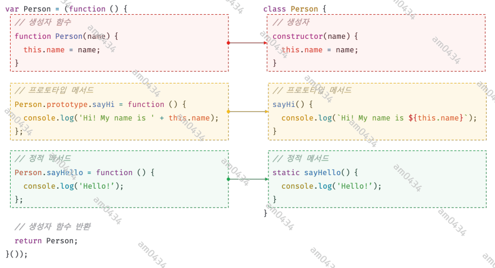
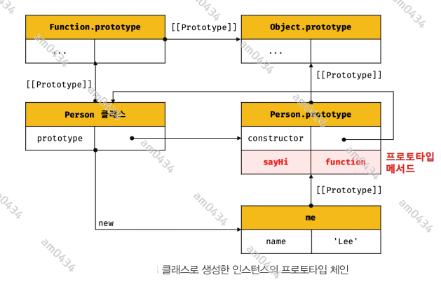
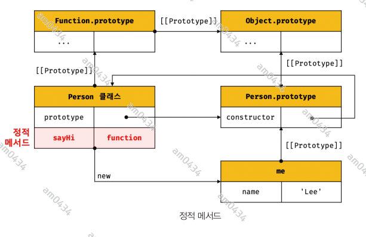
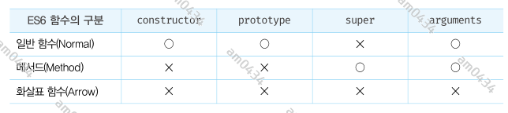

## 25장 - 클래스

### 25.1 클래스는 프로토타입의 문법적 설탕인가?
<<<<<<< HEAD
<<<<<<< HEAD
=======
>>>>>>> 13e63a9 (250406 study_js +)
프로토타입 기반 객체지향 언어는 클래스가 필요 없는 객체지향 프로그래밍 언어다. ES5에서는 클래스 없이도 생성자 함수와 프로토타입을 통해 객체지향
언어의 상속을 구현할 수 있다. 하지만 프로토타입 기반 방식때문에 자스를 어렵게 느끼는 이유가 되기도 한다.  
ES6에 도입된 클래스는 기본 프로토타입 기반 객체지향 프로그래밍보다 클래스 기반 프로그래밍 언어와 매우 흡사한 객체 생성 메커니즘을 제시한다.
그렇다고 기존의 프로토타입 기반 모델을 폐지하는 것은 아니다. 사실 클래스는 함수이며 기존 패턴을 클래스 기반 패턴처럼 사용할 수 있도록 하는
문법적 설탕이라고 볼 수도 있다.  
단, 클래스와 생성자 함수는 모두 프로토타입 기반의 인스턴스를 생성하지만 정확히 동일하게 동작하지는 않는다. 클래스는 생성자 함수보다 엄격하여
생성자 함수에서는 제공하지 않는 기능도 제공한다.  
클래스는 생성자 함수와 매우 유사하지만 다음과 같이 몇 가지 차이가 있다.
1. 클래스는 new 연산자 없이 호출하면 에러가 발생한다. 하지만 생성자 함수를 new 없이 호출하면 일반 함수로서 호출된다.
2. 클래스는 상속을 지원하는 extends 와 super 키워드를 제공한다. 
3. 클래스는 호이스팅이 발생하지 않는 것처럼 동작한다.
4. 클래스 내의 모든 코드에는 암묵적으로 strict mode 가 지정되어 실행되며 해제할 수 없다.
5. 클래스의 constructor, 프로토타입 메서드, 정적 메서드는 모두 프로퍼티 어트리뷰트 [[Enumerable]]의 값이 false 이다. 다시 말해, 열거되지 않는다.

클래스를 프로토타입 기반 객체 생성 패턴의 단순한 문법적 설탕이라고 보기보다는 새로운 객체 생성 메커니즘으로 보는 것이 좀 더 합당하다.

### 25.2 클래스 정의
클래서는 class 키워드를 사용하여 정의한다. 클래스 이름은 파스칼 케이스를 사용하는 것이 일반적이다. 파스칼 케이스를 사용하지 않아도 에러가 발생하지 않는다.  
일반적이지는 않지만 (익명 또는 기명)표현식으로 클래스를 정의할 수도 있다. 이것은 클래스도 값으로 사용할 수 있는 일급객체라는 것을 의미한다.  
좀 더 자세히 말하자면 클래스는 함수다. 따라서 값처럼 사용할 수 있는 일급객체다.  
클래스 몸체에는 0개 이상의 메서드만 정의할 수 있다. 클래스 몸체에서 정의할 수 있는 메서드는 constructor, 프로토타입 메서드, 정적 메서드 세가지이다.
```javascript
class Person {
  // 생성자  
  constructor(name) {
    this.name = name;  // public 하다.
  }
  
  // 프로토타입 메서드
  sayHi() {
    console.log(`Hi! My name is ${this.name}`);
  }
  
  // 정적메서드
  static sayHello() {
    console.log('Hello!');
  }
}

// 인스턴스 생성
const me = new Person('Lee');
// 프로퍼티 참조
console.log(me.name);
// 프로토타입 메서드 호출
me.sayHi()
// 정적 메서드 호출
Person.sayHello()

```

클래스와 생성자 함수의 정의 방식을 비교해 보면 다음과 같다.



### 25.3 클래스 호이스팅
클래스 선언문으로 정의한 클래스는 함수 선언문과 같이 소스코드 평가 과정, 즉 런타임 이전에 먼저 평가되어 함수 객체를 생성한다. 단, 클래스는
클래스 정의 이전에 참조할 수 없다. 클래스 선언문은 마치 호이스팅이 발생하지 않는 것처럼 보이나 그렇지 않다. 단 클래스는 let, const 키워드로
선언한 변수처럼 호이스팅된다. 따라서 클래스 선언문 이전에 일시적 사각지대에 빠지기 때문에 호이스팅이 발생하지 않는 것처럼 동작한다.  
var, let, const, function, function*, class 키워드를 사용하여 선언된 모든 식별자는 호이스팅된다. 모든 선언문은 런타임 이전에 먼저
실행되기 때문이다.

### 25.4 인스턴스 생성
클래스는 생성자 함수이며 new 연산자와 함께 호출되어 인스턴스를 생성한다.

### 25.5 메서드
클래스에 정의할 수 있는 메서드는 생성자, 프로토타입 메서드, 정적 메서드가 있다.

#### 25.5.1 constructor
constructor는 인스턴스를 생성하고 초기화하기 위한 특수한 메서드다. constructor는 이름을 변경할 수 없다.  
개발자 도구를 사용해서 클래스의 내부를 들여다보면 클래스도 함수 객체 고유의 프로퍼티를 모두 갖고 있다. 함수와 동일하게 프로토타입과 연결되어
있으며 자신의 스코프 체인을 구성한다.  
그리고 constructor 프로퍼티는 클래스 자신을 가리키고 있다. 즉, 클래스가 인스턴스를 생성하는 생성자 함수라는 것을 의미한다.  
클래스가 생성한 인스턴스의 내부를 들여다보면 constructor 내부에서 추가한 프로터티가 생성한 인스턴스의 프로퍼티에 추가된 것을 볼 수 있다.
즉 constructor 내부의 this는 생성자 함수와 마찬가지로 클래스가 생성한 인스턴스를 가리킨다.  
그런데 클래스가 평가되어 생성된 함수 객체나 인스턴스 어디에도 constructor 메서드가 안보인다. 이는 클래스 몸체에 정의한 constructor가 단순한
메서드가 아니라는 것을 의미한다. constructor 는 메서드로 해성되는 것이 아니라 클래스가 평가되어 생성한 함수 객체 코드의 일부가 된다.
다시 말해, 클래스 정의가 평가되면 constructor 의 기술된 동작을 하는 함수 객체가 생성된다.  
constructor 는 클래스 내에 한 개만 존재할 수 있다. 2개 이상이 있으면 SysntaxError 가 발생한다.  
생략할 수 있다. 빈 constructor 가 암묵적으로 정의되고, 빈 객체를 반환한다.  
constructor 는 별도의 반환문을 갖지 않아야 한다. new 연산자와 함께 클래스가 호출되면 생성자 함수와 동일하게 암묵적으로 this, 즉 인스턴스를
반환하기 때문이다.
만약 this가 아닌 다른 객체를 명시적으로 반환하면 this, 즉 인스턴스가 반환되지 못하고 return 문에 명시한 객체가 반환된다. 하지만 원시값을 반환하면
암묵적으로 this가 반환된다. 따라서 constructor 의 return 문은 반드시 생략한다.

#### 25.5.2 프로토타입 메서드
클래스의 prototype 프로퍼티에 메서들르 추가하지 않아도 기본적으로 프로토타입 메서드가 된다.



#### 25.5.3 정적 메서드
클래스에서는 메서드에 static 키워드를 붙이면 정적 메서드(클래스 메서드)가 된다. 정적 메서드는 클래스에 바인딩된 메서드가 된다. 정적 메서드는
클래스 정의 이후에 인스턴스를 생성하지 않아도 호출할 수 있다. 정적메서드는 인스턴스로 호출할 수 없다. 정적 메서드가 바인딩된 클래스는 인스턴스의
프로토타입 체인상에 존재하지 않기 때문이다. 



#### 25.5.4 정적 메서드와 프로토타입 메서드의 차이
1. 정적 메서드와 프로통타입 메서드는 자신이 속해 있는 프로토타입 체인이 다르다.
2. 정적 메서드는 클래스로 호출한다.(메서드는 인스턴스로 호출)
3. 정적 메서드는 인스턴스 프로퍼티를 참조할 수 없지만 프로토타입 메서드는 인스턴스 프로퍼티를 참조할 수 있다.

3번에 대해서 정적 메서드는 클래스로 호출하야 하므로 정적 메서드 내부의 this는 인스턴스가 아닌 클래스를 가리킨다. 즉, 프로토타입 메서드와
정적 메서드 내부의 this 바인딩이 다르다.

#### 25.5.5 클래스에서 정의한 메서드의 특징
1. function 키워드를 생략한 메서드 축약 표현을 사용한다.
2. 콤마가 필요 없다.
3. 암묵적으로 strict mode 로 실행된다.
4. for ... in 문이나 Object.keys 메서드 등으로 열거할 수 없다. 즉, [[Enumerable]]이 false 다.
5. non-constructor 이다. new 연산자와 호출할 수 없다.

### 25.6 클래스의 인스턴스 생성 과정
<<<<<<< HEAD
<<<<<<< HEAD
=======
>>>>>>> eb37ce7 (250407 study_js +)
17.2.3 의 '생성자 함수의 인스턴스 생성 과정' 에서 살펴본 바와 유사하다.

### 25.7 프로퍼티

#### 25.7.1 인스턴스 프로퍼티
인스턴스 프로퍼티는 constructor 내부에 정의해야 한다. constructor 내부 코드가 실행되기 이전에 constructor 내부의 this 에는 이미 클래스가
암묵적으로 생성한 인스턴스인 빈 객체가 바인딩되어 있다. 따라서 constructor 내부의 this 에 프로퍼티를 추가하면, 생성자가 생성할 인스턴스에
프로퍼티가 추가된다.

#### 25.7.2 접근자 프로퍼티
16.3.2 에서 살펴보았듯이 접근자 프로퍼티는 자체적으로 값([[Value]] 내부 슬롯)을 갖지 않고 다른 데이터 프로퍼티의 값을 읽거나 저장할 때 사용하는
접근자 함수로 구성된 프로퍼티다. 접근자 프로퍼티는 클래스에서도 사용할 수 있다. 클래스의 메서드는 기본적으로 프로토탇입 메서드가 된다. 따라서 
클래스에서 정의한 접근자 프로퍼티(getter, setter)는 프로토타입 프로퍼티가 된다.

#### 25.7.3 클래스 필드 정의 제안
클래스 필드(필드 또는 멤버)는 클래스 기반 객체지향 언어에서 클래스가 생성할 인스턴스의 프로퍼티를 가리키는 용어다. 클래스 기반 객체지향 언어인 자바의
클래스 필드는 마치 클래스 내부 변수처럼 사용된다.  
자바스크립트의 클래스 몸체에는 메서드만 선언할 수 있다. 따라서 클래스 몸체에 자바와 유사하게 클래스 필드를 선언하면 문법 에러가 발생한다.  
하지만 최신 브라우저 도는 Node.js 에서 실행하면 에러가 발생하지 않는다. 자스에서도 인스턴스 프로퍼티를 마치 클래스 기반 언어의 클래스 필드처럼
정의할 수 있는 새로운 표준 사양이 제안되어있다.  
이것이 표준으로 승급이 확실시되기 때문에 최신 버전에는 미리 구현해 놓았다. 따라서 최신 버전에서는 클래스 필드를 몸체에 정의할 수 있다.
```javascript
class Person{
    name ='lee';
}
const man = new Person();
console.log(man) // Person {name:'lee'}
```
클래스 몸체에서 클래스 필드를 정의하는 경우 this에 바인딩해서는 안된다. this는 constructor 에서만 유효하다.  
클래스 필드 정의 제안으로 인해 인스턴스 프로퍼티를 정의하는 방식은 두 가지가 되었다. 인스턴스를 생성할 때 외부 초기값으로 클래스 필드를 초기화할
필요가 있다면 constructor 에서 인스턴스 프로퍼티를 정의하는 기존의 방식을 사용하고, 외부 초기값으로 클래스 필드를 초기화할 필요가 없다면
두 가지 방식 모두 사용 가능하다.

#### 25.7.4 private 필드 정의 제안(2021년 1월 현재)
자스는 캡슐화를 완전하게 지원하지 않는다. ES6의 클래스도 생성자 함수와 마찬가지로 private, public, protected 와 같은 접근 제한자를 지원하지 않는다.
즉 언제나 public 이다.  
다음 예제를 살펴보자.
```javascript
class Person {
  #name = '';
  
  constructor(name) {
    this.#name= name;
  }
}

const me = new Person('lee');
console.log(me.#name);
```
코드를 실행해보면 #name 식별자를 브라우저에서는 접근이 가능하나, Node.js 에서는 private 으로 인식한다.  
private 필드는 클래스 내부에서만 참조할 수 있다. 클래스 외부에서 private 필드에 직접 접근할 수 있는 방법은 없다. 다만 접근자 프로퍼티를 통해
간접적으로 접근하는 방법은 유효하다. private 필드는 반드시 클래스 몸체에서 정의해야 한다. constructor 에 정의하면 에러가 발생한다.

#### 25.7.5 static 필드 제안

### 25.8 상속에 의한 클래스 확장

#### 25.8.1 클래스 상속과 생성자 함수 상속
상속에 의한 클래스 확장은 프로토타입 기반 상속과는 다른 개념이다. **프로토타입 기반 상속은 프로토타입 체인을 통해 다른 객체의 자산을 상속받는
개념이지만 상속에 의한 클래스 확장은 기존 클래스를 상속받아 새로운 클래스를 확장하여 정의**하는 것이다.  
클래스와 생성자 함수는 인스턴스를 생성할 수 있는 함수라는 점에서 매우 유사하지만 클래스는 상속을 통해 기존 클래스를 확장할 수 있는 문법인
extends 키워드가 기본적으로 제공되지만 생성자 함수는 그렇지 않다.

#### 25.8.2 extends 키워드
```javascript
// 수퍼(베이스/부모) 클래스
class Base {}

// 서브(파생/자식) 클래스
class Child extends Base {}
```

#### 25.8.3 동적 상속
extends 키워드는 클래스뿐 아니라 생성자 함수를 상속받아 클래스를 확장할 수 있다. 단, extends 키워드 앞에는 반드시 클래스가 와야한다.
```javascript
function Base(a) {
  this.a= a;
}

class Child extends Base {}

const inst = new Child(1);
console.log(inst) // Child {a:1}
```

#### 25.8.4 서브클래스의 constructor
constructor 를 생략하면 클래스에 비어 있는 constructor 가 암묵적으로 정의된다. 서브클래스에서 생략하면 클래스에 다음과 같은 constructor 
가 암묵적으로 정의된다. args 는 new 연산자와 함께 클래스를 호출할 때 전달한 인수의 리스트다.
```javascript
constructor(...args) {
  super(...args);
}
```
super() 는 수퍼클래스의 constructor 를 호출하여 인스턴스를 생성한다.

#### 25.8.5 super 키워드

#### 25.8.6 상속 클래스의 인스턴스 생성 과정
1. 서브클래스의 super 호출  
자스 엔진은 클래스를 평가할 때 수퍼클래스와 서브클래스를 구분하기 위해 'base' 또는 'derived' 를 값으로 갖는 내부 슬롯 [[ConstructorKind]]를 갖는다.
다른 클래스를 상속받지 않는 클래스는 해당 내부 슬롯의 값이 base 로 설정되지만 다른 클래스를 상속받는 서브클래스는 값이 derived 로 설정된다. 이를 통해
수퍼클래스와 서브클래스는 new 연산자로 호출되었을 때 동작이 구분된다.  
서브클래스는 자신이 직접 인스턴스를 생성하지 않고 수퍼클래스에게 인스턴스 생성을 위임한다. 이것이 바로 서브클래스의 constructor 에서 super 를 호출하는 이유다.
2. 수퍼클래스의 인스턴스 생성과 this 바인딩  
수퍼클래스의 constructor 가 실행되기 이전에 암묵적으로 빈 객체를 생성하고 this 에 바인딩된다.  이때 인스턴스는 수퍼클래스가 생성한 것이다.
하지만 new 연산자와 함께 호출된 클래스가 서브클래스라는 것이 중요하다. 따라서 인스턴스는 new.target 이 가리키는 서브클래스가 생성한 것으로 처리된다.
3. 수퍼클래스의 인스턴스 초기화
4. 서브클래스 constructor 로의 복귀와 this 바인딩
super 호출이 종료되고 제어 흐름이 서브클래스의 constructor 로 돌아온다. 이때 super가 반환한 인스턴스가 this에 바인딩된다. 서브클래스는 별도의
인스턴스를 생성하지 않는다.
5. 서브클래스의 인스턴스 초기화
6. 인스턴스 반환

#### 25.8.7 표준 빌트인 생성자 함수 확장
extends 키워드 다음에는 클래스뿐만이 아니라 String, Number, Array 같은 표준 빌트인객체도 [[Construct]] 내부 메서드를 갖는 생성자 함수이므로
extends 키워드를 사용하여 확장할 수 있다. 예를 들어 Array 생성자 함수를 상속받아 확장한 클래스가 생성한 인스턴스는 Array.prototype의 모든
메서드를 사용할 수 있다.

---------------------------------------------------------------------

## 26장 - ES6 함수의 추가 기능

### 26.1 함수의 구분
ES6 이전까지 자바스크립트의 함수는 별다른 구분 없이 다양한 목적으로 사용됐다. 자스의 함수는 일반 함수로 호출할 수도 있고, new 연산자와
함께 호출하여 인스턴스를 생성할 수 있는 생성자 함수로서 호출할 수도 있으며, 객체에 바인딩되어 메서드로서 호출할 수 있다. 이는 편리한 것
같지만 실수를 유발할 수 있으며 성능 면에서도 손해다.
```javascript
var foo = function() {
    return 1;
}

// 일반 함수 호출
foo();

// 생성자 함수로 호출
new foo(); // -> foo {}

// 메서드로 호출
var obf = {foo:foo};
obf.foo();
```

주의 할 것은 ES6 이전에 일반적으로 메서드라고 부르던 객체에 바인딩된 함수도 callable 이며 constructor 라는 것이다. 따라서 객체에 바인딩된
함수도 일반 함수로서 호출할 수 있는 것은 물로 생성자 함수로 호출할 수 있다.
```javascript
var obj = {
    x: 10,
    f: function() {return this.x}
}
// 프로퍼티에 f에 바인딩된 함수르로 메서드로 호출
console.log(obj.f()); //10
// f를 일반함수로 호출
var bar = obj.f;
console.log(bar()); // undefined

// f에 바인딩된 함수를 생성자 함수로 호출
console.log(new obj.f()) // f {}
```

위와 같은 상황이 흔치 않겠지만 문법적으로 가능하다는 것은 문제가 있다. 성능 면에서도 문제가 있다. 왜냐하면 constructor 라는 것은 객체에
바인딩된 함수가 prototype 프로퍼티를 가지며, 프로토타입 객체를 생성한다는 것을 의미하기 때문이다.  
함수에 전달하는 콜백함수도 마찬가지다. 콜백 함수도 constructor 이기 때문에 불필요한 프로토타입 객체를 생성한다.  
이러한 문제를 해결하기 위해 ES6 에서는 함수를 사용하는 목적에 따라 세 가지 종류로 명확히 구분했다.



일반 함수는 함수 선언문이나 함수 표현식으로 정의한 함수를 말하며, ES6 이전의 함수와 차이가 없다. 하지만 ES6의 메서드와 화살표 함수는 ES6
이전의 함수와 명확한 차이가 있다.

### 26.2 메서드
ES6 사양의 메서드는 메서드 축약 표현으로 정의된 함수만을 의미한다.

```javascript
const obj = {
    x : 1,
    // 메서드다.
    foo() {return this.x;},
    // bar에 바인딩된 함수는 일반 함수다.
    bar : function() {return this.x;}
}
```
ES6 의 메서드는 인스턴트를 생성할 수 없는 non-constructor 다. 따라서 prototype 프로퍼티가 없고 프로토타입도 생성하지 않는다.  
메서드는 자신을 바인딩한 객체를 가리키는 내부 슬롯 [[HomeObject]]를 갖는다. super 참조는 이 내부 슬롯을 사용하여 수퍼클래스의 메서드를
참조하므로 내부 슬롯을 갖는 ES6 메서드는 super 키워드를 사용할 수 있다.

```javascript
const base = {
  name : 'lee',
  sayHi() {
    return `Hi, ${this.name}!`;
  }
};

const derived = {
  __proto__ : base,
  sayHi() {
    return `${super.sayHi()}. how are you doing?`;
  }
};

console.log(derived.sayHi());
```

### 26.3 화살표 함수
화살표 함수는 기존의 함수 정의 방식보다 간략하게 함수를 정의할 수 있다. 표현만 간략한 것이 아니라 내부 동작도 간략하다. 특히 화살표 함수는
콜백 함수 내부에서 this가 전역 객체를 가리키는 문제를 해결하기 위한 대안으로 유용하다.

#### 26.3.1 화살표 함수 정의
- 함수 정의 : 표현식으로 정의해야 한다. 호출 방식은 기존 함수와 동일하다.
- 매개변수 선언 : 매개변수가 여러개인 경우 () 안에 선언한다. 매개변수가 한 개인 경우 () 생략할 수 있다.  매개변수가 없는 경우 ()를 생략할 수 없다.
- 함수 몸체 정의 : 함수 몸체가 하나의 문으로 구성된다면 중고라호 {}를 생략할 수 있다. 함수 몸체를 감싸는 중괄호를 생략한 경우 함수 몸체
내부의 문이 표현식이 아닌 문(값으로 평가할 수 없는 문)이라면 에러가 발생한다. 표현식이 아닌 문은 반환할 수 없기 때문이다.  
따라서 함수 몸체가 하나의 문이더라도 표현식이 아닌 문이라면 중괄호를 생략할 수 없다.  
객체 리터럴을 반환하는 경우 객체 리터럴을 소괄호()로 감싸야 된다.

#### 26.3.2 화살표 함수와 일반 함수의 차이
1. non-constructor 다.
2. 중복된 매개변수 이름을 선언할 수 없다.
3. 화살표 함수는 함수 자체의 this, arguments, super, new.target 바인딩을 갖지 않는다.
따라서 화살표 함수 내부에서 this, arguments, super, new.target 을 참조하면 스코프 체인을 통해 상위 스코프의 것을 참조한다.

#### 26.3.3 this
화살표 함수가 일반 함수와 구별되는 가장 큰 특징은 this 다. 그리고 화살표 함수는 다른 함수의 인수로 전달되어 콜백 함수로 사용되는 경우가 많다.
중첩함수 내에서 this는 호출한 객체를 가리키는 것이 일반적이다. 하지만 중첩함수 내에서 콜백함수를 일반 함수로 호출하게 되면 콜백함수를 호출한
객체와 콜백함수의 this 가 서로 다른 값을 가리키게 된다. 이렇게 발생하는 문제가 바로 '콜백 함수 내부의 this 문제'이다.  
화살표 함수는 함수 자체의 this 바인딩을 갖지 않는다. 따라서 화살표 함수 내부에서 this를 참조하면 상위 스코프의 this를 그대로 참조한다.
이를 lexical this 라고 한다.

#### 26.3.4 super
화살표 함수는 함수 자체의 super 바인딩을 갖지 않는다. 따라서 화살표 함수 내부에서 super 를 참조하면 this와 마찬가지로 상위 스코프의
super를 참조한다.

#### 26.3.5 arguments

### 26.5 Rest 파라미터
#### 26.5.1 기본 문법
Rest 파라미터(나머지 매개변수)는 매개변수 이름 앞에 세개의 점 ... 을 붙여서 정의한 매개변수를 의미한다. Rest 파라미터는 함수에 전달된
인수들의 목록을 배열로 전달받는다. 일반 매개변수와 Rest 파라미터는 함께 사용할 수 있다. 

#### 26.5.2 Rest 파라미터와 arguments 객체
ES6 에서는 rest 파라미터를 사용하여 가변 인자 함수의 인수 목록을 배열로 직접 전달받을 수 있다. 이를 통해 유사 배열 객체인 arguments 객체를
배열로 변환하는 번거로움을 피할 수 있다.

### 26.5 매개변수 기본값
자스 엔진은 매개변수의 개수와 인수의 개수를 체크하지 않는다. 따라서 의도치 않은 결과가 나올 수 있다.  
ES6 에서 도입된 매개변수 기본값을 사용하면 함수 내에서 수행하던 인수 체크 및 초기화를 간소화할 수 있다. 앞서 살펴본 Rest 파라미터에는
기본값을 지정할 수 없다.
