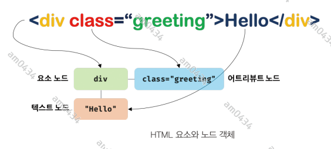
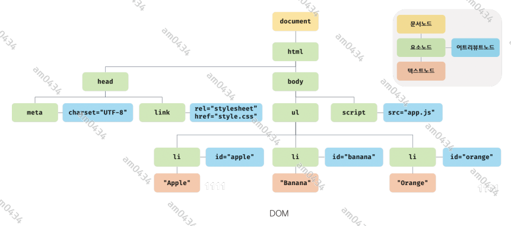
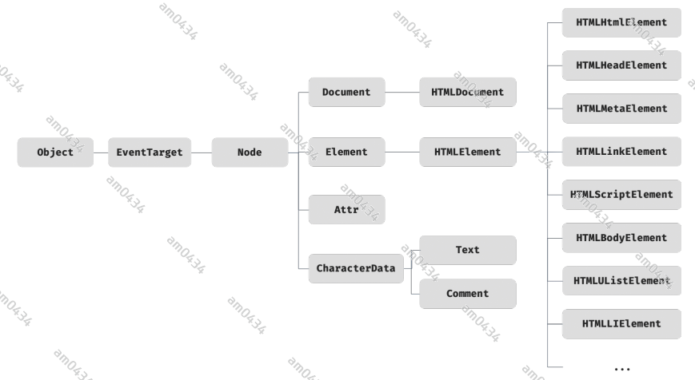
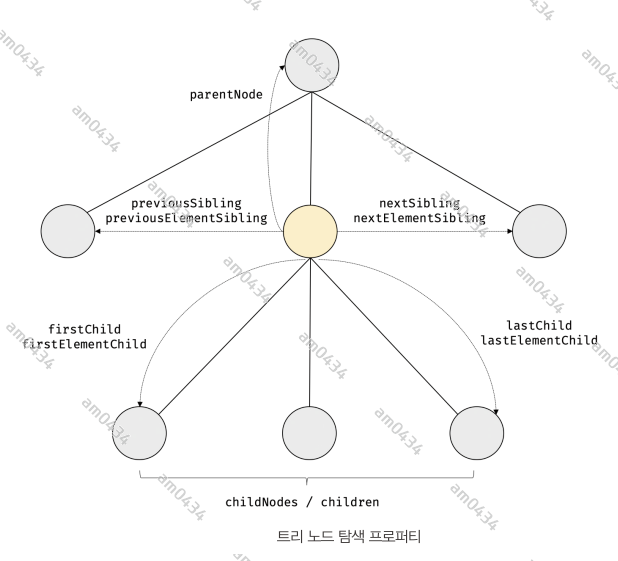

## 39장 DOM
**DOM은 HTML 문서의 계층적 구조와 정보를 표현하며 이를 제어할 수 있는 API, 즉 프로퍼티와 메서드를 제공하는 트리 자료구조다.**
DOM에 대해서 자세히 살펴보겠다.

### 39.1 노드
#### 39.1.1 HTML 요소와 노드 객체
HTML 요소는 렌더링 엔진에 의해 파싱되어 DOM을 구성하는 요소 노드 객체로 변환된다. 이때 HTML 요소의 어트리뷰트는 어트리뷰트 노드로, HTML
요소의 텍스트 콘텐츠는 텍스트 노드로 변환된다. 



HTML 문서는 HTML 요소들의 집합으로 이뤄지며, HTML 요소는 중첩 관계를 가진다. 즉, HTML 요소의 콘텐츠 영역(시작 태그와 종료 태그 사이)에는
텍스트뿐만 아니라 다른 HTML 요소도 포함할 수 있다.  
이때 요소 간에는 중첩 관계에 의해 계층적인 부자 관계가 형성된다. 이러한 요소간 부자 관계를 반영하여 HTML 요소를 객체화한 모든 노드 객체들을 트리
자료구조로 구성한다.

- 트리 자료구조 : 노드 객체들로 구성된 트리 자료구조를 DOM 이라 한다. DOM 트리라고 부르기도 한다.

#### 39.1.2 노드 객체의 타입
다음 문서를 렌더리 엔진이 파싱한다고 생각해보겠다.
```html
<!DOCTYPE html>
<html>
<head>
    <meta charset="UTF-8">
    <link rel="stylesheet" href="style.css">
</head>
<body>
<ul>
    <li id="apple">Apple</li>
    <li id="banana">Banana</li>
    <li id="orange">Orange</li>
</ul>
<script src="app.js"></script>
</body>
</html>
```
렌더링 엔진은 위 문서를 다음과 같이 DOM을 생성한다.



- 문서 노드    
문서 노드는 DOM 트리의 최상위에 존재하는 루트 노드로서 document 객체를 가리킨다. document 객체는 브라우저가 렌더링한 HTML 문서 전체를 가리키는
객체로서 전역 객체 window의 document 프로퍼티에 바인딩되어 있다. 따라서 문서 노드는 window.document 또는 document로 참조할 수 있다.
- 요소 노드  
요소 노드는 HTML 요소를 가리키는 객체다. 요소 노드는 문서의 구조를 표현한다고 할 수 있다.
- 어트리뷰트 노드    
어트리뷰트 노드는 어트리뷰트가 지정한 요소의 요소 노드와 연결되어 있다. 단, 요소 노드는 부모 노드와 연결되어 있지만 어트리뷰트 노드는 부모
노드와 연결되어 있지 않고 요소 노드에만 연결되어 있다. 즉, 어트리뷰트 노드에 접근하여 참조하거나 변경하려면 먼저 요소 노드에 접근해야 한다.
- 텍스트 노드   
요소 노드가 문서의 구조를 표현한다면 텍스트 노드는 문서의 정보를 표현한다고 할 수 있다. 텍스트 노드는 요소 노드의 자식 노드이며, 자식 노드를
가질 수 없는 리프 노드다. 즉, 텍스트 노드는 DOM 트리의 최종단이다. 따라서 텍스트 노드에 접근하려면 먼저 부모 노드인 요소 노드에 접근해야 한다.

#### 39.1.3 노드 객체의 상속 구조



위 그림과 같이 모든 노드 객체는 Object, EventTarget, Node 인터페이스를 상속받는다. 추가적으로 문서 노드는 Document, HTMLDocument
인터페이스를 상속받고 어트리뷰트 노드는 Attr, 텍스트 노드는 CharacterData 인터페이스를 각각 상속받는다.  
요소 노드는 Element 인터페이스를 상속받는다. 그리고 추가적으로 HTMLElement 와 태그의 종류별로 세분화된 인터페이스를 상속받는다.  
노드 객체에는 노드 객체의 종류, 즉 노드 타입에 상관없이 모든 노드 객체가 공통으로 갖는 기능도 있고, 노드 타입에 따라 고유한 기능도 있다.
예를 들어, 모든 노드 객체는 공통적으로 이벤트를 발생시킬 수 있다. 이벤트에 관련된 기능(EventTarget.addEventListener, EventTarget.removeEventListener 등)은
EventTarget 인터페이스가 제공한다. 또한 모든 노드 객체는 트리 자료구조의 노드로서 공통적으로 트리 탐색 기능이나 노드 정보 제공 기능이 필요하다.
이 같은 노드 관련 기능은 Node 인터페이스가 제공한다.  
HTML 요소가 객체화된 요소 노드 객체는 HTML 요소가 갖는 공통적인 기능이 있다. 예를 들어, input 요소 노드 객체와 div 요소 노드 객체는 모두 HTML
요소의 스타일을 나타내는 style 프로퍼티가 있다. 요소가 갖는 공통적인 기능은 HTMLElement 인터페이스가 제공한다.  
하지만 요소의 종류에 따라 고유한 기능도 있다. 예를 들어, input 노드 객체는 value 프로퍼티가 필요하지만 div 요소 노드 객체는 value 프로퍼티가
필요하지 않다. 따라서 필요한 기능을 제공하는 인터페이스(HTMLInputElement, HTMLDivElement 등)가 요소의 종류에 따라 각각 다르다.  
지금까지 살펴본 바와 같이 **DOM은 HTML 문서의 계층적 구조와 정보를 표현하는 것은 물로 노드 객체의 종류, 즉 노드 타입에 따라 필요한 기능을 프로퍼티와
메서드의 집합인 DOM API로 제공한다. 이 DOM API를 통해 HTML의 구조나 내용 또는 스타일 등을 동적으로 조작할 수 있다.**  
중요한 것은 DOM API, 즉 DOM이 제공하는 프로퍼티와 메서드를 사용하여 노드에 접근하고 HTML의 구조나 내용 또는 스타일 등을 동적으로 변경하는 방법을
익히는 것이다. 즉, HTML을 DOM과 연관 지어 바라보아야 한다.

### 39.2 요소 노드 취득
HTML의 구조나 내용 또는 스타일 등을 동적으로 조작하려면 먼저 요소 노드를 취득해야 한다. 텍스트 노드는 요소 노드의 자식 노드이고, 어트리뷰트 노드는
요소 노드와 연결되어 있기 때문에 텍스트 노드나 어트리뷰트 노드를 조작하고자 할 때도 마찬가지다. 요소 노드의 취득은 HTML 요소를 조작하는 시작점이다.

#### 39.2.1 id를 이용한 요소 노드 취득
Document.prototype.getElementById 메서드는 인수로 전달한 id 어트리뷰트 값(이하 id 값)을 갖는 하나의 요소 노드를 탐색하여 반환한다. 반드시
문서 노드인 document를 통해서 호출해야 한다.  
id 값은 HTML 문서 내에서 유일한 값이어야 하며, class 어트리뷰트와는 달리 공백 문자로 구분하여 여러개의 값을 가질 수 없다. 단, 중복된 id 값을
갖는 요소가 여러 개 존재하더라도 어떠한 에러도 발생하지 않는다. 즉, HTML 문서 내에는 중복된 id 값을 갖는 요소가 여러 개 존재할 가능성이 있다.
이 경우 id 값을 갖는 첫 요소 노드만 반환한다. 즉, getElementById 메서드는 언제나 단 하나의 요소 노드를 반환한다.

#### 39.2.2 태그 이름을 이용한 요소 노드 취득
Document.prototype.getElementsByTagName 메서드는 인수로 전달한 태그 이름을 갖는 모든 요소 노드들을 탐색하여 반환한다. 이 메서드는 여러 개의
요소 노드 객체를 갖는 DOM 컬렉션 객체인 HTMLCollection 객체를 반환한다.

```html
<!DOCTYPE html>
<html lang="en">
<head>
    <meta charset="UTF-8">
    <title>DOM API Example</title>
</head>
<body>
<div>
    <ul>
        <li id="apple">apple</li>
        <li id="banana">banana</li>
        <li id="orange">orange</li>
    </ul>
</div>
<script>
    const $elems = document.getElementsByTagName('li');

    //$elems 는 유사배열(배열이 아니다)이기 때문에 forEach를 사용할 수 없다. Array.from() 메스드 혹은 스프레드문법으로 배열로 바꾼다.
    [...$elems].forEach(elem => elem.style.color = 'red')
</script>
</body>
</html>
```
getElementsByTagName 메서드는 Document.prototype 에 정의된 메서드와 Element.prototype 에 정의된 메서드가 있다. Document에 정의된
메서드는 DOM의 루트 노드를 통해 호출하여 DOM 전체에서 요소 노드를 탐색하여 반환한다. 하지만 Element에 정의된 메서드는 특정 요소 노드를 통해
호출하며, 특정 요소 노드의 자손 노드 중에서 태그를 탐색하여 반환한다.

#### 39.2.3 class 를 이용한 요소 노드 취득
Document.prototype/Element.prototype.getElementsByClassName 메서드는 인수로 전달한 class 어트리뷰트 값을 갖는 모든 요소 노드들을 탐색하여
반환한다. 인수로 전달할 class 값은 공백으로 구분하여 여러 개의 class 를 지정할 수 있다. 이 메서드는 여러 개의 요소 노드 객체를 갖는 DOM 컬렉션
객체인 HTMLCollection 객체를 반환한다.
```html
<body>
<div>
    <ul id="fruits">
        <li class="fruit apple">apple</li>
        <li class="fruit banana">banana</li>
        <li class="fruit orange">orange</li>
    </ul>
</div>
<script>
    const $elems = document.getElementsByClassName('fruit');
    [...$elems].forEach(elem => elem.style.color = 'red');

    const $elems02 = document.getElementsByClassName('fruit banana');
    [...$elems02].forEach(elem => elem.style.color = 'yellow');

    // Element.getElementsByClassName() 으로 특정 요소의 자식노드를 class로 검색
    const $fruits = document.getElementById('fruits');
    const $appleElem = $fruits.getElementsByClassName('apple');
    [...$appleElem].forEach(elem => elem.style.color = 'green');
</script>
</body>
```

#### 39.2.4 CSS 선택자를 이용한 요소 노드 취득
CSS 선택자는 스타일을 적용하고자 하는 HTML 요소를 특정할 때 사용하는 문법이다.
```css
/* css 선택자 예시 */
/* 전체 선택자 : 모든 요소 선택 */
* {}
/* 태그 선택자 : 모든 p 태그 요소를 선택*/
p {}
/* id 선택자: id 값이 'foo'인 모든 요소를 선택*/
#foo {}
/* class 선택자*/
.foo {}
/* 어트리뷰트 선택자 : input 요소 중에 type이 'text'인 요소를 모두 선택*/
input[type=text] {}
/* 후손 선택자 : div 요소의 후손 중 p 요소를 모두 선택 */
div p {}
/* 가상 클래스 선택자: hover 상태인 a 요소를 모두 선택*/
a:hover {}

/* 이 밖에도 많다...*/
```
Document.prototype/Element.prototype.querySelector 메서드는 인수로 전달한 CSS 선택자를 만족시키는 하나의 요소 노드를 탐색하여 반환한다.   
Document.prototype/Element.prototype.querySelectorAll 메서드는 인수로 전달한 CSS 선택자를 만족시키는 모든 요소 노드를 탐색하여 반환한다.
querySelectorAll 메서드는 여러 노드 객체를 갖는 DOM 컬렉션 객체인 NodeList 객체를 반환한다. NodeList 객체는 유사 배열 객체이면서 이터러블이다.
**NodeList는 forEach 메서드를 제공한다.**

#### 39.2.5 특정 요소 노드를 취득할 수 있는지 확인
Element.prototype.matches 메서드는 인수로 전달한 CSS 선택자를 통해 특정 요소 노드를 취득할 수 있는지 확인한다. 이 메서드는 이벤트 위임을 사용할 때
유용하다. 이벤트 위임은 40.7에서 살펴보겠다.

#### 39.2.6 HTMLCollection과 NodeList
HTMLCollection과 NodeList의 중요한 특징은 노드 객체의 상태 변화를 실시간으로 반영하는 살아 있는 객체라는 것이다. HTMLCollection은 언제나 live 객체로
동작한다. 단, NodeList는 대부분의 경우 노드 객체의 상태 변화를 실시간으로 반영하지 않고 과거의 정적 상태를 유지하는 non-live 객체로 동작하지만 경우에 따라
live 객체로 동작할 때가 있다.

##### HTMLCollection
HTMLColection 객체는 실시간으로 노드 객체의 상태 변경을 반영하여 요소를 제거하거나 추가하는 등의 변경이 생길 수 있기 때문에 for 문으로 순회하면서
노드 객체의 상태를 변경할 때 주의해야한다. 이 문제는 for 문을 역방향으로 순회하는 방법으로 회피할 수 있다. 더 간단한 해결책은 HTMLCollection 객체를
사용하지 않고 배열로 변환해서 사용하는 것이다. 이렇게 하면 배열의 고차함수(forEach, map, filter 등)을 사용할 수 있다.

##### NodeList
getElementsByTagName, getElementsByClassName 메서드 대신 querySelectorAll 을 사용하는 방법도 있다. 이 메서드가 반환하는 NodeList 객체는
실시간으로 노드 객체의 상태 변경을 반영하지 않는 객체다.  
하지만 childNodes 프로퍼티가 반환하는 NodeList 객체는 HTMLCollection 객체와 같이 실시간으로 노드 객체의 상태 변경을 반영하는 live 객체로 동작하므로
주의가 필요하다.  
  
  
이처럼 HTMLCollection 이나 NodeList 객체는 예상과 다르게 동작할 때가 있어 다루기 까다롭고 실수하기 쉽다. 따라서 노드 객체의 상태 변경과 상관없이
안전하게 DOM 컬렉션을 사용하려면 HTMLCollection이나 NodeList 객체를 배열로 변환하여 사용하는 것을 권장한다. 

### 39.3 노드 탐색
요소 노드를 취득한 다음, 취득한 요소 노드를 기점으로 DOM 트리 노드를 옮겨 다니며 부모, 형제, 자식 노드 등을 탐색해야 할 때가 있다.



parentNode, previousSibling, firstChild, childNodes 프로퍼티는 Node.prototype 이 제공하고, 프로퍼티 키에 Element가 포함된 프로퍼티와
children 프로퍼티는 Element.prototype 이 제공한다.  

노드 탐색 프로퍼티는 모두 접근자 프로퍼티다. 단 setter 없이 getter만 존재하여 참조만 가능한 읽기 전용 접근자 프로퍼티다.

#### 39.3.1 공백 텍스트 노드
HTML 요소 사이의 스페이스, 탭, 줄바꿈(개행) 등의 공백 문자는 텍스트 노드를 생성한다. 이를 공백 텍스트 노드라 한다. 따라서 노드를 탐색할 때는 공백
문자가 생성한 공백 테스트 노드에 주의해야 한다. 

#### 39.3.2 자식 노드 탐색
자식 노드를 탐색하기 위해서는 다음과 같은 노드 탐색 프로퍼티를 사용한다.
- Node.prototype.childNodes : 자식 노드를 모두 탐색하여 DOM 컬렉션 객체인 NodeList에 담아 반환한다. 텍스트 노드도 포함되어 있을 수 있다.
- Element.prototype.children : 자식 노드 중에서 요소 노드만 모두 탐색하여 HTMLCollection 에 담아 반환한다. 텍스트 노드가 포함되지 않는다.
- Node.prototype.firstChild : 첫 번째 자식 노드를 반환한다. 텍스트 노드이거나 요소 노드다.
- Node.prototype.lastChild : 마지막 자식 노드를 반환한다. 텍스트 노드이거나 요소 노드다.
- Element.prototype.firstElementChild : 요소 노드만 반환한다.
- Element.prototype.lastElementChild : 요소 노드만 반환한다.

#### 39.3.3 자식 노드 존재 확인
자식 노드가 존재하는지 확인하려면 Node.prototype.hasChildNodes 메서드를 사용한다. 단, 이 메서드는 childNodes 프로퍼티와 마찬가지로 텍스트 노드를
포함하여 자식 노드의 존재를 확인한다.  
자식 노드 중에 요소 노드가 존재하는지 확인하려면 children.length 또는 Element 인터페이스의 childElementCount 프로퍼티를 사용한다.

#### 39.3.4 요소 노드의 텍스트 노드 탐색
요소 노드의 텍스트 노드는 요소 노드의 자식 노드다. 따라서 요소 노드의 텍스트 노드는 firstChild 프로퍼티로 접근할 수 있다. firstChild 프로퍼티는
첫 번째 자식 노드를 반환한다. firstChild 프로퍼티가 반환한 노드는 텍스트 노드이거나 요소 노드다.

#### 39.3.5 부모 노드 탐색
부모 노드를 탐색하려면 Node.prototype.parentNode 프로퍼티를 사용한다. 텍스트 노드는 DOM 트리의 최종단 노드인 리프 노드이므로 부모 노드가 텍스트
노드인 경우는 없다.

#### 39.3.6 형제 노드 탐색
부모 노드가 같은 형제 노드를 탐색하려면 다음과 같은 노드 탐색 프로퍼티를 사용한다. 단, 어트리뷰트 노드는 요소 노드와 연결되어 있지만 부모 노드가 같은
형제 노드가 아니기 때문에 반환되지 않는다. 즉, 다음 프로퍼티는 텍스트 노드 또는 요소 노드만 반환한다.
- Node.prototype.previousSibling
- Node.prototype.nextSibling 
- Element.prototype.previousElementSibling
- Element.prototype.nextElementSibling

### 39.4 노드 정보 취득
노드 객체에 대한 정보를 취득하려면 다음과 같은 노드 정보 프로퍼티를 사용한다.

- Node.prototype.nodeType    
노드 객체의 종류, 즉 노드 타입을 나타내는 상수를 반환한다. 노드 타입 상수는 Node에 정의되어 있다.  
Node.ELEMENT_NODE : 요소 노드 타입을 나타내는 상수 1을 반환  
Node.TEXT_NODE : 텍스트 노드 타입을 나타내는 상수 3을 반환
Node.DOCUMENT_NODE : 문서 노드 타입을 타나내는 상수 9 반환

- Node.prototype.nodeName
노드의 이름을 문자열로 반환한다.    
요소노드 : 대문자 문자열로 태그 이름 반환      
텍스트 노드 : 문자열 "#text"를 반환     
문서 노드 : 문자열 "#document"를 반환

```html
<body>
<div>
    <div id="foo">hello</div>
</div>
<script>
    //문서 노드의 노드 정보를 취득한다.
    console.log(document.nodeType); // 9
    console.log(document.nodeName); // #document

    // 요소 노드의 노드 정보를 취득한다.
    const $foo = document.getElementById('foo');
    console.log($foo.nodeType); // 1
    console.log($foo.nodeName); // DIV

    // 텍스트 노드의 노드 정보를 취득한다.
    const $text = $foo.firstChild
    console.log($text.nodeType); // 3
    console.log($text.nodeName); // #text
</script>
</body>
```

### 39.5 요소 노드의 텍스트 조작

#### 39.5.1 nodeValue
지금까지 살펴본 노드 탐색, 노드 정보 프로퍼티는 모두 읽기 전용 접근자 프로퍼티다. Node.prototype.nodeValue 프로퍼티는 setter와 getter 모두 존재하는
접근자 프로퍼티다. 따라서 nodeValue 프로퍼티는 참조와 할당 모두 가능하다.  
노드 객체의 nodeValue 프로퍼티를 참조하면 노드 객체의 값을 반환한다. 노드 객체의 값이란 텍스트 노드의 텍스트다. 따라서 텍스트 노드가 아닌 노드, 즉 문서 노드나
요소 노드의 nodeValue 프로퍼티를 참조하면 null을 반환한다.

```html
<body>
<div>
    <div id="foo">hello</div>
</div>
<script>
    // 문서 노드의 nodeValue
    console.log(document.nodeType); // null

    // 요소 노드의 nodeValue
    const $foo = document.getElementById('foo');
    console.log($foo.nodeValue); // null


    // 텍스트 노드의 nodeValue
    const $text = $foo.firstChild
    console.log($text.nodeValue); // hello
</script>
</body>
```
텍스트 노드의 nodeValue 프로퍼티에 값을 할당할면 텍스트 노드의 값, 즉 텍스트를 변경할 수 있다. 따라서 요소 노드의 텍스트를 변경하려면
다음과 같은 순서의 처리가 필요하다.

1. 텍스트를 변경할 요소 노드를 취득한 다음, 취득한 요소 노드의 텍스트 노드를 탐색한다. 텍스트 노드는 요소 노드의 자식 노드이므로
firstChild 프로퍼티를 사용하여 탐색한다.
2. 탐색한 텍스트 노드의 nodeValue 프로퍼티를 사용하여 텍스트 노드의 값을 변경한다.

```html
<body>
<div>
    <div id="foo">hello</div>
</div>
<script>
    // 요소 노드 취득
    const $foo = document.getElementById('foo');

    // 텍스트 노드 취득
    const $firstChild = $foo.firstChild;
    console.log($firstChild.nodeValue) // hello
    
    // 텍스트 노드 값 변경
    $firstChild.nodeValue = 'hello world';
    console.log($firstChild.nodeValue) // hello world

</script>
</body>
```

#### 39.5.2 textContent
Node.prototype.textContent 프로퍼티는 setter, getter 모두 존재하는 접근자 프로퍼티로서 요소 노드의 텍스트와 모든 자손 노드의 텍스트를 모두
취득하거나 변경한다.  
요소 노드의 textContent 프로퍼티를 참조하면 요소 노드의 콘텐츠 영역(시작 태그와 종료 태그 사이) 내의 텍스트를 모두 반환한다. 다시 말해, 요소 노드의
childNodes 프로퍼티가 반환한 모든 노드들의 텍스트 노드의 값, 즉 텍스트를 모두 반환한다. 이때 HTML 마크업은 무시된다.
```html
<body>
<div>
    <div id="foo">hello <span>World</span></div>
</div>
<script>
    // #foo 요소 노드의 텍스트를 모두 취득
    console.log(document.getElementById('foo').textContent); // hello World
</script>
</body>
```
nodeValue 프로퍼티는 텍스트 노드의 nodeValue 프로퍼티를 참조할 때만 텍스트 노드의 값, 즉 텍스트를 반환한다. 다만 nodeValue 프로퍼티를 사용하면
textContent 프로퍼티를 사용할 때 보다 코드가 더 복잡하다.  
만약 요소 노드의 콘텐츠 영역에 자식 요소 노드가 없고 텍스트만 존재한다면 같은 결과를 반환하지만 textContent 가 더 간단하다.  
요소 노드의 textContent 프로퍼티에 문자열을 할당하면 요소 노드의 모든 자식 노드가 제거되고 할당한 문자열이 텍스트로 추가된다. 이 때 할당한
문자열에 HTML 마크업이 포함되어 있더라도 문자열 그대로 텍스트로 취급된다. 
```html
<body>
<div>
    <div id="foo">hello<span> World</span></div>
</div>
<script>
    // 이때 foo 요소 노드의 모든 자식 노드가 제거되고 할당한 문자열이 텍스트로 추가된다.
    document.getElementById('foo').textContent = 'hi! <span>World</span>';
</script>
</body>

/*
hi! <span>World</span>
*/
```

**참고로 textContent 프로퍼티와 유사한 동작을 하는 innerText 프로퍼티가 있다. innerText 프로퍼티는 다음과 같은 이유로 사용하지 않는다.**
- innerText 는 CSS에 순종적이다. 
- innerText 는 느리다.

**innerHTML 을 사용하면 변경된 문자열에 HTML 마크업을 파싱한다.**


