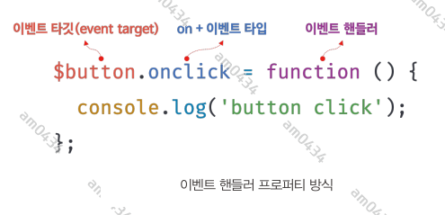
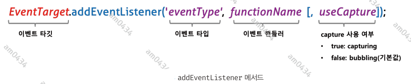
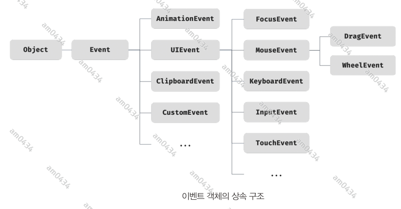

## 40장 이벤트

### 40.1 이벤트 드리븐 프로그래밍
브라우저는 처리해야 할 특정 사건이 발생하면 이를 감지하여 이벤트를 발생 시킨다. 예를 들어, 클릭, 키보드 입력, 마우스 이동 등이 일어나면 브라우저는
이를 감지하여 특정한 타입의 이벤트를 발생시킨다.  
만약 애플리케이션이 특정 타입의 이벤트에 대해 반응하여 어떤 일을 하고 싶다면 해당하는 타입의 이벤트가 발생했을 대 호출될 함수를 브라우저에게 알려
호출을 위임한다. 이때 이벤트가 발생했을 때 호출될 함수를 **이벤트 핸들러**라 하고, 이벤트가 발생했을 때 브라우저에게 이벤트 핸들러의 호출을 위임하는
것을 **이벤트 핸들러 등록**이라 한다.    
예를 들어, 사용자가 버튼을 클릭했을 때 함수를 호출하여 어떤 처리를 하고 싶다고 가정해보자. 이때 문제는 "언제 함수를 호출해야 하는가"다. 사용자가
언제 버튼을 클릭할지 알 수 없으므로   
다행히 브라우저는 사용자의 버튼 클릭을 감지하여 클릭 이벤트를 발생시킬 수 있다. 그리고 특정 버튼 요소에서 클릭 이벤트가 발생하면 특정 함수(이벤트 핸들러)를
호출하도록 브라우저에게 위임(이벤트 핸들러 등록)할 수 있다. 즉, 함수를 언제 호출할지 알 수 없으므로 개발자가 명시적으로 함수를 호출하는 것이 아니라
브라우저에게 함수 호출을 위임하는 것이다.
```html
div>
    <button id="button">click me</button>
</div>
<script>
    const $button = document.getElementById("button");

    $button.onclick = () => {alert('button clicked!');};
</script>
```
위 예제를 살펴보면 버튼 요소 $button 의 onclick 프로퍼티에 함수를 할당한다. 나중에 자세히 다루겠지만 Window, Document, HTMLElement 타입의
객체는 onclick과 같이 특정 이벤트에 대응하는 다양한 이벤트 핸들러 프로퍼티를 가지고 있다. 이 이벤트 핸들러 프로퍼티에 함수를 할당하면 해당 이벤트가
발생했을 때 할당한 함수가 브라우저에 의해 호출된다.  
이처럼 이벤트와 그에 대응하는 함수(이벤트 핸들러)를 통해 사용자와 애플리케이션은 상호작용을 할 수 있다. 이와 같이 **프로그램의 흐름을 이벤트 중심으로
제어하는 프로그래밍 방식을 이벤트 드리븐 프로그래밍이라 한다.**

### 40.2 이벤트 타입
이벤트 타입(event type)은 이벤트의 종류를 나타내는 문자열이다. 이벤트 타입은 약 200여 가지가 있다. 사용 빈도가 높은 이벤트만 소개하겠다. 상세한 목록은
MDN의 Event reference 에서 확인할 수 있다.

#### 40.2.1 마우스 이벤트
- click : 마우스 버튼을 클릭했을 때(누른다음 때야 됨)
- dbclick : 더브클릭
- mousedown : 마우스 버튼을 눌렀을 때(누르기만 해도 동작)
- mouseup : 누르고 있떤 마우스 버튼을 놓았을 때
- mousemove : 마우스 커서를 움직였을 때
- mouseenter : 마우스 커서를 HTML 요소 안으로 이동했을 때(버블링 되지 않는다.)
- mouseover : 마우스 커서를 HTML 요소 안으로 이동했을 때(버블링된다.)
- mouseleave : 마우스 커스를 HTML 요소 밖으로 이동했을 때(버블링 되지 않는다.)
- mouseout : 마우스 커스를 HTML 요소 밖으로 이동했을 때(버블링된다.)

#### 40.2.2 키보드 이벤트
- keydown : 모든 키를 눌렀을 때 발생한다.
- (keypress) : 문자 키를 눌렀을 때 연속적으로 발생한다. 폐지(deprecated) 되었다... 사용하지 않을 것을 권장한다.
- keyup : 누르고 있던 키를 놓았을 때 한 번만 발생한다.

#### 40.2.3 포커스 이벤트
- focus : HTML 요소가 포커스를 받았을 때(버블링 안됨)
- blur : HTML 요소가 포커스를 잃었을 때(버블링 안됨)
- focusin : HTML 요소가 포커스를 받았을 때(버블링 됨)
- focusout : HTML 요소가 포커스를 잃었을 때(버블링 됨)
  
focusin, focusout 이벤트 핸들러를 이벤트 핸들러 프로퍼티 방식으로 등록하면 크롬, 사파리에서 정상 동작하지 않는다.
addEventListener 메서드 방식을 사용해 등록해야 한다.

#### 40.2.4 폼 이벤트
- submit : 
1. form 요소 내의 input(text, checkbox, radio), select 입력 필드(textarea 제외)에서 인터 키를 눌렀을때
2. from 요소 내의 submit 버튼 <button type='submit'/> 을 크릭했을때 
3. submit 이벤트는 form 요소에서 발생한다.
- reset : form 요소 내의 reset 버튼을 클릭했을 때(사용되지 않음)

#### 40.2.5 값 변경 이벤트
1. input : input 요소의 값이 입력되었을 때
2. change : input 요소의 값이 변경되었을 때(change 이벤트는 HTML 요소가 포커스를 잃었을 때 사용자의 입력이 종료되었다고 인시가여 발생한다.)
3. readystatechange :

#### 40.2.6 DOM 뮤테이션 이벤트
1. DOMContentLoaded : HTML 문서의 로드와 파싱이 완료되어 DOM 생성이 완료되었을 때

#### 40.2.7 뷰 이벤트
1. resize : 브라우저 윈도우의 크기를 리사이즈할 때 연속적으로 발생한다.(오직 window 객체에서만 발생한다.) 
2. scroll : 웹페이지(document) 또는 HTML 요소를 스크롤할 때 연속적으로 발생한다.

#### 40.2.8 리소스 이벤트
1. load
2. unload
3. abort
4. error

### 40.3 이벤트 핸드러 등록
이벤트 핸들러는 이벤트가 발생했을 때 브라우저에 호출을 위임한 함수다. 다시 말해, 이벤트가 발생하면 브라우저에 의해 호출될 함수가 이벤트 핸들러다.  
이벤트가 발생했을 때 브라우저에게 이벤트 핸들러의 호출을 위임하는 것을 이벤트 핸들러 등록이라 한다. 이벤트 핸들러를 등록하는 방법은 3가지다.

#### 40.3.1 이벤트 핸들러 어트리뷰트 방식
HTML 요소의 어트리뷰트 중에는 이벤트에 대응하는 이벤트 핸들러 어트리뷰트가 있다. 이벤트 핸들러 어트리뷰트의 이름은 onclick과 같이 on 접두사와
이벤트 종류를 나타내는 이벤트 타입으로 이루어져 있다. 이벤트 핸들러 어트리뷰트 값으로 함수 호출문 등의 문을 할당하면 이벤트 핸들러가 등록된다.
```html
<body>
<button onclick="sayHi('lee')">click me!</button>
<script>
    const sayHi=(name)=>console.log(`hi, ${name}`);
</script>
</body>
```
주의할 점은 이벤트 핸들러 어트리뷰트 값으로 함수 참조가 아닌 함수 호출문 등의 문을 할당한다는 것이다.   
이벤트 핸들러 등록이란 함수 호출을 브라우저에게 위임하는 것이라 했다. 따라서 이벤트 핸들러를 등록할 때 콜백 함수와 마찬가지로 함수 참조를 등록해야
브라우저가 이벤트 핸들러를 호출할 수 있다. 만약 함수 참조가 아니라 함수 호출문을 등록하면 함수 호출문의 평가 결과가 이벤트 핸들러로 등록된다.
함수를 반환하는 고차 함수 호출문을 이벤트 핸들러로 등록한다면 문제가 없겠지만 함수가 아닌 값을 반환하는 함수 호출문을 이벤트 핸들러로 등록하면
브라우저가 이벤트 핸들러를 호출할 수 없다.   
하지만 위 예제는 이벤트 핸들러 어트리뷰트 값으로 함수 호출문을 할당했다. 이때 **이벤트 핸들러 어트리뷰트 값은 사실 암묵적으로 생성될 이벤트 핸들러의
함수 몸체를 의미**한다. 즉 onclick="sayHi('lee')" 어트리뷰트는 파싱되어 다음과 같은 함수를 암묵적으로 생성하고, 이벤트 핸들러 어트리뷰트 이름과
동일한 onclick 이벤트 핸들러 프로퍼티에 할당한다.
```html
function onclick(event) {
    sayHi('lee');
}
```
이처럼 동작하는 이유는 이벤트 핸들러에 인수를 전달하기 위해서다. 만약 이벤트 핸들러 어트리뷰트 값으로 함수 참조를 할당해야 한다면 이벤트 핸들러에
인수를 전달하기 곤란하다.

#### 40.3.2 이벤트 핸들러 프로퍼티 방식
window 객체와 Document, HTMLElement 타입의 DOM 노드 객체는 이벤트에 대응하는 이벤트 핸들러 프로퍼티를 가지고 있다. 이벤트 핸들러 프로퍼티의 키는
이벤트 핸들러 어트리뷰트와 마찬가지로 onclick과 같이 on 접두사 이벤트의 종류를 나타내는 이벤트 타입으로 이루어져 있다. 이벤트 핸들러 프로퍼티에 함수를
바인딩하면 이벤트 핸들러가 등록된다.

```html
<body>
<button id="event">click me!</button>
<script>
    const $event = document.getElementById('event')
    $event.onclick= ()=> console.log('clicked')
</script>
</body>
```

이벤트 핸들러를 등록하기 위해서는 이벤트를 발생시킬 객체인 **이벤트 타깃**과 이벤트의 종류를 나타내는 문자열인 **이벤트 타입** 그리고 **이벤트 핸들러**를
지정할 필요가 있다. 



이벤트 핸들러는 대부분 이벤트를 발생시킬 이벤트 타깃에 바인딩한다. 하지만 반드시 이벤트 타깃에 이벤트 핸들러를 바인딩해야 하는 것은 아니다. 이벤트 핸들러는
이벤트 타깃 또는 전파된 이벤트를 캐치할 DOM 노드 객체에 바인딩한다. 이에 대해서는 40.6, 40.7 에서 자세히 살펴보도록 하겠다.  
앞서 살펴본 '이벤트 핸들러 어트리뷰트 방식'도 결국 DOM 노드 객체의 이벤트 핸들러 프로퍼티로 변환되므로 결과적으로 이벤트 핸들러 프로퍼티 방식과 동일하다고
할 수 있다.  
단점으로는 이벤트 핸들러 프로퍼티에는 하나의 이벤트 핸들러만 바인딩할 수 있다.

#### 40.3.3 addEventListener 메서드 방식
DOM Level 2에서 도입된 EventTarget.prototype.addEventListener 메서드를 사용하여 이벤트 핸들러를 등록할 수 있다. 앞서 살펴본 '이벤트 핸들러 어트리뷰트 방식'과
'이벤트 핸들러 프로퍼티 방식'은 DOM Level 0 부터 제공되던 방식이다.



addEventListener 메서드의 첫 번째 매개변수에는 이벤트의 종류를 나타내는 문자열인 이벤트 타입을 전달한다. 이때 이벤트 핸들러 프로퍼티 방식과는 달리
on 접두사를 붙이지 않는다. 두 번째 매개변수에는 이벤트 핸들러를 전달한다. 마지막 매개변수에는 이벤트를 캐치할 이벤트 전파 단계를 지정한다. 캡처링과
버블링에 대해서는 40.6에서 살펴보겠다.

```html
<body>
<button id="event">click me!</button>
<script>
    const $event = document.getElementById('event')
    $event.addEventListener('click',()=>console.log('clicked!!!'))
</script>
</body>
```

이벤트 핸들러 프로퍼티 방식은 이벤트 핸들러 프로퍼티에 이벤트 핸들러를 바인딩하지만 addEventListener 메서드에는 이벤트 핸들러를 인수로 전달한다.
동일한 HTML 요소에서 발생한 동일한 이벤트에 대해 두 방식을 모두 사용하여 이벤트 핸들러를 등록하면 어떻게 동작할지 생각해보자.  
addEventListener 메서드 방식은 이벤트 핸들러 프로퍼티에 바인딩된 이벤트 핸들러에 아무런 영향을 주지 않는다. 따라서 2개의 이벤트 핸들러가 모두
호출된다.   
addEventListener 메서드는 하나 이상의 이벤트 핸들러를 등록할 수 있다. 이때 이벤트 핸들러는 등록된 순서대로 호출된다. 단, addEventListener 메서드를
통해 참조가 동일한 이벤트 핸들러를 중복 등록하면 하나의 이벤트 핸들러만 등록된다.

### 40.4 이벤트 핸들러 제거
addEventListener 로 등록한 이벤트 핸들러를 제거하려면 EventTarget.prototype.removeEventListener 메서드를 사용한다. 해당 메서드에 전달할 인수는
addEventListener 와 동일하다. 단, addEventListener에 전달한 인수와 removeEventListener 메서드에 전달한 인수가 일치하지 않으면 제거되지 않는다.
따라서 무기명 함수(예를 들어 화살표 함수, 익명함수)를 이벤트 핸들러로 등록한 경우 제거할 수 없다.  
이벤트 핸들러 프로퍼티 방식으로 등록한 이벤트 핸들러는 removeEventListener 메서드로 제거할 수 없다. 이벤트 핸들러 프로퍼티 방식으로 등록한 이벤트
핸들러를 제거하려면 이벤트 핸들러 프로퍼티에 null을 할당한다.

### 40.5 이벤트 객체
이벤트가 발생하면 이벤트에 관련한 다양한 정보를 담고 있는 이벤트 객체가 동적으로 생성된다. **생성된 이벤트 객체는 이벤트 핸들러의 첫 번째 인수로
전달된다.**

```html
<style>
    .message {
        width: 1000px;
        height: 800px;
    }
</style>
<body>
    <p>클릭하세요. 클릭한 곳의 좌표가 표시됩니다.</p>
    <div class="message"></div>
<script>
    const $msg = document.querySelector('.message');
    function showCoors(e) {
        $msg.textContent= `clientX: ${e.clientX}, clientY: ${e.clientY}`;
    }
    $msg.onclick=showCoors;
</script>
```
클릭 이벤트에 의해 생성된 이벤트 객체는 이벤트 핸들러의 첫 번째 인수로 전달되어 매개변수 e에 암묵적으로 할당된다. 이는 브라우저가 이벤트 핸들러를 호출할 때
이벤트 객체를 인수로 전달하기 때문이다. 따라서 이벤트 객체를 전달받으려면 이벤트 핸들러를 정의할 때 이벤트 객체를 전달받을 매개변수를 명시적으로 선언해야 한다.
위 예제에서 e라는 이름으로 매개변수를 선언했으나 다른 이름으로 사용하여도 상관없다.   
이벤트 핸들러 어트리뷰트 방식으로 이벤트 핸들러를 등록했다면 다음과 같이 event 를 통해 이벤트 객체를 전달받을 수 있다.

```html
<style>
    html, body {
        height: 100%;
    }
    .message {
        width: 1000px;
        height: 800px;
    }
</style>
<body onclick="showCoors(event)">
    <p>클릭하세요. 클릭한 곳의 좌표가 표시됩니다.</p>
    <div class="message"></div>
<script>
    const $msg = document.querySelector('.message');
    function showCoors(e) {
        $msg.textContent= `clientX: ${e.clientX}, clientY: ${e.clientY}`;
    }
</script>
</body>
```
이벤트 핸들러 어트리뷰트 방식의 경우 이벤트 객체를 전달받으려면 이벤트 핸들러의 첫 번째 매개변수 이름이 반드시 event이어야 한다. 만약 event가 아닌 다른
이름으로 매개변수를 선언하면 이벤트 객체를 전달받지 못한다. 그 이유는 40.3.1 에서 살펴본 바와 같이 이벤트 핸들러 어트리뷰트 값은 사실 암묵적으로 생성되는
이벤트 핸들러의 함수 몸체를 의미하기 때문이다. 즉, onclick="showCoords(event)" 어트리뷰트는 파싱되어 다음과 같은 함수를 암묵적으로 생성하여
onclick 이벤트 핸들러 프로퍼티에 할당한다.
```javascript
function onclick(event) {
    showCoors(event);
}
```

#### 40.5.1 이벤트 객체의 상속 구조
이벤트가 발생하면 이벤트 타입에 따라 다양한 타입의 이벤트 객체가 생성된다. 이벤트 객체는 다음과 같은 상속 구조를 갖는다.



위 그림의 Event, UIEvent, MouseEvent 등 모두는 생성자 함수다 따라서 다음과 같이 생성자 함수를 호출하여 이벤트 객체를 생성할 수 있다.
```html
<body>
    <script>
        let e = new Event('foo')
        console.log(e);
        
        console.log(e.type);
        console.log(e instanceof Event);
        console.log(e instanceof Object);
        
        // FocusEvent 생성자 ㅎ마수를 호출하여 focus 이벤트 타입의 FocusEvent 객체를 생성한다.
        e = new FocusEvent('focus');
        console.log(e);
        
        // MouseEvent 생성자 함수를 호출하여 click 이벤트 타입의 MouseEvent 객체를 생성한다.
        e = new MouseEvent('click');
        console.log(e);
    </script>
</body>
```
이벤트가 발생하면 암묵적으로 생성되는 이벤트 객체도 생성자 함수에 의해 생성된다. 그리고 생성된 이벤트 객체는 생성자 함수와 더불어 생성되는
프로토타입으로 구성된 프로토타입 체인의 일원이 된다.   
이벤트 객체 중 일부는 사용자의 행위에 의해 생성된 것이고 일부는 자바스크립트 코드에 의해 인위적으로 생성된 것이다. 예를 들어, MouseEvent 타입의
이벤트 객체는 사용자가 마우스를 클릭하거나 이동했을 때 생성되는 이벤트 객체이며, CustomEvent 타입의 이벤트 객체는 자바스크립트 코드에 의해
인위적으로 생성한 이벤트 객체다.   
Event 인터페이스는 DOM 내에서 발생한 이벤트에 의해 생성되는 이벤트 객체를 나타낸다. Event 인터페이스에는 모든 이벤트 객체의 공통 프로퍼티가
정의되어 있고 FocusEvent, MouseEvent, KeyboardEvent, WheelEvent 같은 하위 인터페이스에는 이벤트 타입에 따라 고유한 프로퍼티가 정의되어
있다.

#### 40.5.2 이벤트 객체의 공통 프로퍼티
Event 인터페이스, 즉 Event.prototype에 정의되어 있는 이벤트 관련 프로퍼티는 UIEvent, CustomEvent, MouseEvent 등 모든 파생 이벤트 객체에
상속된다. 즉, Event 인터페이스의 이벤트 관련 프로퍼티는 모든 이벤트 객체가 상속받는 공통 프로퍼티다. 이벤트 객체의 공통 프로퍼티는 다음과 같다.

공통 프로퍼티| 설명                                                                                    |타입
:---|:--------------------------------------------------------------------------------------|:---
type| 이벤트타입                                                                                 |string
target| 이벤트를 발생시킨 DOM 요소                                                                      |DOM요소 노드
currentTarget| 이벤트 핸들러가 바인딩된 DOM요소                                                                   |DOM 요소 노드
eventPhase| 이벤트 전파 단계(0:이벤트없음. 1:캡처링 단계. 2:타깃단계, 3:버블링단계)                                         | number
bubbles | 이벤트를 버블리으로 전파하는지 여부. 다음 이벤트 bubbles:false로 버블링하지 않는다.                                 | boolean
cancelable | preventDefault 메서드를 호출하여 이벤트의 기본동작을 취소할 수 있는지 여부.다음 이벤트는 cancelable: false로 취소할 수 없다. | boolean
defaultPrevented | preventDefault 메서드를 호출하여 이벤트를 취소했는지 여부 | boolean
isTrust | 사용자의 행위에 의해 발생한 이벤트인지 여부. 인위적으로 발생시킨 이벤트인 경우 false 이다. | boolean
timeStamp | 이벤트가 발생한 시각(기준시부터 경과한 밀리초) |number


예를 들어, 체크 박스 요소의 체크 상태가 변경되면 현재 체크 상태를 출력해보도록 하자.

```html
<body>
<input type="checkbox">
<em class="message">off</em>
    <script>
        const $checkbox = document.querySelector('input[type="checkbox"]');
        const $msg = document.querySelector('.message');

        //change 이벤트가 발생하면 Event 타입의 이벤트 객체가 생성된다.
        $checkbox.onchange= (e) => {
            console.log(Object.getPrototypeOf(e) === Event.prototype); // true

            //e.target 은 change 이벤트를 발생시킨 checkbox를 가리키고
            //e.currentTarget은 이벤트 핸들러가 바인딩된 DOM 요소 checkbox를 가리킨다.
            console.log(e.target === e.currentTarget); // true

            $msg.textContent = e.target.checked ? 'on':'off';
        };
    </script>
</body>
```
사용자의 입력에 의해 체크 상태가 변경되면 checked 프로퍼티의 값이 변경되고 change 이벤트가 발생한다. 이때 Event 객체가 생성된다. 이벤트 객체의
target 프로퍼티는 이벤트를 발생시킨 객체를 나타낸다. 따라서 target 프로퍼티가 가리키는 객체는 change 이벤트를 발생시킨 DOM 요소이고 이 객체의
checked 프로퍼티는 현재의 체크 상태를 나타낸다.  
위 예제의 경우 이벤트를 발생시킨 DOM 요소와 이벤트 핸들러가 바인딩된 DOM 요소는 모두 checkbox다. 따라서 target 프로퍼티와 currentTarget
프로퍼티는 동일한 객체를 가리킨다. 하지만 나중에 살펴볼 이벤트 위임에서는 서로다른 DOM 요소를 가리킬 수 있다.

#### 40.5.3 마우스 정보 취득
click, dblclick, mousedown, mouseup, mousemove, mouseenter, mouseleave 이벤트가 발생하면 생성되는 MouseEvent 타입의 이벤트 객체는
다음과 같은 고유의 프로퍼티를 갖는다.
- 마우스 포인터의 정보를 나타내는 프로퍼티: screenX/screenY, clientX/clientY, pageX/pageY, offsetX/offsetY
- 버튼 정보를 나타내는 프로퍼티 : altKey, ctrlKey, shiftKey, button

#### 40.5.4 키보드 정보 취득
keydown, keyup, keypress 이벤트가 발생하면 생성되는 KeyboardEvent 타입의 이벤트 객체는 altKey, ctrlKey, shiftKey, metaKey, key,keyCode같은
고유의 프로퍼티를 갖는다.