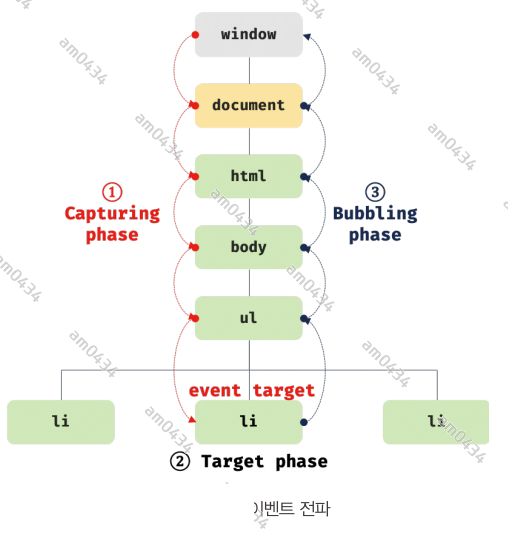

### 40.6 이벤트 전파
DOM 트리 상에 존재하는 DOM 요소 노드에서 발생한 이벤트는 DOM 트리를 통해 전파된다. 이를 이벤트 전파라고 한다.
```html
<body>
<ul id="fruits">
    <li id="apple">apple</li>
    <li id="banana">banana</li>
    <li id="orange">orange</li>
</ul>
    <script>
    </script>
</body>
```
ul 요소의 두 번째 자식 요소인 li 요소에서 클릭 이벤트가 발생한다. 이때 **생성된 이벤트 객체는 이벤트를 발생시킨 DOM 요소인 이벤트 타깃을 중심으로
DOM 트리를 통해 전파된다.** 이벤트 전파는 이벤트 객체가 전파되는 방향에 따라 다음과 같이 3단계로 구분할 수 있다.



1. 캡처링 단계 : 이벤트가 상위 요소에서 하위 요소 방향으로 전파
2. 타깃 단계 : 이벤트가 이벤트 타깃에 도달
3. 버블링 단계 : 이벤트가 하위 요소에서 상위 요소 방향으로 전파

예를 들어, 다음 예제와 같이 ul 요소에 이벤트 핸들러를 바인딩하고 ul 요소의 하위 요소인 li 요소를 클릭하여 이벤트를 발생시켜보자. 이때
이벤트 타깃(event.target)은 li 요소이고 커런트 타깃(event.currentTarget)은 ul 요소이다.

```html
<body>
<ul id="fruits">
    <li id="apple">apple</li>
    <li id="banana">banana</li>
    <li id="orange">orange</li>
</ul>
    <script>
        const $fruits = document.querySelector('#fruits')

        // 하위 요소를 클릭한 경우 캡처링 단계의 이벤트를 캐치한다.
        $fruits.addEventListener('click',event=> {
            console.log(`이벤트 단계 : ${event.eventPhase}`); // 3: 버블링단계
            console.log(`이벤트 타깃 : ${event.target}`); // [object HTMLLIElement]
            console.log(`커런트 이벤트 : ${event.currentTarget}`); // [object HTMLULElement]
        },true)
        
        $fruits.onclick=(event) => {
            console.log(`이벤트 단계 : ${event.eventPhase}`); // 3: 버블링단계
            console.log(`이벤트 타깃 : ${event.target}`); // [object HTMLLIElement]
            console.log(`커런트 이벤트 : ${event.currentTarget}`); // [object HTMLULElement]
        }
    </script>
</body>
```
**li 요소를 클릭하면 클릭 이벤트가 발생하여 클릭 이벤트가 생성되고 클릭된 li 요소가 이벤트 타깃이 된다. 이때 클릭 이벤트 객체는 window에서 시작해서
이벤트 타깃 방향으로 전파된다. 이것이 캡처링 단계다. 이후 이벤트 객체는 이벤트를 발생시킨 이벤트 타깃에 도달한다. 이것이 타깃 단계다. 그리고 이벤트 객체는
이벤트 타깃에서 시작해서 window 방향으로 전파된다. 이것이 버블링 단계다.**  
이벤트 핸들러 어트리뷰트/프로퍼티 방식으로 등록한 이벤트 핸들러는 타깃 단계와 버블링 단계의 이벤트만 캐치할 수 있다. 하지만 addEventListener 메서드 방식으로
등록한 이벤트 핸들러는 타깃 단계와 버블링 단계뿐만 아니라 캡처링 단계의 이벤트도 선별적으로 캐치할 수 있다. 캡처링 단계의 이벤트를 캐치하려면 addEventListner
메서드의 3번째 인수로 true를 전달해야 한다.  
만약 이벤트 핸들러가 캠처링 단계의 이벤트를 캐치하도록 설정되어 있따면 이벤트 핸들러는 window 에서 시작해서 이벤트 타깃 방향으로 전파되는 이벤트를 캐치하고,
이벤트를 발생시킨 이벤트 타깃과 이벤트 핸들러가 바인딩된 커런트 타깃이 같은 DOM 요소라면 이벤트 핸들러는 타깃 단계의 이벤트 객체를 캐치한다.

이처럼 이벤트는 이벤트를 발생시킨 이벤트 타깃은 물론 상위 DOM 요소에서도 캐치할 수 있다. 즉, DOM 트리를 통해 전파되는 이벤트는 이벤트 패스에 위치한
모든 DOM 요소에서 캐치할 수 있다. 하지만 다음 이벤트는 버블링을 통해 전파되지 않는다. 이 이벤트들은 버블링을 통해 이벤트를 전파하는지 여부를 나타내는
이벤트 객체의 공통 프로퍼티 event.bubbles 값이 모두 false 이다.
- 포커스 이벤트 : focus/blur
- 리소스 이벤트 : load/unload/abort/error
- 마우스 이벤트 : mouseenter/mouseleave

캡처링 단계의 이벤트와 버블링 단계의 이벤트를 캐치하는 이벤트 핸들러를 혼용해서 사용할 수 있다.

### 40.7 이벤트 위임
사용자가 내비게이션 아이템(li 요소)을 클릭하여 선택하면 현재 선택된 내비게이션 아이템에 active 클래스를 추가하고 그 외의 모든 내비게이션
아이템의 active 클래스는 제거하는 다음 예제를 살펴보자
```html
<style>
    #fruits {
        display:flex;
        list-style-type:none;
        padding: 0;
    }

    #fruits li {
        width:100%;
        cursor:pointer;
    }
    #fruits .active {
        color:red;
        text-decoration:underline;
    }
    p {
        display: inline;
        color:red;
    }
</style>
<body>
<nav>
<ul id="fruits">
    <li id="apple" class="active">apple</li>
    <li id="banana">banana</li>
    <li id="orange">orange</li>
</ul>
</nav>
<div>selected item : <p class="msg">apple</p></div>
    <script>
        const $fruits = document.querySelector('#fruits')
        const $msg = document.querySelector('.msg')

        function activate({target}) {
            [...$fruits.children].forEach(fruit => {
                // 두 번째 매개변수의 값이 true 면 추가! false 면 제거!
                // 두 번째 매개변수가 없으면 그냥 반대로
                fruit.classList.toggle('active', fruit === target)
                $msg.textContent = target.id;
            });
        }

        document.getElementById('banana').onclick = activate;
        document.getElementById('orange').addEventListener('click', activate);
        document.getElementById('apple').addEventListener('click', activate)
    </script>
</body>
```
위 예제를 살펴보면 모든 내비게이션 아이템(li 요소)이 클릭 이벤트에 반응하도록 activate를 등록했다. 만일 내비게이션 아이탬이 100개라면 모두
등록해야 한다. 이 경우 성능 저하 뿐 아니라 유지 보수에도 부적합하다.  
이벤트 위임은 여러 개의 하위 DOM 요소에 각각 이벤트 핸들러를 등록하는 대신 하나의 상위 DOM 요소에 이벤트 핸들러를 등록하는 방법이다. 이 방법을
사용해서 예제를 수정해보겠다.
```html
<body>
<nav>
<ul id="fruits">
    <li id="apple" class="active">apple</li>
    <li id="banana">banana</li>
    <li id="orange">orange</li>
</ul>
</nav>
<div>selected item : <p class="msg">apple</p></div>
    <script>
        const $fruits = document.querySelector('#fruits')
        const $msg = document.querySelector('.msg')

        function activate({target}) {
            // 이벤트를 발생시킨 요소가 fruits의 자식 요소가 아니면 무시
            if(!target.matches('#fruits>li')) return;

            [...$fruits.children].forEach(fruit => {
                fruit.classList.toggle('active', fruit===target);
                $msg.textContent = target.id;
            })
        }

        $fruits.onclick=activate;
    </script>
</body>
```
이 경우 주의할 점은 상위 요소에 이벤트 핸들러를 등록하기 때문에 이벤트 타깃, 즉 실제로 이벤트를 발생시킨 요소가 개발자가 기대한 요소가 아닐 수 있다는
것이다. 따라서 이벤트에 반응이 필요한 DOM 요소에 한정하여 이벤트 핸들러가 실행되도록 검사할 필요가 있다.  
Element.prototype.matches 메서드는 인수로 전달된 선택자에 의해 특정 노드를 탐색 가능한지 확인한다.

### DOM 요소의 기본 동작 조작
#### 40.8.1 DOM 요소의 기본 동작 중단
DOM 요소는 저마다 기본 동작이 있다. 예를 들어, a 요소를 클릭하면 href 어트리뷰트에 지정된 링크로 이동하고, checkbox는 요소를 클릭하면 체크 또는 해제된다.  
이벤트 객체의 preventDefault 메서드는 이러한 DOM 요소의 기본 동작을 중단시킨다.

#### 40.8.2 이벤트 전파 방지
이벤트 객체의 stopPropagation 메서드는 이벤트 전파를 중지시킨다.
```html
<body>
<div class="container">
    <button class="btn1">btn01</button>
    <button class="btn2">btn02</button>
    <button class="btn3">btn03</button>
</div>
    <script>
        const $container = document.querySelector('.container');

        function containedEvent ({target}) {
            if (!target.matches('.container>button')) return;
            console.log(target);
            [...$container.children].forEach(() => {
                target.style.color = 'red';
            })
        }
        // 상위 요소에서 모든 이벤트를 처리한다.
        $container.addEventListener('click', containedEvent);
        
        // btn2 는 자신이 발생시킨 이벤트가 전파되는 것을 중단하여 자신에게 바인딩된 이벤트 핸들러만 실행한다. 
        const $btn2 = document.querySelector('.btn2')?.addEventListener('click',(event)=> {
            event.stopPropagation();
            event.target.style.color = 'green';
        })
    </script>
</body>
```

### 40.9 이벤트 핸들러 내부의 this
#### 40.9.1 이벤트 핸들러 어트리뷰트 방식
이벤트 핸들러 어트리뷰트의 값으로 지정한 문자열은 사실 암묵적으로 생성되는 이벤트 핸들러의 문이라고 했다. 따라서 handleClick 함수는
이벤트 핸들러에 의해 일반 함수로 호출된다. 일반 함수로 호출되는 함수 내부의 this는 전역 객체를 가리킨다.  
단, 이벤트 핸들러를 호출할 때 인수로 전달한 this는 이벤트를 바인딩한 DOM 요소를 가리킨다.

#### 40.9.2 이벤트 핸들러 프로퍼티 방식가 addEventListener 메서드 방식
두 방식 모두 이벤트를 바인딩한 DOM 요소를 가리킨다. 즉, 이벤트 핸들러 내부의 this는 이벤트 객체의 currentTarget 프로퍼티와 같다.

### 40.10 이벤트 핸들러에 인수 전달
함수에 인수를 전달하려면 함수를 호출할 때 전달해야 한다. 이벤트 핸들러 어트리뷰트 방식은 함수 호출문을 사용할 수 있기 때문에 인수를 전달할 수 있지만
이벤트 핸들러 프로퍼티 방식과 addEventListener 메서드 방식의 경우 이벤트 핸들러를 브라우저가 호출하기 때문에 함수 호출문이 아닌 함수 자체를
등록해야 한다. 따라서 인수를 전달할 수 없다. 그러나 인수를 전달할 방법이 전혀 없는 것은 아니다. 이벤트 핸들러 내부에서 함수를 호출하면서
인수를 전달할 수 있다.

### 40.11 커스텀 이벤트
#### 40.11.1 커스텀 이벤트 생성
#### 40.11.2 커스텀 이벤트 디스패치