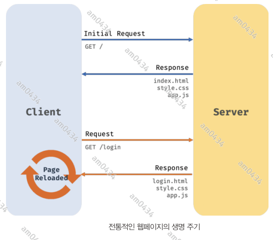
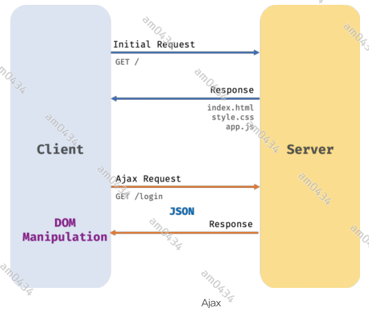

## 43장 Ajax
### 43.1 Ajax 란?
Ajax(Asynchronous Javascript and XML)란 자바스크립트를 사용하여 브라우저가 서버에게 비동기 방식으로 데이터를 요청하고, 서버가 응답한 데이터를
수신하여 웹페이지를 동적으로 갱신하는 프로그래밍 방식을 말한다. Ajax는 브라우저에서 제공하는 Web API 인 XMLHttpRequest 객체를 기반으로 동작한다.
XMLHttpRequest는 HTTP 비동기 통신을 위한 메서드와 프로퍼티를 제공한다.   
이전의 웹페이지는 html 태그로 시작해서 html 태그로 끝나는 완전한 HTML을 서버로부터 전송받아 웹페이지 전체를 처음부터 렌더링하는 방식으로 동작했다.
따라서 화면이 전환되면 서버로부터 새로운 HTML을 전송받아 웹페이지 전체를 처음부터 다시 렌더링했다.



이러한 전통적인 방식은 다음과 같은 단점이 있다.
1. 이전 윂페이지와 차이가 없어서 변경할 필요가 없는 부분까지 포함한 완전한 HTML을 서버로부터 매번 다시 전송받기 때문에 불필요한 데이터 통신이 발생한다.
2. 변경할 필요가 없는 부분까지 처음부터 다시 렌더링한다. 이로 인해 화면 전환이 일어나면 순간적으로 깜박이는 현상이 발생한다.
3. 클라이언트와 서버와의 통신이 동기 방식으로 동작하기 때문에 서버로부터 응답이 있을 때까지 다음 처리는 블로킹된다.
  
Ajax의 등장은 이러한 전통적인 패러다임을 획기적으로 전환했다. 즉, 서버로부터 웹페이지의 변경에 필요한 데이터만 비동기 방식으로 전송받아 웹페이지를 
변경할 필요가 없는 부분은 다시 렌더링하지 않고, 변경할 필요가 있는 부분만 한정적으로 렌더링하는 방식이 가능해진 것이다. 이를 통해 브라우저에서도 
데스트톱 애플리케이션과 유사한 빠른 퍼포먼스와 부드러운 화면 전환이 가능해졌다.



Ajax는 전통적인 방식과 비교했을 때 다음과 같은 장점이 있다.
1. 변경할 부분을 갱신하는 데 필요한 데이터만 서버로부터 전송받기 때문에 불필요한 데이터 통신이 발생하지 않는다.
2. 변경할 필요가 없는 부분은 다시 렌더링하지 않는다. 따라서 화면의 깜박이는 현상이 발생하지 않는다.
3. 클라이언트와 서버와의 통신이 비동기 방식으로 동작하기 때문에 블로킹이 발생하지 않는다.

### 43.2 JSON
JSON(JavaScript Object Notation)은 클라이언트와 서버 간의 HTTP 통신을 위한 텍스트 데이터 포맷이다.자스에 종속되지 않는 언어 독립형 데이터 포맷으로,
대부분의 프로그래밍 언어에서 사용할 수 있다.

#### 43.2.1 JSON 표기 방식
JSON은 자스의 객체 리터럴과 유사하게 키와 값으로 구성된 순수한 텍스트다.
```json
{
  "name": "lee",
  "age": 23,
  "hobby": ["soccer","sleep"]
}
```
**JSON의 키는 반드시 큰따옴표(작은 따옴표 사용불가)로 묶어야 한다. 값은 객체 리터럴과 같은 표기법을 그대로 사용할 수 있다. 하지만 문자열은 반드시
큰따옴표로 묶어야 한다.**

#### 43.2.2 JSON.stringify
**JSON.stringify 메서드는 객체를 JSON 포맷의 문자열로 변환**한다. 클라이언트가 서버로 객체를 전송하려면 객체를 문자열화해야 하는데 이를 **_직렬화_**라 한다.

```javascript
const obj = {
    name: 'lee',
    age: 10,
    hobby: ['traveling','soccer']
}
console.log(obj) //{ name: 'lee', age: 10, hobby: [ 'traveling', 'soccer' ] }

const json = JSON.stringify(obj)
console.log(json) // {"name":"lee","age":10,"hobby":["traveling","soccer"]}
console.log(typeof json) // string

// 세번째 인수 객체를 JSON 포맷의 문자열로 변환하면서 들여쓰기를 한다.
const prettierJson = JSON.stringify(obj,null,2)
console.log(prettierJson)
/*
{
  "name": "lee",
  "age": 10,
  "hobby": [
    "traveling",
    "soccer"
  ]
}
 */

// replacer 함수, 값의 타입이 Number이면 필터링되어 반환되지 않는다.
function filter (key, value) {
    // undefined - 반환하지 않음
    return typeof value ==='number'?undefined: value;
}

const replacerJson = JSON.stringify(obj,filter,2)
console.log(replacerJson)
/*
{
  "name": "lee",
  "hobby": [
    "traveling",
    "soccer"
  ]
}
*/

```
JSON.stringfy 메서드는 객체뿐만 아니라 배열도 JSON 포맷의 문자열로 변환한다.

#### 43.2.3 JSON.parse
JSON.parse 메서드는 JSON 포맷의 문자열을 객체로 변환한다. 서버로부터 클라이언트에게 전송된 JSON 데이터는 문자열이다. 이 문자열을 객체로서 사용하려면
JSON 포맷의 문자열을 객체화해야 하는데 이를 역직렬화라 한다.

### 43.3 XMLHttpRequest
#### 43.3.1 XMLHttpRequest 객체 생성
#### 43.3.2 XMLHttpRequest 객체의 프로퍼티와 메서드
#### 43.3.3 HTTP 요청 전송
#### 43.3.4 HTTP 응답 처리

-----------------------------------------------------------------------------------

## 44장 REST API


----------------------------------------------------------------------------------

## 45장 프로미스
자바스크립트는 비동기 처리를 위한 하나의 패턴으로 콜백 함수를 사용한다. 하지만 전통적인 콜백 패턴은 콜백 헬로 인해 가독성이 나쁘고 에러의 처리가 곤란하며
여러 개의 비동기 처리를 한번에 처리하는 데도 한계가 있다.
ES6에서 비동기 처리를 위한 또 다른 패턴으로 프로미스를 도입했다. 프로미스는 전통적인 콜백 패턴이 가진 단점을 보완하면서 비동기 처리 시점을 명확하게
표현할 수 있다는 장점이 있다.

### 45.1 비동기 처리를 위한 콜백 패턴의 단점
#### 45.1.1 콜백 헬
아래 예제는 GET 요청을 위한 함수이다.

```javascript
const get = url => {
    // XMLHttpRequest 는 브라우저 환경에서 실행가능하다.
    const xhr = new XMLHttpRequest();
    xhr.open('GET', url);
    xhr.send();

    xhr.onload= () => {
        if(xhr.status === 200) {
            console.log(JSON.parse(xhr.response));
        } else {
            console.error(`${xhr.status} ${xhr.statusText}`);
        }
    };
};

get('https://jsonplaceholder.typicode.com/posts/1',)
/*
{
    userId: 1, 
    id: 1, 
    title: 'sunt aut facere repellat provident occaeca ...', 
    body: 'quia et suscipit\nsuscipit  architecto ...'
}
 */
```
get 함수는 비동기 함수다. 비동기 함수란 내부에 비동기로 동작하는 코드를 포함한 함수를 말한다. 비동기 함수를 호출하면 함수 내부의 비동기로 동작하는 코드가 완료되지
않았다 해도 기다리지 않고 즉시 종료된다. 즉, 비동기 함수 내부의 비동기로 동작하는 코드는 비동기 함수가 종료된 이후에 완료된다. 따라서 비동기 함수 내부의 비동기로
동작하는 코드에서 처리 결과를 외부로 반환하거나 상위 스코프의 변수에 할당하면 기대한 대로 동작하지 않는다.    
예를 들어, setTimeout 함수가 비동기 함수인 이유는 콜백 함수의 호출이 비동기로 동작하기 때문이다. 즉 비동기 함수인 setTimeout 함수의 콜백 함수는 setTimeout 함수가
종료된 이후에 호출된다. 따라서 setTimeout 함수 내부의 콜백 함수에서 처리한 결과를 외부로 반환하거나 상위 스코프의 변수에 할당하면 기대한 대로 동작하지 않는다.
```javascript
let g =0;
setTimeout(()=>g=100,0)
console.log(g)//0
```

GET 요청을 전송하고 서버의 응답을 전달받는 get 함수도 비동기 함수다. **get 함수가 비동기 함수인 이유는 get 함수 내부의 onload 이벤트 핸들러가 비동기로 동작하기 때문**이다.
get 함수를 호출하면 GET 요청을 전송하고 onload 이벤트 핸들러를 등록한 다음 undefined를 반환하고 즉시 종료된다. 즉 비동기 함수인 get 함수 내부의 onload
이벤트 핸들러는 get 함수가 종료된 이후에 실행된다. 따라서 get 함수의 onload 이벤트 핸들러에서 서버의 응답 결과를 반환하거나 상위 스코프의 변수에 할당하면 기대한 대로
동작하지 않는다.

get 함수가 서버의 응답 결과를 반환하도록 아래와 같이 수정했다.
```javascript
const get = url => {
    // XMLHttpRequest 는 브라우저 환경에서 실행가능하다.
    const xhr = new XMLHttpRequest();
    xhr.open('GET', url);
    xhr.send();

    xhr.onload= () => {
        if(xhr.status === 200) {
            // 서버의 응답을 반환
            return xhr.response
        } else {
            console.error(`${xhr.status} ${xhr.statusText}`);
        }
    };
};

const response = get('https://jsonplaceholder.typicode.com/posts/1',)
console.log(response) // undefined
```
xhr.onload 이벤트 핸들러 프로퍼티에 바인딩한 이벤트 핸들러의 반환문은 get 함수의 반환문이 아니다. get 함수는 반환문이 생략되었으므로 암묵적으로 undefined를
반환한다. 함수의 반환값은 명시적으로 호출한 다음에 캐치할 수 있으므로 onload 이벤트 핸들러를 get 함수가 호출할 수 있다면 이벤트 핸들러의 반환값을 get 함수가
캐치하여 다시 반환할 수도 있겠지만 onload 이벤트 핸들러는 get 함수가 호출하지 않기 때문에 그럴 수도 없다. 따라서 onload 이벤트 핸들러의 반환값은
캐치할 수 없다.

비동기 함수 get이 호출되면 함수 코드를 평가하는 과정에서 get 함수의 실행 컨텍스트가 생성되고 실행 컨텍스트 스캑(콜 스택)에 푸시된다. 이후 함수 코드 실행
과정에서 xhr.onload 이벤트 핸들러 프로퍼티에 이벤트 핸들러가 바인딩된다.  
get 함수가 종료하면 get 함수의 실행 컨텍스트가 콜 스택에서 팝되고, 곧바로 console.log(코드 마지막)가 호출된다. 이때 console.log의 실행 컨텍스트가 
생성되어 실행 컨텍스트 스택에 푸시된다. 만약 console.log 가 호출되기 직전에 load 이벤트가 발생했더라도 xhr.onload 이벤트 핸들로 프로퍼티에 바인딩한
이벤트 핸들러는 결코 console.log 보다 먼저 실행되지 않는다.    
서버로부터 응답이 도착하면 xhr 객체에서 load 이벤트가 발생한다. 이때 xhr.onload 핸들러 프로퍼티에 바인딩한 이벤트 핸들러가 즉시 실행되는 것이 아니다.
xhr.onload 이벤트 핸들러는 load 이벤트가 발생하면 일단 태스크 큐에 저장되어 대기하다가, 콜 스택이 비면 이벤트 루프에 의해 콜 스택으로 푸시되어 실행된다.    
따라서 xhr.onload 이벤트 핸들러가 실행되는 시점에는 콜 스택이 빈 상태여야 하므로 console.log는 이미 종료된 이후다.    
   
**이처럼 비동기 함수는 비동기 처리 결과를 외부에 반환할 수 없고, 상위 스코프의 변수에 할당할 수도 없다. 따라서 비동기 함수의 처리 결과(서버의 응답 등)에 대한
후속 처리는 비동기 함수 내부에서 수행해야 한다. 이때 비동기 함수를 범용적으로 사용하기 위해 비동기 함수에 비동기 처리 결과에 대한 후속 처리를 수행하는 콜백
함수를 전달하는 것이 일반적이다. 필요에 따라 비동기 처리가 성공하면 호출될 콜백 함수와 비동기 처리가 실패하면 호출될 콜백 함수를 전달할 수 있다.**  
  
하지만 콜백 함수를 통해 비동기 처리 결과에 대한 후속 처리를 수행하는 비동기 함수가 비동기 처리 결과를 가지고 또다시 비동기 함수를 호출해야 한다면 호출이 중첩되어
복잡도가 높아지는 현상이 발생하는데, 이를 콜백 핼이라 한다.

#### 45.1.2 에러 처리의 한계
비동기 처리를 위한 콜백 패턴의 문제점 중에서 가장 심각한 것은 에러 처리가 곤란하다는 것이다.

이러한 단점을 극복하기 위해 프로미스(Promise)가 도입됐다.

### 45.2 프로미스의 생성
Promise 생성자 함수를 new 연산자와 함께 호출하면 프로미스(Promise 객체)를 생성한다. Promise는 호스트 객체가 아닌 ECMAScript 사양에 정의된 표준 빌트인
객체이다.    
Promise 생성자 함수는 비동기 처리를 수행할 콜백 함수를 인수로 전달받는데 이 콜백 함수는 resolve와 reject 함수를 인수로 전달받는다.

```javascript
// 프로미스 생성
const promise = new Promise((resolve,reject) => {
    // Promise 함수의 콜백 함수 내부에서 비동기 처리를 수행한다.
    if(/* 비동기 처리 성공*/) {
        resolve('result');
    } else { /* 처리 실패 */
        reject('failure reason')
    }
})
```
Promise 생성자 함수가 인수로 전달받은 콜백 함수 내부에서 비동기 처리를 수행한다. 이때 비동기 처리가 성공하면 콜백 함수의 인수로 전달받은 resolve 함수를
호출하고, 실패하면 reject 함수를 호출한다. 앞선 예제의 비동기 함수 get을 프로미스를 사용해서 다시 구현해보자.

```javascript
const get = url => {
    return new Promise((resolve, reject) => {
        const xhr = new XMLHttpRequest();
        xhr.open("GET", url);
        xhr.send()

        xhr.onload = () => {
            if (xhr.status === 200) {
                resolve(JSON.parse(xhr.response));
            } else {
                reject(new Error(xhr.status));
            }
        };
    });
};

// 후속 처리
get('https://jsonplaceholder.typicode.com/posts/1')
    .then(r => console.log(r))
    .catch(e=>console.error(e))
    .finally(()=>console.log('bye!'));
```
비동기 함수인 get 함수 내부에서 프로미스를 생성하고 반환한다. 비동기 처리는 Promise 생성자 함수가 인수로 전달받은 콜백 함수 내부에서 수행한다.
만약 비동기 처리가 성공하면 비동기 처리 결과를 resolve 함수에 인수로 전달하면서 호출하고, 비동기 처리가 실패하면 에러를 reject 함수에 인수로 전달하면서
호출한다.

프로미스는 다음과 같이 현재 비동기 처리가 어떻게 진행되고 있는지를 나타내는 상태 정보를 갖는다.

프로미스 상태 정보 | 의미 | 상태 변경 조건
:---|:---|:---
pending | 비동기 처리가 아직 수행되지 않은 상태 | 프로미스가 생성된 직후 기본 상태
fulfilled| 비동기 처리가 수행된 상태(성공) | resolve 함수 호출
rejected | 비동기 처리가 수행된 상테(실패) | reject 함수 호출

    
생성된 직후의 프로미스는 기본적으로 pending 상태다. 이후 비동기 처리가 수행되면 비동기 처리 결과에 따라 다음과 같이 상태가 변경된다.
- 비동기 처리 성공 : resolve 함수를 호출해 프로미스를 fulfilled 상태로 변경
- 비동기 처리 실패 : reject 함수를 호출해 프로미스를 rejected 상태로 변경

즉 프로미스는 비동기 처리 상태와 처리 결과를 관리하는 객체다.

### 45.3 프로미스의 후속 처리 메서드
프로미스의 비동기 처리 상태가 변화하면 이에 따른 후속 처리를 해야 한다. 예를 들어, 프로미스가 fulfilled 상태가 되면 프로미스의 처리 결과를 가지고
무언가를 해야 하고, 프로미스가 reject 상태가되면 프로미스의 처리 결과(에러)를 가지고 에러 처리를 해야 한다. 이를 위해 프로미스는 후속 메서드 then,
catch, finally 를 제공한다.   
**프로미스의 비동기 처리 상태가 변화하면 후속 처리 메서드에 인수로 전달한 콜백 함수가 선택적으로 호출**된다. 이때 후속 처리 메서드의 콜백 함수에 프로미스의
처리 결과를 인수로 전달된다.

#### 45.3.1 Promise.prototype.then
then 메서드는 두 개의 콜백 함수를 인수로 전달받는다.
- 첫 번째 콜백 함수는 프로미스가 fulfilled 상태(resolve 함수가 호출된 상태)가 되면 호출된다. 이때 콜백 함수는 프로미스의 비동기 처리 결과를 인수로 전달받는다.
- 두 번째 콜백 함수는 프로미스가 rejected 상태(reject 함수가 호출된 상태)가 되면 호출된다. 이때 콜백 함수는 프로미스의 에러를 인수로 전달받는다.

then 메서드는 언제나 프로미스를 반환한다. 만약 then 메서드의 콜백 함수가 프로미스를 반환하면 그 프로미스를 그대로 반환하고, 프로미스가 아닌 값을 반환하면
그 값을 암묵적으로 resolve 또는 reject 하여 프로미스를 생성해 반환한다.

#### 45.3.2 Promise.prototype.catch
catch 메서드는 한 개의 콜백 함수를 인수로 받는다. catch 메서드의 콜백 함수는 프로미스가 rejected 상태인 경우만 호출된다. then 과 동일하게 동작하며,
언제나 프로미스를 반환한다

#### 45.3.3 Promise.prototype.finally
finally는 한개의 콜백 함수를 인수로 전달받는다. finally 메서드의 콜백 함수는 프로미스의 성공과 실패 상관없이 무조건 한 번 호출된다. 이 메서드는 프로미스의
상태와 상관없이 공통적으로 수행해야 할 처리 내용이 있을 때 유용하다. 언제나 프로미스를 반환한다.

### 45.4 프로미스의 에러 처리
프로미스는 에러를 문제없이 처리할 수 있다. then 메서드의 두번째 콜백함수를 사용하거나 catch 메서드를 사용할 수 있다. 가독성과 편의성 면에서 catch 메서드를
사용하는것을 권장한다.

### 45.5 프로미스 체이닝
then, catch, finally 후속 처리 메서드는 언제나 프로미스를 반환하므로 연속적으로 호출할 수 있다.   
프로미스는 프로미스 체이닝을 통해 비동기 처리 결과를 전달받아 후속 처리를 하므로 비동기 처리를 위한 콜백 패턴에서 발생하던 콜백 헬이 발생하지 않는다.
다만 프로미스도 콜백 패턴을 사용하므로 콜백 함수를 사용하지 않는 것은 아니다.   
콜백 패턴은 가독성이 좋지 않다. 이 문제는 async/await 을 통해 해결할 수 있다. async/await 을 사용하면 프로미스의 후속 처리 메서드 없이 마치 동기
처리처럼 프로미스가 처리 결과를 반화하도록 구현할 수 있다.

### 45.6 프로미스의 정적 메서드
Promise 는 5가지 정적 메서드를 제공한다.

#### 45.6.1 Promise.resolve / Promise.reject

#### 45.6.2 Promise.all
여러 개의 비동기 처리를 모두 병렬 처리할 때 사용한다. Promise.all 메서드는 프로미스를 요소로 갖는 배열 등의 이터러블을 인수로 전달받는다. 그리고
전달받은 모든 프로미스가 모두 fulfilled 상태가 되면 모든 처리 결과를 배열에 저장해 새로운 프로미스를 반환한다.

#### 45.6.3 Promise.race
all 과 동일하게 프로미스를 요소로 갖는 배열 등의 이터러블을 인수로 전달받는다. 하지만 모든 프로미스가 fulfilled 상태가 되는 것을 기다리는 것이 아니라
가장 먼저 fulfilled 상태가 된 프로미스의 처리 결과를 resolve 하는 새로운 프로미스를 반환한다. reject 상태가 되면 all 메서드와 동일하게 처리된다. 즉 전달된
프로미스가 하나라도 reject 상태가 되면 에러를 reject하는 새로운 프로미스를 즉시 반환한다.

#### 45.6.4 Promise.allSettled
프로미스를 요소로 갖는 배열 등의 이터버블을 인수로 전달받는다. 그리고 전달받은 프로미스가 모두 settled 상태(비동기 처리가 수행된 상태)가 되면 처리
결과를 반환한다. fulfilled 또는 reject 상태와는 상관이 없이 인수로 전닯다은 모든 프로미스들의 처리 결과를 반환한다. 

### 45.7 마이크로태스크 큐
```javascript
setTimeout(()=>console.log(1),0);

Promise.resolve()
.then(()=>console.log(2))
.then(()=>console.log(3));
```

1 2 3 순으로 출력할 것 같지만 2 3 1 순으로 출력된다. 그 이유는 프로미스의 후속 처리 메서드의 콜백 함수는 태스크 큐가 아니라 마이크로태스크 큐에
저장되기 때문이다.    
마이크로태스크 큐는 태스크 큐와는 별도의 큐다. 마이크로태스크 큐에는 프로미스의 후속 처리 메서드의 콜백 함수가 일시 저장된다.  
콜백 함수나 이벤트 핸들러를 일시 저장한다는 점에서 동일하지만 **_마이크로태스크 큐는 태크수 큐보다 우선순위가 높다._** 

### 45.8 fetch
fetch 함수는 HTTP 요청 전송을 제공하는 클라이언트 사이드 Web API다. 사용법이 간단하고 프로미스를 지원하기 때문에 비동기 처리를 위한 콜백 패턴의
단점에서 자유롭다.   
**fetch 함수가 반환하는 프로미는 기본적으로 404 Not Found, 500 Internal Server Error 와 같은 HTTP 에러를 발생해도 reject 하지 않고 불리언 타입의
ok 상태를 false 로 설정한 Response 객체를 resolve 한다. 오프라인 등의 네트워크 장애나 CORS 에러에 의해 요청이 완료되지 못한 경우에만 프로미스를
reject 한다.   
따라서 fetch 함수를 사용할 때는 다음과 같이 fetch 함수가 반환한 프로미스가 resolve한 불리언 타입의 ok 상태를 확인해 명시적으로 에러를 처리할 필요가 있다.**


