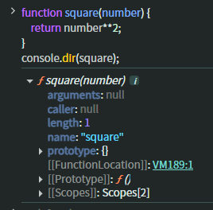

## ch15 - let, const 키워드와 블록 레벨 스코프

### 15.1 var 키워드로 선언한 변수의 문제점
var 키워드로 변수를 선언하는 경우 주의를 기울이지 않으면 심각한 문제가 발생할 수 있다.

#### 15.1.1 변수 중복 선언 허용
#### 15.1.2 함수 레벨 스코프
#### 15.1.3 변수 호이스팅

### 15.2 let 키워드
#### 15.2.1 변수 중복 선언 금지
#### 15.2.2 블록 레벨 스코프
let 키워드로 선언한 변수는 모든 코드 블록을 지역 스코프로 인정하는 블록 레벨 스코프를 따른다.
#### 15.2.3 변수 호이스팅
let 키워드로 선언한 변수는 변수 호이스팅이 발생하지 않는 것처럼 동작한다. var 키워드로 선언한 변수는 런타임 이전에 자스 엔진에 의해 암묵적으로
선언 단계와 초기화 단계(undefined)가 한번에 진행된다. 그리고 런타임에 변수 할당문에 도달하면 비로소 값이 할당된다.  
let 키워드로 선언한 변수는 선언과 초기화가 분리되어 진행된다. 즉, 런타임 이전에 자스 엔진에 의해서 선언이 이뤄지지만 초기화는 변수 선언문에 도달했을 때
초기화(undefined)되고, 값이 할당 되는 지점에서 할당이 이뤄진다. 따라서 스코프의 시작 지점부터 초기화 단계(선언부분) 직전 까지는 변수를 참조할 수 없다.
이 구간을 일시작 사각지대라고 부른다.  
결국 let 키워드로 선언한 변수는 호이스팅이 발생하지 않는 것처럼 보인다. 하지만 그렇지 않다. 다음 예제를 보면, 만약 호이스팅이 발생하지 않는다면
전역변수 1을 출력해야 된다. 하지만 호이스팅(블록 안에서)이 발생하기 때문에 참조 에러가 발생한다.
```javascript
let foo =1;
{
  console.log(foo); // ReferenceError : Cannot access 'foo' before initialization
  let foo =2;
}
```
#### 15.2.4 전역 객체와 let
let 키워드로 선언한 전역 변수는 전역 객체의 프로퍼티가 아니다. let 전역 변수는 보이지 않는 개념적인 블록(전역 렉시컬 환경의 선언적 환경 레코드, 23장에서 보겠다.)
내에 존재한다.

### 15.3 const 키워드
상수를 선언하기 위해 사용한다. 하지만 반드시 상수만을 위해 사용하지는 않는다. let 키워드와 대부분 동일하므로 let 키워드와 다른 점을 중심으로 보겠다.

#### 15.3.1 선언과 초기화
const 키워드로 선언한 변수는 반드시 선언과 동시에 초기화해야 한다.
#### 15.3.2 재할당 금지
#### 15.3.3 상수
const 키워드로 선언한 변수에 원시 값을 할당한 경우 변수 값을 변경할 수 없다. **즉, 상수는 재할당이 금지된 변수를 말한다.** 상수는 상태 유지와 가독성, 유지보수의 편의를 위해 적극적으로 사용해야 한다.  
일반적으로 상수의 이름은 대문자로 선언해 상수임을 명확히 나타낸다. 여러 단어로 이뤄진 경우에는 언더스코어(_)로 구분해서 스네이크 케이스로 표현한다.
#### 15.3.4 const 키워드와 객체
const 키워드로 선언된 변수에 원시 값을 할당한 경우 값을 변경(재할당)할 수 없다. **하지만 const 키워드로 선언된 변수에 객체를 할당한 경우 값을 변경할 수 있다.**
변경 불가능한 값인 원시 값은 재할당 없이 변경(교체)할 수 있는 방법이 없지만 변경 가능한 값이 객체는 재할당 없이도 변경이 가능하기 때문이다.  
즉, const 키워드는 재할당을 금지할 뿐 "불변"을 의미하지 않는다.

### 15.4 var vs. let vs. const
- ✨ var 키워드는 사용하지 않는다.
- ✨ 재할당이 필요한 경우에 한정이 let을 사용한다. 이때 스코프는 최대한 좁게 만든다.
- ✨ 변수를 선언하는 시점에는 재할당이 필요할지 잘 모른다. 그리고 객체는 의외로 재할당이 드물다. 따라서 일단 const 를 사용한다. 그리고 나중에 let으로 바꿔도 는지 않다.

---------------------------------------------------------------------------

## ch16 - 프로퍼티 어트리뷰트
### 16.1 내부 슬롯과 내부 메서드
내부 슬롯과 내부 메서드는 자스 엔진의 구현 알고리즘을 설명하기 위해 ECMAScript 사양에서 사용하는 의사 프로퍼티와 의사 메서드다. 이중 대괄호([[...]])
로 감싼 이름들이 내부 슬롯과 내부 메서드다. 이것들은 실제로 동작하지만 개발자가 직접 접근하도록 공개된 객체의 프로퍼티는 아니다. 즉, 자스 엔진의 내부 로직으로
원칙적으로 접근과 호출할 수 있는 방법을 제공하지 않는다. 단, 일부에 한하여 접근할 수 있도록 방법을 제공한다.  
예를 들어, 모든 객체는 [[Prototype]] 이라는 내부 슬롯을 갖는다. 이 경우, __proto__ 를 통해 간접적으로 접근할 수 있다.

### 16.2 프로퍼티 어트리뷰트와 프로퍼티 디스크립터 객체
자스 엔진은 프로퍼티를 생성할 때 프로퍼티의 상태를 나타내는 프로퍼티 어트리뷰트를 기본값으로 자동 정의한다. **프로퍼티의 상태란 프로퍼티의 값(value),
값의 갱신 가능 여부(writable), 열거 가능 여부(enumerable), 재정의 가능 여부(configurable)를 말한다.**  
프로퍼티 어트리뷰트는 자스 엔진이 관리하는 내부 상태 값인 내부 슬롯[[Value]],[[Writable]],...   이다. 따라서 직접 접근할 수 없지만
Object.getOwnPropertyDescriptor 또는 Object.getOwnPropertyDescriptors 메서드를 사용해서 간접적으로 확인할 수 있다.

### 16.3 데이터 프로퍼티와 접근자 프로퍼티
프로퍼티는 데이터 프로퍼티와 접근자 프로퍼티로 구분한다.
- 데이터 프로퍼티 : 키와 값으로 구성된 일반적인 프로퍼티
- 접근자 프로퍼티 : 자체적으로는 값을 갖지 않고 다른 데이터 프로퍼티의 값을 읽거나 저장할 때 호출되는 접근자 함수로 구성된 프로퍼티

#### 16.3.1 데이터 프로퍼티
데이터 프로퍼티는 [[Value]], [[Writable]], [[Enumerable]], [[Configurable]] 의 어트리뷰트(속성)을 갖는다.

#### 16.3.2 접근자 프로퍼티
접근자 프로퍼티는 자체적으로 값을 갖지 않고 다른 데이터 프로퍼티의 값을 읽거나 저장할 때 사용하는 접근자 함수로 구성된 프로퍼티다.
[[Get]],[[Set]],[[Enumerable]],[[Configurable]] 의 속성을 갖는다.  
접근자 함수는 getter/setter 함수라고도 부른다. 접근자 프로퍼티는  getter 와 setter 함수를 모두 정의할 수 있꼬 하나만 정의할 수도 있다. 
`16.3.2.js`의 메서드 앞에 get, set 이 붙은 메서드가 있는데 이것들이 바로 getter, setter 함수이고, 함수의 이름 fullName이 접근자 프로퍼티이다.
이 프로퍼티는 자체적으로 값을 가지지 않으며 데이터 프로퍼티의 값을 읽거나 저장할 때 관여할 뿐이다. 위의 코드의 데이터 프로퍼티와 접근자 프로퍼티를
비교해보면 다음과 같다.
```
{
  firstName: {
    value: 'lee',
    writable: true,
    enumerable: true,
    configurable: true
  },
  lastName: {
    value: 'crazy',
    writable: true,
    enumerable: true,
    configurable: true
  },
  fullName: {
    get: [Function: get fullName],
    set: [Function: set fullName],
    enumerable: true,
    configurable: true
  }
```

### 16.4 프로퍼티 정의
새로운 프로퍼티를 추가하면서 프로퍼티 어트리뷰트를 명시적으로 정의하거나, 기존 프로퍼티 어트리뷰트를 재정의하는 것을 말한다.
Object.defineProperty 메서드를 사용하면 프로퍼티의 어트리뷰트를 정의할 수 있따. 인수로는 객체의 참조와 데이터 프로퍼티의 키인 문자열, 프로퍼티
디스크립터 객체를 전달한다.`16.4.js` 그리고 Object.defineProperties 메서드를 사용하면 여러개의 프로퍼티를 한번에 정의할 수 있다.

### 16.5 객체 변경 방지
#### 16.5.1 객체 확장 방지
Object.preventExtentions 메서드는 객체의 확장을 금지한다. 프로퍼티 추가 금지를 의미한다. 확장이 가능한 객체인지 여부는 Object.isExtensible
메서드로 확인할 수 있다.
#### 16.5.2 객체 밀봉
Object.seal 메서드는 객체를 밀봉한다. 프로퍼티 추가 및 삭제와 프로퍼티 어트리뷰트 재정의 금지를 의미(프로퍼티 값의 갱신은 가능)한다. 즉, 밀봉된 객체는 읽기와 쓰기만 가능한다.
밀봉된 객체인지 여부는 Object.isSealed 메서드로 확인한다.
#### 16.5.3 객체 동결
Object.freeze 메서드는 객체를 동결한다. 동결된 객체는 읽기만 가능한다. Object.isFrozen 메서드로 확인할 수 있다.
#### 16.5.4 불변객체
Object.freeze 메서드로 객체를 동결해도 중첩 객체까지 동결할 수 없다. 객체의 중첩까지 동결하려면 객체를 값으로 갖는 모든 프로퍼티에 대해
재귀적으로 Object.freeze 메서드를 호출해야 한다.

----------------------------------------------

## ch17 - 생성자 함수에 의한 객체 생성
객체 리터럴을 사용하여 객체를 생성하는 방식과 생성자 함수를 사용하여 객체를 생성하는 방식과의 장단점을 살펴본다.

### 17.1 Object 생성자 함수
new 연산자와 함께 Object 생성자 함수를 호출하면 빈 객체를 생성하여 반환한다. 빈 객체를 생성한 이후 프로퍼티 또는 메서드를 추가하여 객체를 완성한다.
```javascript
const person = new Object();

person.age = 32;
person.name = 'lee';

```
이 방식은 특별한 이유가 없다면 그다지 유용해 보이지 않는다.

### 17.2 생성자 함수
#### 17.2.1 객체 리터럴에 의한 객체 생성 방식의 문제점
객체 리터럴에 의한 객체 생성 방식은 직관적이고 간편하다. 하지만 이 방식은 단 하나의 객체만 생성한다. 따라서 동이한 프로퍼티를 갖는 객체를 여러 개
생성해야 하는 경우 매번 같은 프로퍼티를 기술해야 하기 때문에 비효율적이다.

#### 17.2.2 생성자 함수에 의한 객체 생성 방식의 장점
템플릿(클래스)처럼 생성자 함수를 사용하여 프로퍼티 구조가 동일한 객체 여러 개를 간편하게 생성할 수 있다.`17.2.2.js`  
여기서 this는 객체 자신의 프로퍼티나 메서드를 참조하기 위한 자기 참조 변수다. this가 가리키는 값, 
즉 this 바인딩은 함수 호출 방식에 따라 동적으로 결정된다.
- 일반 함수로서 호출 : 전역 객체
- 메서드로서 호출 : 메서드를 호출한 객체
- 생성자 함수로서 호출 : 생성자 함수가 (미래에) 생성할 인스턴스

생성자 함수는 이름 그대로 객체를 생성하는 함수다. 하지만 자스의 생성자는 형식이 정해져 있지 않고 일반 함수와 동일한 방법으로 생성자 함수를 정의하고
**new 연산자와 함께 호출하면 해당 함수는 생성자 함수로 동작한다. 만약 new 연산자와 함께 생성자 함수를 호출하지 않으면 일반 함수로 동작**한다.


#### 17.2.3 생성자 함수의 인스턴스 생성 과정
`17.2.3.js`

1. 인스턴스 생성과 this 바인딩
2. 인스턴스 초기화
3. 인스턴스 반환
생성자 함수 내부의 모든 처리가 끝나면 완성된 인스턴스가 바인됭된 this를 암묵적으로 반환한다. 만약 this가 아닌 다른 객체를 명시적으로 반환하면
명시된 객체가 반환된다. 하지만 명시적으로 원시 값을 반환하면 원시 값은 무시되고 암묵적으로 this가 반환된다.  
이처럼 생성자 함수 내부에서 명시적으로 this가 아닌 다른 값을 반환하는 것은 생성자 함수의 기본 동작을 훼손한다. **따라서 생성자 함수의 return 문은 반드시 생략한다.**

#### 17.2.4 내부 메서드 [[Call]] 과 [[Construct]]
함수는 객체이지만 일반 객체와는 다르다. 일반 객체는 호출할 수 없지만 함수는 호출할 수 있다. 함수가 일반 함수로서 호출되면 함수 객체의
내부 메서드 [[Call]]이 호출되고 new 연산자와 함께 생성자 함수로서 호출되면 [[Construct]]가 호출된다.  
Call 을 갖는 함수 객체를 callable 이라 하며, Construct 를 갖는 함수 객체를 constructor(non-constructor) 라고 부른다.
함수 객체는 callable 이면서 constructor 이거나 callable 이면서 non-constructor 이다.

#### 17.2.5 constructor 와 non-constructor 구분
- constructor : 함수 선언문, 함수 표현식, 클래스(클래스도 함수다)
- non-constructor : 메서드(ES6 의 축약표현), 화살표 함수

`17.2.5.js` 함수를 프로퍼티 값으로 사용하면 일반적으로 메서드로 통칭하지만, non-constructor 로 구분하는 것은 메서드 축약표현으로 정의된 메서드이다.

#### 17.2.6 new 연산자

#### 17.2.7 new.target
함수 내부에서 new.target을 사용하면 new 연산자와 함께 생성자 함수로서 호출되었는지 확인할 수 있다. new 연산자와 함께 생성자 함수로서 호출되면 함수 내부의
new.target은 함수 자신을 가리킨다. new 연산자 없이 일반 함수로서 호출된 함수 내부의 new.target 은 undefined 다.`17.2.7.js`

----------------------------------------------

## ch18 - 함수와 일급 객체

### 18.1 일급 객체
다음과 같은 조건을 만족하는 객체를 일급 객체라 한다.
1. 무명의 리터럴로 생성할 수 있다. 즉, 런타임에 생성이 가능하다.
2. 변수나 자료구조(객체, 배열 등)에 저장할 수 있다.
3. 함수의 매개변수에 전달할 수 있다.
4. 함수의 반환값으로 사용할 수 있다.

자스의 함수는 일급 객체다. 이것은 함수를 객체와 동일하게 사용할 수 있다는 것이다. 객체는 값이므로 함수를 값과 동일하게 취급한다.
따라서 함수는 값을 사용할 수 있는 곳(변수 할당문, 객체의 프로퍼티, 배열의 요소, 함수 호출의 인수, 반환문 등...)이라면 어디든
리터럴로 정의할 수 있으며 런타임에 객체로 평가된다.  
가장 큰 장점은 함수의 매개변수에 전달할 수 있으며, 함수의 반환값으로 사용할 수도 있다는 것이다.

### 18.2 함수 객체의 프로퍼티
함수는 객체다. 따라서 함수도 프로퍼티를 가질 수 있다. 브라우저 콘솔에 console.dir 메서드를 사용해서 내부를 들여다보겠다.


Object.getOwnPropertyDescriptors 메서드로 프로퍼티 어트리뷰트를 확인할 수 있다.  
arguments, caller, length, name, prototype 프로퍼티는 모두 함수 객체의 데이터 프로퍼티이다.

#### 18.2.1 arguments 프로퍼티
함수 객체의 arguments 프로퍼티 값은 arguments 객체다. 이 객체는 함수 호출 시 전달된 인수들의 정보를 담고 있는 순회 가능한 유사 배열 객체이며,
함수 내부에서 지역 변수처럼 사용된다.
arguments 객체는 매개변수 개수를 확정할 수 없는 가변 인자 함수를 구현할 때 유용하다. 이 객체는 배열 형태로 인자 정보를 담고 있지만 실제 배열이
아닌 유사 배열 객체다. 사용하기에 번거로울 수 있다. 그래서 ES6 에서는 Rest 파라미터를 도입했다(...args). Rest 파라미터는 나중에 살펴본다.

#### 18.2.2 caller 프로퍼티
함수 객체의 caller 프로퍼티는 함수 자신을 호출한 함수르 가리킨다.

#### 18.2.3 length 프로퍼티
함수를 정의할 때 선언한 매개변수의 개수를 가리킨다.

#### 18.2.4 name 프로퍼티
함수 이름을 나타낸다. 

#### 18.2.5 __proto__ 접근자 프로퍼티
모든 객체는 [[Prototype]] 이라는 내부 슬롯을 갖는다. [[Prototype]] 내부 슬롯은 객체지향 프로그래밍의 상속을 구현하는 프로토타입 객체를 가리킨다.
__proto__ 프로퍼티는 [[Prototype]] 내부 슬롯이 가리키는 프로토타입 객체에 접근하기 위해 사용하는 접근자 프로퍼티다. 

#### 18.2.6 prototype 프로퍼티
prototype 프로퍼티는 생성자 함수로 호출할 수 있는 함수 객체, 즉 constructor 만이 소유하는 프로퍼티다.  
prototype 프로퍼티는 함수가 객체를 생성하는 생성자 함수로 호출될 때 생성자 함수가 생성할 인스턴스의 프로토타입 객체를 가리킨다.


