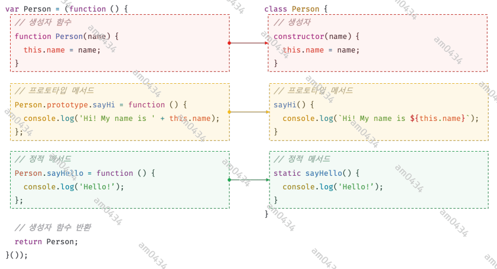
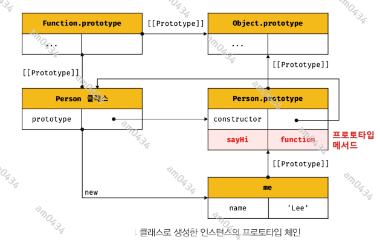
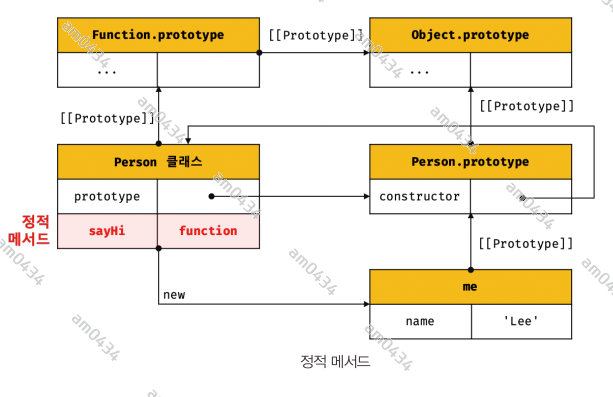

## 25장 - 클래스

### 25.1 클래스는 프로토타입의 문법적 설탕인가?
프로토타입 기반 객체지향 언어는 클래스가 필요 없는 객체지향 프로그래밍 언어다. ES5에서는 클래스 없이도 생성자 함수와 프로토타입을 통해 객체지향
언어의 상속을 구현할 수 있다. 하지만 프로토타입 기반 방식때문에 자스를 어렵게 느끼는 이유가 되기도 한다.  
ES6에 도입된 클래스는 기본 프로토타입 기반 객체지향 프로그래밍보다 클래스 기반 프로그래밍 언어와 매우 흡사한 객체 생성 메커니즘을 제시한다.
그렇다고 기존의 프로토타입 기반 모델을 폐지하는 것은 아니다. 사실 클래스는 함수이며 기존 패턴을 클래스 기반 패턴처럼 사용할 수 있도록 하는
문법적 설탕이라고 볼 수도 있다.  
단, 클래스와 생성자 함수는 모두 프로토타입 기반의 인스턴스를 생성하지만 정확히 동일하게 동작하지는 않는다. 클래스는 생성자 함수보다 엄격하여
생성자 함수에서는 제공하지 않는 기능도 제공한다.  
클래스는 생성자 함수와 매우 유사하지만 다음과 같이 몇 가지 차이가 있다.
1. 클래스는 new 연산자 없이 호출하면 에러가 발생한다. 하지만 생성자 함수를 new 없이 호출하면 일반 함수로서 호출된다.
2. 클래스는 상속을 지원하는 extends 와 super 키워드를 제공한다. 
3. 클래스는 호이스팅이 발생하지 않는 것처럼 동작한다.
4. 클래스 내의 모든 코드에는 암묵적으로 strict mode 가 지정되어 실행되며 해제할 수 없다.
5. 클래스의 constructor, 프로토타입 메서드, 정적 메서드는 모두 프로퍼티 어트리뷰트 [[Enumerable]]의 값이 false 이다. 다시 말해, 열거되지 않는다.

클래스를 프로토타입 기반 객체 생성 패턴의 단순한 문법적 설탕이라고 보기보다는 새로운 객체 생성 메커니즘으로 보는 것이 좀 더 합당하다.

### 25.2 클래스 정의
클래서는 class 키워드를 사용하여 정의한다. 클래스 이름은 파스칼 케이스를 사용하는 것이 일반적이다. 파스칼 케이스를 사용하지 않아도 에러가 발생하지 않는다.  
일반적이지는 않지만 (익명 또는 기명)표현식으로 클래스를 정의할 수도 있다. 이것은 클래스도 값으로 사용할 수 있는 일급객체라는 것을 의미한다.  
좀 더 자세히 말하자면 클래스는 함수다. 따라서 값처럼 사용할 수 있는 일급객체다.  
클래스 몸체에는 0개 이상의 메서드만 정의할 수 있다. 클래스 몸체에서 정의할 수 있는 메서드는 constructor, 프로토타입 메서드, 정적 메서드 세가지이다.
```javascript
class Person {
  // 생성자  
  constructor(name) {
    this.name = name;  // public 하다.
  }
  
  // 프로토타입 메서드
  sayHi() {
    console.log(`Hi! My name is ${this.name}`);
  }
  
  // 정적메서드
  static sayHello() {
    console.log('Hello!');
  }
}

// 인스턴스 생성
const me = new Person('Lee');
// 프로퍼티 참조
console.log(me.name);
// 프로토타입 메서드 호출
me.sayHi()
// 정적 메서드 호출
Person.sayHello()

```

클래스와 생성자 함수의 정의 방식을 비교해 보면 다음과 같다.



### 25.3 클래스 호이스팅
클래스 선언문으로 정의한 클래스는 함수 선언문과 같이 소스코드 평가 과정, 즉 런타임 이전에 먼저 평가되어 함수 객체를 생성한다. 단, 클래스는
클래스 정의 이전에 참조할 수 없다. 클래스 선언문은 마치 호이스팅이 발생하지 않는 것처럼 보이나 그렇지 않다. 단 클래스는 let, const 키워드로
선언한 변수처럼 호이스팅된다. 따라서 클래스 선언문 이전에 일시적 사각지대에 빠지기 때문에 호이스팅이 발생하지 않는 것처럼 동작한다.  
var, let, const, function, function*, class 키워드를 사용하여 선언된 모든 식별자는 호이스팅된다. 모든 선언문은 런타임 이전에 먼저
실행되기 때문이다.

### 25.4 인스턴스 생성
클래스는 생성자 함수이며 new 연산자와 함께 호출되어 인스턴스를 생성한다.

### 25.5 메서드
클래스에 정의할 수 있는 메서드는 생성자, 프로토타입 메서드, 정적 메서드가 있다.

#### 25.5.1 constructor
constructor는 인스턴스를 생성하고 초기화하기 위한 특수한 메서드다. constructor는 이름을 변경할 수 없다.  
개발자 도구를 사용해서 클래스의 내부를 들여다보면 클래스도 함수 객체 고유의 프로퍼티를 모두 갖고 있다. 함수와 동일하게 프로토타입과 연결되어
있으며 자신의 스코프 체인을 구성한다.  
그리고 constructor 프로퍼티는 클래스 자신을 가리키고 있다. 즉, 클래스가 인스턴스를 생성하는 생성자 함수라는 것을 의미한다.  
클래스가 생성한 인스턴스의 내부를 들여다보면 constructor 내부에서 추가한 프로터티가 생성한 인스턴스의 프로퍼티에 추가된 것을 볼 수 있다.
즉 constructor 내부의 this는 생성자 함수와 마찬가지로 클래스가 생성한 인스턴스를 가리킨다.  
그런데 클래스가 평가되어 생성된 함수 객체나 인스턴스 어디에도 constructor 메서드가 안보인다. 이는 클래스 몸체에 정의한 constructor가 단순한
메서드가 아니라는 것을 의미한다. constructor 는 메서드로 해성되는 것이 아니라 클래스가 평가되어 생성한 함수 객체 코드의 일부가 된다.
다시 말해, 클래스 정의가 평가되면 constructor 의 기술된 동작을 하는 함수 객체가 생성된다.  
constructor 는 클래스 내에 한 개만 존재할 수 있다. 2개 이상이 있으면 SysntaxError 가 발생한다.  
생략할 수 있다. 빈 constructor 가 암묵적으로 정의되고, 빈 객체를 반환한다.  
constructor 는 별도의 반환문을 갖지 않아야 한다. new 연산자와 함께 클래스가 호출되면 생성자 함수와 동일하게 암묵적으로 this, 즉 인스턴스를
반환하기 때문이다.
만약 this가 아닌 다른 객체를 명시적으로 반환하면 this, 즉 인스턴스가 반환되지 못하고 return 문에 명시한 객체가 반환된다. 하지만 원시값을 반환하면
암묵적으로 this가 반환된다. 따라서 constructor 의 return 문은 반드시 생략한다.

#### 25.5.2 프로토타입 메서드
클래스의 prototype 프로퍼티에 메서들르 추가하지 않아도 기본적으로 프로토타입 메서드가 된다.



#### 25.5.3 정적 메서드
클래스에서는 메서드에 static 키워드를 붙이면 정적 메서드(클래스 메서드)가 된다. 정적 메서드는 클래스에 바인딩된 메서드가 된다. 정적 메서드는
클래스 정의 이후에 인스턴스를 생성하지 않아도 호출할 수 있다. 정적메서드는 인스턴스로 호출할 수 없다. 정적 메서드가 바인딩된 클래스는 인스턴스의
프로토타입 체인상에 존재하지 않기 때문이다. 



#### 25.5.4 정적 메서드와 프로토타입 메서드의 차이
1. 정적 메서드와 프로통타입 메서드는 자신이 속해 있는 프로토타입 체인이 다르다.
2. 정적 메서드는 클래스로 호출한다.(메서드는 인스턴스로 호출)
3. 정적 메서드는 인스턴스 프로퍼티를 참조할 수 없지만 프로토타입 메서드는 인스턴스 프로퍼티를 참조할 수 있다.

3번에 대해서 정적 메서드는 클래스로 호출하야 하므로 정적 메서드 내부의 this는 인스턴스가 아닌 클래스를 가리킨다. 즉, 프로토타입 메서드와
정적 메서드 내부의 this 바인딩이 다르다.

#### 25.5.5 클래스에서 정의한 메서드의 특징
1. function 키워드를 생략한 메서드 축약 표현을 사용한다.
2. 콤마가 필요 없다.
3. 암묵적으로 strict mode 로 실행된다.
4. for ... in 문이나 Object.keys 메서드 등으로 열거할 수 없다. 즉, [[Enumerable]]이 false 다.
5. non-constructor 이다. new 연산자와 호출할 수 없다.

### 25.6 클래스의 인스턴스 생성 과정


