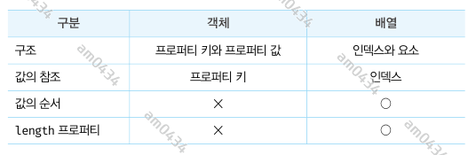

## 27장 - 배열

### 27.1 배열이란?
자스에 배열이라는 타입은 존재하지 않는다. 배열은 객체 타입이다.  
배열은 배열 리터럴, Array 생성자 함수, Array.of, Array.from 메서드로 생성할 수 있다. 배열의 생성자 함수는 Array 이며, 배열의 프로토타입
객체는 Array.prototype 이다. Array.prototype 은 배열을 위한 빌트인 메서드를 제공한다.  
배열은 객체이지만 일반 객체와는 구별되는 독특한 특징이 있다.



### 27.2 자바스크립트 배열은 배열이 아니다.
자료구조에서 말하는 일반적인 배열은 동일한 크기의 메모리 공간이 빈틈없이 연속적으로 나열된 자료구조를 말한다. 이러한 배열을 '밀집 배열'이라고 한다.
이와 같은 일반적인 배열은 인덱스를 통해 임의의 요소에 접근하기에 매우 효율적이지만 정렬되지 않은 배열에서 특정 요소를 검색하기에는 자원 소모가 크다.
또한 배열에 요소를 삽입하거나 삭제하는 경우 다른 요소들을 이동해야 하는 단점도 있다.  
**자스의 배열은 이러한 일반적인 배열과는 다르다. 즉, 배열의 요소를 위한 각각의 메모리 공간은 동일한 크기를 갖지 않아도 되며, 연속적으로 이어져 있지
않을 수 있다. 이러한 배열을 '희소 배열' 이라 한다.** 자스의 배열은 일반적인 배열의 동작을 흉내 낸 특수한 객체다.  
일반적인 배열과 자스의 배열의 장단점을 정리해보면 다음과 같다.
- 일반 배열은 인덱스로 요소에 빠르게 접근할 수 있다. 하지만 요소를 삽입 또는 삭제하는 경우에는 효율적이지 않다.
- 자스의 배열은 해시 테이블로 구현된 객체이므로 인덱스로 요소에 접근하는 경우 성능면에서 느릴수 밖에 없는 단점이 있지만 요소를 삽입, 삭제하는 경우
매우 빠른 성능을 기대할 수 있다.

인덱스로 배열 요소에 접근할 때 일반적인 배열보다 느릴 수 밖에 없는 구조적인 단점을 보완하기 위해 자스 엔진은 배열을 일반 객체와 구별하여 좀 더 
일반적인 배열처럼 동작하도록 최적화하여 구현했다. 

### 27.3 length 프로퍼티와 희소 배열
length 프로퍼티 값은 요소의 개수, 즉 배열의 길이를 바탕으로 결정되지만 임의의 숫자 값을 명시적으로 할당할 수 있다. 현재 length 값보다 작은 값을
할당하면 배열의 길이가 줄어든다. 주의할 것은 큰 숫자 값을 할당하는 경우다. 이때 length 프로퍼티 값은 변경 되지만 실제 배열의 길이가 늘어나지는
않는다.
```javascript
const arr = [1]

arr.length =3

console.log(arr.length)
console.log(arr)
/*
3
[ 1, <2 empty items> ]
 */
```
위 예제에서 2 empty items 는 실제로 추가된 배열의 요소가 아니다. 즉 arr[1], arr[2] 에는 값이 존재하지 않는다. 이처럼 배열의 요소가 연속적으로 위치하지
않고 일부가 비어있는 배열을 희소 배열이라 한다. 자바스크립트는 희소 배열을 문법적으로 허용한다.  
일반적인 배열의 length 는 배열의 요소의 개수와 언제나 일치한다. 하지만 희소 배열은 length 와 배열 요소의 개수가 일치하지 않는다. 희소 배열의 length 는
희소 배열의 실제 요소 개수보다 언제나 크다.  
배열을 생성할 경우에는 희소 배열을 생성하지 않도록 주의해야 한다.

### 27.4 배열 생성
#### 27.4.1 배열 리터럴

#### 27.4.2 Array 생성자 함수
Array 생성자 함수는 전달된 인수의 개수에 따라 다르게 동작하므로 주의가 필요하다.

- 전달된 인수가 1개이고 숫자인 경우 length 프로퍼티 값이 인수인 배열을 생성한다.
- 전달된 인수가 없으면 빈 배열을 생성한다. 즉, 배열 리터럴 []과 같다.
- 전달된 인수가 2개 이상이거나 숫자가 아닌경우 인수를 요소로 갖는 배열을 생성한다.

#### 27.4.3 Array.of
ES6 에서 도입됐다. 이 메서드는 전달된 인수를 요소로 갖는 배열을 생성한다. 인수가 1개이고 숫자이더라도 이 인수는 배열의 요소가 된다.

#### 27.4.4 Array.from
ES6 에서 도입됐다. 이 메서드는 유사 배열 객체 또는 **이터러블 객체를 인수로 전달받아** 배열로 변환하여 반환한다.

```javascript
// 유사 배열 객체를 변환하여 배열 생성
const arr = Array.from({length:3, 0:1,1:'a',2:'c'})
// 문자열은 이터러블이다.
const arr02 = Array.from('hello')
console.log(arr)
console.log(arr02)
/*
[ 1, 'a', 'c' ]
[ 'h', 'e', 'l', 'l', 'o' ]
 */
```
유사 배열 객체란 마치 배열처럼 인덱스로 프로퍼티 값에 접근할 수 있고 length 프로퍼티를 갖는 객체를 말한다. 유사 배열 객체는
마치 배열처럼 for 문으로 순회할 수도 있다.

### 27.5 배열 요소의 참조
배열의 요소를 참조할 때는 []를 사용한다. 대괄호 안에는 인덱스가 와야 된다.

### 27.6 배열 요소의 추가와 갱신
배열의 요소를 동적으로 추가할 수 있다. 존재하지 않는 인덱스를 사용해 값을 할당하면 새로운 요소가 추가된다. 이때 length는 자동
갱신된다.
만약 현재 배열의 length 값보다 큰 인덱스로 새로운 요소를 추가하면 희소 배열이 된다.

### 27.7 배열 요소의 삭제
배열은 사실 객체이기 때문에 배열의 특정 요소를 삭제하기 위해 delete 연산자를 사용할 수 있다. delete 연산자는 객체의 프로퍼티를
삭제한다. 하지만 **delete 연산자를 사용하면 length 프로퍼티 값은 변하지 않는다. 따라서 희소배열을 만드는 delete 연산자는
사용하지 않는 것이 좋다.**

### 27.8 배열 메서드
배열 메서드는 결과물을 반환하는 패턴이 두 가지이므로 주의가 필요하다. **배열에는 원본 배열(배열 메서드를 호출한 배열, 즉 배열 메서드의 
구현체 내부에서 this 가 가리키는 객체)을 직접 변경하는 메서드와 원본 배열을 직접 변경하지 않고 새로운 배열을 생성하는 메서드**가 있다.  
원본 배열을 직접 변경하는 메서드는 외부 상태를 직접 변경하는 부수 효과가 있으므로 사용할 때 주의해야 한다. 가급적 사용하지 않는 것이 좋다.

#### 27.8.1 Array.isArray
전달된 인수가 배열이면 true, 아니면 false 를 반환한다.

#### 27.8.2 Array.prototype.indexOf
원본 배열에서 인수로 전달된 요소를 검색하여 인덱스를 반환한다. 이 메서드는 배열에 특정 요소가 존재하는지 확인할 때 유용하다.
ES7 에서 도입된 Array.prototype.includes 메서드를 사용하면 가독성이 더 좋다.
- 원본 배열에 인수로 전달한 요소와 중복되는 요소가 여러 개 있다면 첫 번째로 검색된 요소의 인덱스 반환.
- 원본 배열에 인수로 전달한 요소가 존재하지 않으면 -1 반환

```javascript
const foods = ['apple','banana']

if (!foods.includes('orange')) {
    foods.push('orange')
}
```

#### 27.8.3  Array.prototype.push
인수로 전달받은 모든 값을 원본 배열의 마지막 요소로 추가하고 변경된 length 프로퍼티 값을 반환한다. 원본 배열을 직접 변경한다.  
push 메서드는 성능 면에서 좋지 않다. 마지막 요소로 추가할 요소가 하나뿐이라면 length 프로퍼티를 사용하여 배열의 마지막에 요소를 직접
추가할 수 있다. 이 방법이 더 빠르다.
```javascript
const arr =[1,2];

arr[arr.length] = 3;

// 스프레드 문법
const newArr = [...arr, 4];
```
push 메서드는 원본 배열을 변가한다. 따라서 ES6 의 스프레드 문법을 사용하는 편이 더 좋다. 

#### 27.8.4 Array.prototype.pop
pop 메서드는 마지막 요소를 제거하고 제거한 요소를 반환한다. 원본이 빈 배열이면 undefined 를 반환한다. 원본 배열을 직접 변경한다.

#### 27.8.5 Array.prototype.unshift
unshift 메서드는 인수로 전달받은 모든 값을 원본 배열의 선두에 요소로 추가하고 변경된 length 프로퍼티값을 반환한다. 원본 배열을 변경한다.  
이 메서드또한 부수효과가 있기 때문에 스프레드 문법을 사용하는 편이 좋다.

#### 27.8.6 Array.prototype.shift
shift 메서드는 원본 배열에서 첫 번째 요소를 제거하고 제거한 요소를 반환한다. 원본 배열을 변경한다.

#### 27.8.7 Array.prototype.concat
concat 메서드는 인수로 전달된 값들을 원본 배열의 마지막 요소로 추가한 새로운 배열을 반환한다. 원본 배열은 변경되지 않는다.  
push와 unshift 는 concat 메서드로 대체할 수 있다. concat 메서드 역시 스프레드 문법으로 대체할 수 있다.  
결론적으로 **push/unshift 메서드와 concat 메서드를 사용하는 대신 ES6의 스프레드 문법을 일관성 있게 사용하는 것을 권장한다.**

#### 27.8.8 Array.prototype.splice
원본 배열의 중간에 요소를 추가하거나 중간에 있는 요소를 제거하는 경우 splice 메서드를 사용한다. splice 는 3개의 매개변수가 있으며
원본 배열을 직접 변경한다. 제거된 요소들을 반환한다.
- start : 원본 배열의 요소를 제거하기 시작할 인덱스다. start 만 지정하면 원본 배열의 start 부터 모든 요소를 제거한다. start가 음수이면
배열의 끝에서의 인덱스를 나타낸다. 즉 -1은 마지막 요소를 가리키고 -n 이면 마지막에서 n번째 요소를 가리킨다.
- deleteCount: 원본 배열의 요소를 제거하기 시작할 인덱스인 strat 부터 제거할 요소의 개수다. deleteCount 가 0 이면 아무런 요소도 제거되지 않는다.
- items : 제거한 위치에 삽입할 요소들의 목록이다. 생략할 경우 원본 배열에서 요소들
- 을 제거하기만 한다.

```javascript
const arr = [1,2,3,4]
const result = arr.splice(1,2,20,30)
console.log(result) // [2,3]
console.log(arr) // [1,20,30,4]
```
splice 메서드의 두 번째 인수, 즉 제거할 요소를 0으로 지정하면 아무런 요소도 제거하지 않고 새로운 요소들을 삽입한다.  
배열에서 특정 요소를 제거하려면 indexOf 메서드를 통해서 요소의 인덱스를 구하고, splice 메서드를 사용한다.  
filter 메서드를 사용하여 특정 요소를 제거할 수 있다. 하지만 특정 요소가 중복된 경우 모두 제거된다.
```javascript
const arr = [1,2,3,4,1]

function removeAll(array,item) {
    return array.filter(v => v!==item);
} 

console.log(removeAll(arr,1))  // [2,3,4]
```

#### 27.8.9 Array.prototype.slice
slice 메서드는 인수로 전달된 범위의 요소들을 복사하여 배열로 반환한다. 원본 배열은 변경되지 않는다. 이름이 유사한 splice 메서드는 원본 배열을
변경하므로 주의해야 한다. slice 는 두 개의 매개변수를 갖는다.
- start : 복사를 시작할 인덱스이다.
- end : 복사를 종료할 인덱스다. 이 인덱스에 해당하는 요소는 복사되지 않는다. end는 생략 가능하면 생략 시 기본값은 length 프로퍼티 값이다.


#### 27.8.10 Array.prototype.join
원본 배열의 모든 요소를 문자열로 변환한 후, 인수로 전달받은 문자열, 즉 구분자로 연결한 문자열을 반환한다. 구분자는 생략 가능하며 기본
구분자는 콤바(',')다.

#### 27.8.11 Array.prototype.reverse
reverse 메서드는 원본 배열의 순서를 반대로 뒤집는다. 이때 원본 배열이 변경된다. 반환값은 변경된 배열이다.

#### 27.8.12 Array.prototype.fill
ES6 에서 도입된 fill 메서드는 인수로 전달받은 값을 배열의 처음부터 끝까지 요소로 채운다. 이때 원본 배열이 변경된다.  
fill 메서드로 요소를 채울 경우 모든 요소를 하나의 값만으로 채울 수밖에 없다는 단점이 있다. 하지만 Array.from 메서드를 사용하면 두 번째
인수로 전달한 콜백 함수를 통해 요소값을 만들면서 배열을 채울 수 있다. Array.from 메서드는 두 번째 인수로 전달한 콜백 함수에 첫 번째
인수에 의해 생성된 배열의 요소 값과 인덱스를 순차적으로 전달하면서 호출하고, 콜백 함수의 반환값으로 구성된 배열을 반환한다.
```javascript
const sequences = (length=0) => Array.from({length},(_,i) =>i);

console.log(sequences(3)); // [0,1,2]
```

#### 27.8.13 Array.prototype.includes
배열 내에 특정 요소가 포함되어 있는지 확인하여 true 또는 false 를 반환한다. 첫 번째 인수로 검색할 대상을 지정한다. 두 번째 인수로 검색을 시작할
인덱스를 지정할 수 있다. 

#### 27.8.14 Array.prototype.flat
ES10(ECMAScript 2019) 에서 도입된 flat 메서드는 인수로 전달한 깊이만큼 재귀적으로 배열을 평탄화한다.
```javascript
[1, [2,3,4,5]].flat(); // [1,2,3,4,5]
```
중첩 배열을 평탄화할 깊이를 인수로 전달할 수 있다. 인수를 생략할 경운 기본값은 1이다. 인수로 Infinity 를 전달하면 중첩 배열 모두를 평탄화한다.

### 27.9 배열 고차 함수
고차 함수는 함수를 인수로 전달받거나 함수를 반환하는 함수를 말한다. 자스의 함수는 일급 객체이므로 함수를 값처럼 인수로 전달할 수 있으며
반환할 수도 있다. 고차 함수는 외부 상태의 변경이나 가변 데이터를 피하고 불변셩을 지향하는 함수형 프로그래밍에 기반을 두고 있다.  
함수형 프로그래밍은 순수 함수와 보조 함수의 조합을 통해 로직 내에 존재하는 조건문과 반복문을 제거하여 복잡성을 해결하고 변수의 사용을 억제하여
상태 변경을 피하려는 프로그래밍 패러다임이다. 함수형 프로그래밍은 결국 순수 함수를 통해 부수 효과를 최대한 억제하여 오류를 피하고 프로그램의
안정성을 높이려는 노력의 일환이라고 할 수 있다.

자스는 고차 함수를 다수 지원한다. 특히 배열은 매우 유용한 고차 함수를 제공한다. 배열 고차 함수는 활용도가 매우 높으므로 사용법을 잘 이해해야 한다.

#### 27.9.1 Array.prototype.sort
sort 메서드는 배열의 요소를 정렬한다. 원본 배열을 직접 변경하며 정렬된 배열을 반환한다. 기본값은 오름차순으로 정렬한다.  
문자열 요소로 이루어진 배열의 정렬은 아무런 문제가 없다. 하지만 숫자 요소로 이루어진 배열을 정렬할 때는 주의가 필요하다. sort 메서드의 기본 정렬
순서는 유니코드 코드 포인트의 순서를 따른다. 배열의 요소가 숫자 타입이라도 일시적으로 문자열로 변환 후 유니코드 순서를 기준으로 정렬한다.  
따라서 숫자 요소를 정렬할 때는 sort 메서드에 **정렬 순서를 정의하는 비교 함수를 인수로 전달해야 한다.** 비교 함수는 양수나 음수 또는 0을
반환해야 한다. 비교 함수의 반환값이 0보다 작으면 비교 함수의 첫 번째 인수를 우선 정렬하고, 0이면 정렬하지 않으며, 0보다 크면 두 번째 인수를
우선하여 정렬한다.
```javascript
const points = [40,100,1,5,2,25,10];

// 숫자 배열의 오름차순 정렬, 비교 함수의 반환값이 0보다 작으면 a를 우선하여 정렬
points.sort((a,b)=>a-b); // [1,2,5,10,25,40,100]

points.sort((a,b)=>b-a); // [100,40,25,10,5,2,1]
```

객체 요소를 갖는 배열을 정렬하는 예제
```javascript
const todos = [
    {id:4, content:'Java'},
    {id:1, content:'css'},
    {ig:3, contest:'go'}
];

function compare(key) {
    return (a,b) => (a[key]> b[key] ? 1 : (a[key]<b[key]?-1:0));
}

// id를 기준으로 오름차순 정렬
todos.sort(compare('id'))
```

#### 27.9.2 Array.prototype.forEach
조건문이나 반복문은 로직의 흐름을 이해하기 어렵게 한다. 특히 for 문은 반복을 위한 변수를 선언해야 하며, 조건식과 증감식으로 이루어져
있어서 함수형 프로그래밍이 추구하는 바와 맞지 않는다.  
forEach 메서드는 for 문을 대체할 수 있는 고차 함수다. forEach 메서드는 자신의 내부에서 반복문을 실행한다. 즉, forEach 메서드는 반복문을
추상화한 고차 함수로서 내부에서 반복문을 통해 자신을 호출한 배열을 순회하면서 수행해야 할 처리를 콜백 함수로 전달받아 호출한다.
```javascript
const number =[1,2,3];
const pows = []

number.forEach(item=>pows.push(item**2));
console.log(pows) // [1,4,9]
```

forEach 메서드의 콜백 함수는 forEach 메서드를 호출한 배열의 요소값과 인덱스, forEach 메서드를 호출한 배열 자체, 즉  this 를 순차적으로
전달받을 수 있다. 다시 말해, forEach 메서든느 콜백 함수를 호출할 때 3개의 인수, 즉 forEach 메서드를 호출한 배열의 요소값과 인덱스, forEach
메서드를 호출한 배열(this)을 순차적으로 전달한다.
```javascript
[1,2,3].forEach((value,index,arr)=>console.log(`인덱스 : ${index} / 값 : ${value} / this: ${arr}`))
```

forEach 메서드는 원본 배열을 변경하지 않는다. 하지만 콜백 함수를 통해 원본 배열을 변경할 수 있다.  
forEach 메서드도 내부에서 반복문을 통해 배열을 순회할 수밖에 없다. 단, 반복문을 메서드 내부로 은닉해서 로직의 흐름을 이해하기 쉽게 하고 복잡성을 해결한다.
그리고 break, continue 문을 사용할 수 없다. 다시 말해, 배열의 모든 요소를 빠짐없이 모두 순회하며 중단할 수 없다. 희소 배열의 경우 존재하지 않는 요소는
순회 대상에서 제외된다. 이는 배열을 순회하는 map, filter, reduce 메서드 등에서도 마찬가지다.  
forEach 문은 for 문에 비해서 성능은 좋지는 않지만 가독성은 더 좋다. 따라서 요소가 대단히 많은 배열을 순회하거나 복잡한 코드 또는 높은 성능이 필요한 경우가
아니라면 forEach 사용을 권장한다.

#### 27.9.3 Array.prototype.map
map 메서드는 자신을 호출한 배열의 모든 요소를 순회하면서 인수로 전달받은 콜백 함수를 반복 호출한다. 그리고 콜백 함수의 반환값들로 구성된 새로운 배열을
반환한다. 원본 배열은 변경되지 않는다.
```javascript
const numbers = [1,4,9,16];

const roots = numbers.map(item => Math.sqrt(item));
console.log(roots)  // [1,2,3,4]
```
map 메서드는 콜백 함수를 호출할 때 3개의 인수, 요소값, 인덱스, 그리고 amp 메서드를 호출한 배열을 순차적으로 전달한다.

#### 27.9.4 Array.prototype.filter
콜백 함수의 반환값이 true 인 요소로만 구성된 새로운 배열을 반환한다. 이때 원본 배열은 변경되지 않는다.
```javascript
const numbers=[1,2,3,4,5];

const odds = numbers.filter((item) => item%2===1)
console.log(odds) // [1,3,5]
```
filter 메서드는 자신을 호출한 배열에서 특정 요소를 제거하기 위해 사용할 수 있다. 이 경우 특정 요소가 중복되어 있다면 중복된 요소들이 모두 제거된다.
특정 요소 하나만 제거하려면 indexOf 메서드를 통해 특정 요소의 인덱스를 취득한 다음에 splice 메서드를 사용한다.
```javascript
const numbers = [1,2,3,4,5];

const delIndex = numbers.indexOf(3);

numbers.splice(delIndex,1);
console.log(numbers) // [1,2,4,5]
```

#### 27.9.5 Array.prototype.reduce
reduce 메서드는 콜백 함수의 반환값을 다음 순회 시에 콜백 함수의 첫 번째 인수로 전달하여 콜백 함수를 호출하여 **하나의 결과값을 만들어 반환한다.** 이때 원본은
변경되지 않는다.  
이 메서드는 첫 번째 인수로 콜백 함수, 두 번째 인수로 초기값을 전달받는다. 콜백 함수에는 4개의 인수, 초기값 또는 콜백 함수의 이전 반환값, reduce 메서드를 호출한 배열의
요소값과 인덱스, 메서드를 호출한 배열 자체가 전달된다.
```javascript
const sum=[1,2,3,4].reduce((value,currentValue,index,array) => value+currentValue,0)

console.log(sum) // 10
```
reduce 메서드의 다양한 활용법

- 평균 구하기
- 최대값 구하기
- 요소의 중복 횟수 구하기
- 중첩 배열 평탄화
- 중복 요소 제거
중복 요소를 제거할 때는 filter 메서드를 사용하는 방법이 더 직관적이다. 또는 중복되지 않는 유일한 값들의 집합인 Set을 사용할 수 있다. 이 방법을 추천한다.  
  
주의할 것은 두 번째 인수로 전달하는 초기값이 옵션이라는 것이다. 즉, reduce 메서드의 두 번째 인수로 전달하는 초기값은 생략할 수 있다. 히지만 초기값을 전달하는 것이
안전하다.

#### 27.9.6 Array.prototype.some
some 메서드는 콜백 함수의 반환값이 단 한 번이라도 참이면 true, 모두 거짓이면 false 를 반환한다. 

#### 27.9.7 Array.prototype.every
every 메서드는 콜백 함수의 반환값이 모두 참이면 true, 단 하나라도 거짓이면 false 를 반환한다.

#### 27.9.8 Array.prototype.find
인수로 전달된 콜백 함수를 호출하여 반환값이 true 인 첫 번째 요소를 반환한다.

#### 27.9.9 Array.prototype.findIndex
인수로 전달된 콜백 함수를 호출하여 반환값이 true 인 첫 번째 요소의 인덱스를 반환한다. 요소가 존재하지 않으면 -1을 반환한다.

#### 27.9.10 Array.prototype.flatmap


