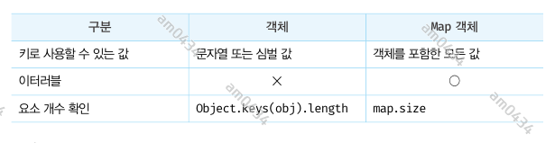

## 35장 - 스프레드 문법
ES6 에서 도입된 스프레드 문법(전개 문법) ... 은 하나로 뭉쳐 있는 여러 값들의 집합을 펼쳐서 개별적인 값들의 목록으로 만든다.   
스프레드 문법을 사용할 수 있는 대상은 Array, String, Map, Set, DOM 컬렉션(NodeList, HTMLCollection), arguments 와 같이
for...of 문으로 순회할 수 있는 이터러블에 한정된다.

```javascript
console.log(...[1,2,3]); // 1  2  3
```
위 예제엇 ... [1,2,3] 은 이터러블인 배열을 펼쳐서 요소들을 개별적인 값들의 목록 1 2 3 으로 만든다. 이때 1 2 3 은 값이 아니라 값들의 목록이다.
즉, 스프레드 문법의 결과는 값이 아니다. 이는 스프레드 문법 ... 이 피연산자를 연산하여 값을 생성하는 연산자가 아님을 의미한다. 따라서 스프레드
문법의 결과는 변수에 할당할 수 없고, 다음과 같이 쉼표로 구분한 값의 목록을 사용하는 문맥에서 사용할 수 있다.
- 함수 호출문의 인수 목록
- 배열 리터럴의 요소 목록
- 객체 리터럴의 프로퍼티 목록

### 35.1 함수 호출문의 인수 목록에서 사용하는 경우
요소들의 집합인 배열을 펼쳐서 개별적인 값들의 목록으로 만든 후, 이를 함수의 인수 목록으로 전달해야 하는 경우가 있다.
```javascript
const arr = [1,2,3];

// 배열 요소중 최대값을 구하기 위해서 Math.max 메서드 사용.
const max= Math.max(arr) // -> NaN
const realMax = Math.max(...arr);
```
만약 Math.max 메서드에 숫자가 아닌 배열을 인수로 전달하면 최대값을 구할 수 없으므로 NaN을 반환한다. 이 같은 문제를 해결하기 위해서 스프레드
문법을 사용하면 더 간결하고 가독성이 좋아진다.  
**Rest 파라미터와 형태가 동일하여 혼동할 수 있으므로 주의가 필요하다. Rest 파라미터는 함수에 전달된 인수들의 목록을 배열로 전달받기 위해
매개변수 이름 앞에 ... 을 붙이는 것이다.** Rest 파라미터와 스페레드 문법은 서로 반대의 개념이다.

### 35.2 배열 리터럴 내부에서 사용하는 경우
스프레드 문법을 배열 리터럴에서 사용하면 ES5에서 사용하던 기존의 방식보다 더욱 간결하고 가독성도 좋게 표현할 수 있다.

#### 35.2.1 concat
2개의 배열을 1개의 배열로 결합하고 싶은 경우 concat 메서드를 사용해야 했다. 스프레드 문법을 사용하면 별도의 메서드를 사용하지 않고 배열
리터럴만으로 배열을 결합할 수 있다.
```javascript
const arr = [...[1,2], ...[3,4]];
console.log(arr) // [1,2,3,4]
```

#### 35.2.2 splice
ES5 에서 어떤 배열의 중간에 다른 배열의 요소들을 추가하거나 제거하려면 splice 메서드를 사용한다. 이때 splice 메서드의 세 번째 인수로 배열을
전달하면 배열 자체가 추가된다.  
이 때 스프레드 문법을 사용하면 추가할 배열의 요소를 별다른 메서드를 사용하지 않고 추가할 수 있다.

#### 35.2.3 배열 복사
ES5 에서 배열을 복사하려면 slice 메서드를 사용한다. 스프레드 문법을 사용하면 간결하게 표현할 수 있다. 이 때 얕은 복사를 한다.
```javascript
const a = [1,2];
const b =[...a];

console.log(a===b); // false
console.log(a[0]===b[0]); // true
```

#### 35.2.4 이터러블을 배열로 변환

### 35.3 객체 리터럴 내부에서 사용하는 경우
일반 객체를 대상으로도 스프레드 문법을 사용할 수 있다. 
```javascript
const obj = {x:1, y:2};
const copy = {...obj}
console.log(obj)
console.log(copy)

//객체 병합
const merged = {...obj, a:3,b:4};
console.log(merged)
/*
{ x: 1, y: 2 }
{ x: 1, y: 2 }
{ x: 1, y: 2, a: 3, b: 4 }
 */
```

--------------------------------------------------------

## 36장 디스트럭처링 할당
디스트럭처링 할당(구조 분해 할당)은 구조화된 배열과 같은 이터러블 또는 객체를 destructuring(비구조화, 구조 파괴)하여 1개 이상의 변수에
개별적으로 할당하는 것을 말한다. 배열과 같은 이터러블 또는 객체 리터럴에서 필요한 값만 추출하여 변수에 할당할 때 유용하다.

### 36.1 배열 디스트럭처링 할당
ES6 의 배열 디스트럭처링 할당은 배열의 각 요소를 배열로부터 추출하여 1개 이상의 변수에 할당한다. 이때 배열 디스트럭처링 할당의 대상(할당의 우변)은
이터러블이어야 하며, 할당 기준은 배열의 인덱스다. 즉, 순서대로 할당된다.
```javascript
const arr = [1,2,3]
const [one, two,three ] = arr;

console.log(one,two,three); // 1 2 3 
```
할당을 위해서는 할당 연산자 왼쪽에 값을 할당받을 변수를 선언해야 한다. 이때 변수를 배열 리터럴 형태로 선언한다. 이때 우변에 이터러블을 할당하지
않으면 에러가 발생한다.

### 36.2 객체 디스트럭처링 할당
ES6 의 객체 디스트럭처링 할당은 객체의 각 프로퍼티를 객체로부터 추출하여 1개 이상의 변수에 할당한다. 이때 객체 디스트럭처링 할당의 대상(할당문의 우변)은
객체이어야 하며, 할당 기준은 프로퍼티 키다. 즉, 순서는 의미가 없으며 선언된 변수 이름과 프로퍼티 키가 일치하면 할당된다.
```javascript
const user = {name:'lee', age:30};
const {name,age} = user;

console.log(name,age); // lee 30
```
객체의 프로퍼티 키와 다른 변수 이름으로 프로퍼티 값을 할당받으려면 다음과 같이 변수를 선언해야 한다.
```javascript
const user = {name:'lee', age:30};
// 변수명 변경과 기본값 설정
const {name:a,age:b = 18} = user;

console.log(a,b); // lee 30
```
위의 예제처럼 변수에 기본값을 설정할 수 있다.

--------------------------------------------------

## 37장 Set 과 Map

### 37.1 Set
Set 객체는 중복되지 않는 유일한 값들의 집합(set)이다. Set 객체는 배열과 유사하지만 동일한 값을 중복하여 포함할 수 없고, 요소 순서에 의미가 없으며,
인덱스로 요소에 접근할 수 없다.  
이러한 Set 객체의 특성은 수학적 집합의 특성과 일치한다. 따라서 Set 을 통해 교집합, 합집합, 차집합, 여집합 등을 구현할 수 있다.

#### 37.1.1 Set 객체의 생성
Set 객체는 Set 생성자 함수로 생성한다. Set 생성자 함수에 인수를 전달하지 않으면 빈 Set 객체가 생성된다. **Set 생성자 함수는 이터러블을 인수로
전달받아 Set 객체를 생성한다. 이때 이터러블의 중복된 값은 Set 객체에 요소로 저장되지 않는다.**
```javascript
const set = new Set();
console.log(set);

const set1 = new Set([1,2,3,3]);
console.log(set1);

const set2 = new Set('hello');
console.log(set2)

/*
Set(0) {}
Set(3) { 1, 2, 3 }
Set(4) { 'h', 'e', 'l', 'o' }
 */
```
중복을 허용하지 않는 Set 객체의 특성을 활용하여 배열에서 중복된 요소를 제거할 수 있다.
```javascript
const uniq = (array:[]) => [...new Set(array)];
console.log(uniq([1,2,3,4,5,2,3,7,8,9,7]));
```

#### 37.1.2 요소의 개수 확인
Set 객체의 요소 개수를 확인할 때는 Set.prototype.size 프로퍼티를 사용한다. size 프로퍼티는 setter 함수 없이 getter 함수만 존재하는
접근자 프로퍼티다. 따라서 size 프로퍼티에 숫자를 할당하여 Set 객체의 요소 개수를 변경할 수 없다.

#### 37.1.3 요소 추가
Set 객체에 요소를 추가할 때는 Set.prototype.add 메서드를 사용한다.
```javascript
const set = new Set()
set.add(1).add(2).add(3).add(3);
console.log(set)// Set(3) {1,2,3}
```
일치 비교 연산자 '===' 를 사용하면 NaN과 NaN을 다르다고 평가한다. 하지만 Set 객체는 같다고 평가하여 중복을 허용하지 않는다. 
+0, -0 또한 같다고 평가하여 중복을 허용하지 않는다.

#### 37.1.4 요소 존재 여부 확인
Set 객체에 특정 요소가 존재하는지 확인하려면 Set.prototype.has 메서드를 사용한다. has 메서드는 특정 요소의 존재 여부를 나타내는
불리언 값을 반환한다.

#### 37.1.5 요소 삭제
특정 요소를 삭제하려면 Set.prototype.delete 메서드를 사용한다. 삭제 성공 여부를 나타내는 불리언 값을 반환한다. delete 메서드에는
인덱스가 아니라 삭제하려는 요소값을 인수로 전달해야 한다. Set 객체는 순서에 의미가 없다. 다시 말해, 인덱스를 갖지 않는다.

#### 37.1.6 요소 일괄 삭제
clear 메서드를 사용한다. 언제나 undefined 를 반환한다.

#### 37.1.7 요소 순회
Set 객체의 요소를 순회하려면 Set.prototype.forEach 메서드를 사용한다. forEach 메서드는 콜백 함수와 forEach 메서드의 콜백 함수 내부에서
this로 사용될 객체(옵션)를 인수로 전달한다. 이때 콜백함수는 3개의 인수를 전달받는다.
- 첫 번째 인수 : 현재 순회 중인 요소값
- 두 번째 인수 : 현재 순회 중인 요소값
- 세 번째 인수 : 현재 순회 중인 Set 객체 자체

첫 번째 ,두 번째 인수는 같은 값이다. 이렇게 동작하는 이유는 Array.prototype.forEach 메서드와 인터페이스를 통일하기 위함이며 다른 의미는
없다. 
```javascript
const set = new Set([1,2,3]);
set.forEach((v,v2,set)=>console.log(v,v2,set));

/*
1 1 Set(3) { 1, 2, 3 }
2 2 Set(3) { 1, 2, 3 }
3 3 Set(3) { 1, 2, 3 }
 */
```
**Set 객체는 이터러블이다.** 따라서 for...of 문으로 순회할 수 있으며, 스프레드 문법과 배열 디스트럭처링의 대상이 될 수 있다.

#### 37.1.8 집합연산
- 교집합
- 합집합
- 차집합
- 부분 집합과 상위 집합

### 37.2 Map
Map 객체는 키와 값의 쌍으로 이루어진 컬렉션이다. Map 객체는 객체와 유사하지만 다음과 같은 차이가 있다.



#### 37.2.1 Map 객체의 생성
Map 객체는 Map 생성자 함수로 생성한다. Map 생성자 함수에 인수를 전달하지 않으면 빈 Map 객체가 생성된다.  
**Map 생성자 함수는 이터러블을 인수로 전달받아 Map 객체를 생성한다. 이때 인수로 전달되는 이터러블은 키와 값의 쌍으로 이루어진 요소로
구성되어야 한다.** Map 생성자 함수의 인수로 전달한 이터러블에 중복된 키를 갖는 요소가 존재하면 값이 덮어써진다. 따라서 Map 객체에는 
중복된 키를 갖는 요소가 존재할 수 없다.

#### 37.2.2 요소 개수 확인
Map.prototype.size 프로퍼티를 사용한다.

#### 37.2.3 요소 추가
Map.prototype.set 메서드를 사용한다.
```javascript
const map = new Map([[1,2]]);
console.log(map);
map.set('key','val').set('key2','val2');
console.log(map);
/*
Map(1) { 1 => 2 }
Map(3) { 1 => 2, 'key' => 'val', 'key2' => 'val2' }
 */
```

객체는 문자열 또는 심벌 값만 키로 사용할 수 있다. 하지만 Map 객체는 키 타입에 제한이 없다. 따라서 객체를 포함한 모든 값을 키로 사용할 수 있다.
이는 Map 객체와 일반 객체의 가장 두드러지는 차이점이다.

#### 37.2.4 요소 취득
Map.prototype.get 메서드를 사용한다. get 메서드의 인수로 키를 전달하면 Map 객체에서 인수로 전달한 키를 갖는 값을 반환한다. 요소가 없으면
undefined 를 반환한다.

#### 37.2.5 요소 존재 여부 확인
has 메서드를 사용한다.

#### 37.2.6 요소 삭제
delete 메서드를 사용한다. 이때 delete 메서드는 불리언 값을 반환한다. 따라서 연속적으로 사용할 수 없다.

#### 37.2.7 요소 일괄 삭제
clear 메서드를 사용한다.

#### 37.2.8 요소 순회
forEach 메서드를 사용한다. 배열의 forEach 메서드와 유사하게 콜백 함수와 forEach 메서드의 콜백 함수 내부에서 this 로 사용될 객체(옵션)를
인수로 전달한다.
- 첫 번째 인수 : 현재 요소값
- 두 번째 인수 : 현재 요소의 키 값
- 세 번째 인수 : 순회중인 Map 객체 자체

Map 객체는 이터러블이다. 따라서 for ... of 문으로 순회할 수 있으며, 스프레드 문법과 배열 디스트럭처링 할당의 대상이 될 수 있다.
```javascript
const lee = {name: 'Lee'};
const kim = {name: 'Kim'};

const map = new Map([[lee, "developer"],[kim,"designer"],[kim,"designer"]]);

console.log(Symbol.iterator in map) // 이터러블인지 확인

for(const entry of map) {
    console.log(entry);
}

console.log(...map) // 스프레드 문법

const [a,b] = map; // 배열 디스트럭처링
console.log(a ,'//', b);

/*
true
[ { name: 'Lee' }, 'developer' ]
[ { name: 'Kim' }, 'designer' ]
[ { name: 'Lee' }, 'developer' ] [ { name: 'Kim' }, 'designer' ]
[ { name: 'Lee' }, 'developer' ] // [ { name: 'Kim' }, 'designer' ]
 */
```
Map 객체는 이터러블이면서 동시에 이터레이터인 객체를 반환하는 메서드를 제공한다.


```javascript
const lee = {name: 'Lee'};
const kim = {name: 'Kim'};

const map = new Map([[lee, "developer"],[kim,"designer"],[kim,"designer"]]);

for (const key of map.keys()) {
    console.log(key);
}

for(const val of map.values() ) {
    console.log(val);
}
/*
{ name: 'Lee' }
{ name: 'Kim' }
developer
designer
 */
```


