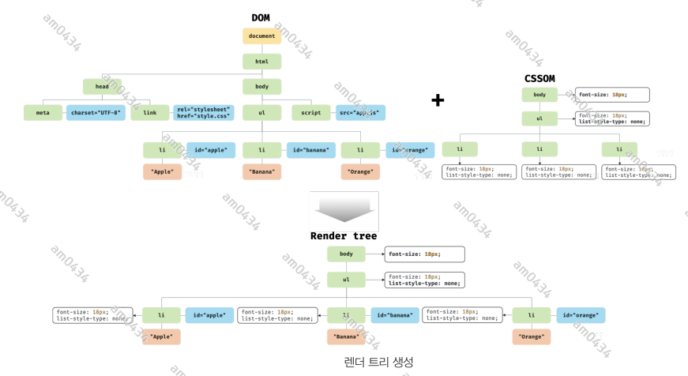

## 35장 - 스프레드 문법
ES6 에서 도입된 스프레드 문법(전개 문법) ... 은 하나로 뭉쳐 있는 여러 값들의 집합을 펼쳐서 개별적인 값들의 목록으로 만든다.   
스프레드 문법을 사용할 수 있는 대상은 Array, String, Map, Set, DOM 컬렉션(NodeList, HTMLCollection), arguments 와 같이
for...of 문으로 순회할 수 있는 이터러블에 한정된다.

```javascript
console.log(...[1,2,3]); // 1  2  3
```
위 예제엇 ... [1,2,3] 은 이터러블인 배열을 펼쳐서 요소들을 개별적인 값들의 목록 1 2 3 으로 만든다. 이때 1 2 3 은 값이 아니라 값들의 목록이다.
즉, 스프레드 문법의 결과는 값이 아니다. 이는 스프레드 문법 ... 이 피연산자를 연산하여 값을 생성하는 연산자가 아님을 의미한다. 따라서 스프레드
문법의 결과는 변수에 할당할 수 없고, 다음과 같이 쉼표로 구분한 값의 목록을 사용하는 문맥에서 사용할 수 있다.
- 함수 호출문의 인수 목록
- 배열 리터럴의 요소 목록
- 객체 리터럴의 프로퍼티 목록

### 35.1 함수 호출문의 인수 목록에서 사용하는 경우
요소들의 집합인 배열을 펼쳐서 개별적인 값들의 목록으로 만든 후, 이를 함수의 인수 목록으로 전달해야 하는 경우가 있다.
```javascript
const arr = [1,2,3];

// 배열 요소중 최대값을 구하기 위해서 Math.max 메서드 사용.
const max= Math.max(arr) // -> NaN
const realMax = Math.max(...arr);
```
만약 Math.max 메서드에 숫자가 아닌 배열을 인수로 전달하면 최대값을 구할 수 없으므로 NaN을 반환한다. 이 같은 문제를 해결하기 위해서 스프레드
문법을 사용하면 더 간결하고 가독성이 좋아진다.  
**Rest 파라미터와 형태가 동일하여 혼동할 수 있으므로 주의가 필요하다. Rest 파라미터는 함수에 전달된 인수들의 목록을 배열로 전달받기 위해
매개변수 이름 앞에 ... 을 붙이는 것이다.** Rest 파라미터와 스페레드 문법은 서로 반대의 개념이다.

### 35.2 배열 리터럴 내부에서 사용하는 경우
스프레드 문법을 배열 리터럴에서 사용하면 ES5에서 사용하던 기존의 방식보다 더욱 간결하고 가독성도 좋게 표현할 수 있다.

#### 35.2.1 concat
2개의 배열을 1개의 배열로 결합하고 싶은 경우 concat 메서드를 사용해야 했다. 스프레드 문법을 사용하면 별도의 메서드를 사용하지 않고 배열
리터럴만으로 배열을 결합할 수 있다.
```javascript
const arr = [...[1,2], ...[3,4]];
console.log(arr) // [1,2,3,4]
```

#### 35.2.2 splice
ES5 에서 어떤 배열의 중간에 다른 배열의 요소들을 추가하거나 제거하려면 splice 메서드를 사용한다. 이때 splice 메서드의 세 번째 인수로 배열을
전달하면 배열 자체가 추가된다.  
이 때 스프레드 문법을 사용하면 추가할 배열의 요소를 별다른 메서드를 사용하지 않고 추가할 수 있다.

#### 35.2.3 배열 복사
ES5 에서 배열을 복사하려면 slice 메서드를 사용한다. 스프레드 문법을 사용하면 간결하게 표현할 수 있다. 이 때 얕은 복사를 한다.
```javascript
const a = [1,2];
const b =[...a];

console.log(a===b); // false
console.log(a[0]===b[0]); // true
```

#### 35.2.4 이터러블을 배열로 변환

### 35.3 객체 리터럴 내부에서 사용하는 경우
일반 객체를 대상으로도 스프레드 문법을 사용할 수 있다. 
```javascript
const obj = {x:1, y:2};
const copy = {...obj}
console.log(obj)
console.log(copy)

//객체 병합
const merged = {...obj, a:3,b:4};
console.log(merged)
/*
{ x: 1, y: 2 }
{ x: 1, y: 2 }
{ x: 1, y: 2, a: 3, b: 4 }
 */
```

--------------------------------------------------------

## 36장 디스트럭처링 할당
디스트럭처링 할당(구조 분해 할당)은 구조화된 배열과 같은 이터러블 또는 객체를 destructuring(비구조화, 구조 파괴)하여 1개 이상의 변수에
개별적으로 할당하는 것을 말한다. 배열과 같은 이터러블 또는 객체 리터럴에서 필요한 값만 추출하여 변수에 할당할 때 유용하다.

### 36.1 배열 디스트럭처링 할당
ES6 의 배열 디스트럭처링 할당은 배열의 각 요소를 배열로부터 추출하여 1개 이상의 변수에 할당한다. 이때 배열 디스트럭처링 할당의 대상(할당의 우변)은
이터러블이어야 하며, 할당 기준은 배열의 인덱스다. 즉, 순서대로 할당된다.
```javascript
const arr = [1,2,3]
const [one, two,three ] = arr;

console.log(one,two,three); // 1 2 3 
```
할당을 위해서는 할당 연산자 왼쪽에 값을 할당받을 변수를 선언해야 한다. 이때 변수를 배열 리터럴 형태로 선언한다. 이때 우변에 이터러블을 할당하지
않으면 에러가 발생한다.

### 36.2 객체 디스트럭처링 할당
ES6 의 객체 디스트럭처링 할당은 객체의 각 프로퍼티를 객체로부터 추출하여 1개 이상의 변수에 할당한다. 이때 객체 디스트럭처링 할당의 대상(할당문의 우변)은
객체이어야 하며, 할당 기준은 프로퍼티 키다. 즉, 순서는 의미가 없으며 선언된 변수 이름과 프로퍼티 키가 일치하면 할당된다.
```javascript
const user = {name:'lee', age:30};
const {name,age} = user;

console.log(name,age); // lee 30
```
객체의 프로퍼티 키와 다른 변수 이름으로 프로퍼티 값을 할당받으려면 다음과 같이 변수를 선언해야 한다.
```javascript
const user = {name:'lee', age:30};
// 변수명 변경과 기본값 설정
const {name:a,age:b = 18} = user;

console.log(a,b); // lee 30
```
위의 예제처럼 변수에 기본값을 설정할 수 있다.

--------------------------------------------------

## 37장 Set 과 Map

### 37.1 Set
Set 객체는 중복되지 않는 유일한 값들의 집합(set)이다. Set 객체는 배열과 유사하지만 동일한 값을 중복하여 포함할 수 없고, 요소 순서에 의미가 없으며,
인덱스로 요소에 접근할 수 없다.  
이러한 Set 객체의 특성은 수학적 집합의 특성과 일치한다. 따라서 Set 을 통해 교집합, 합집합, 차집합, 여집합 등을 구현할 수 있다.

#### 37.1.1 Set 객체의 생성
Set 객체는 Set 생성자 함수로 생성한다. Set 생성자 함수에 인수를 전달하지 않으면 빈 Set 객체가 생성된다. **Set 생성자 함수는 이터러블을 인수로
전달받아 Set 객체를 생성한다. 이때 이터러블의 중복된 값은 Set 객체에 요소로 저장되지 않는다.**
```javascript
const set = new Set();
console.log(set);

const set1 = new Set([1,2,3,3]);
console.log(set1);

const set2 = new Set('hello');
console.log(set2)

/*
Set(0) {}
Set(3) { 1, 2, 3 }
Set(4) { 'h', 'e', 'l', 'o' }
 */
```
중복을 허용하지 않는 Set 객체의 특성을 활용하여 배열에서 중복된 요소를 제거할 수 있다.
```javascript
const uniq = (array:[]) => [...new Set(array)];
console.log(uniq([1,2,3,4,5,2,3,7,8,9,7]));
```

#### 37.1.2 요소의 개수 확인
Set 객체의 요소 개수를 확인할 때는 Set.prototype.size 프로퍼티를 사용한다. size 프로퍼티는 setter 함수 없이 getter 함수만 존재하는
접근자 프로퍼티다. 따라서 size 프로퍼티에 숫자를 할당하여 Set 객체의 요소 개수를 변경할 수 없다.

#### 37.1.3 요소 추가
Set 객체에 요소를 추가할 때는 Set.prototype.add 메서드를 사용한다.
```javascript
const set = new Set()
set.add(1).add(2).add(3).add(3);
console.log(set)// Set(3) {1,2,3}
```
일치 비교 연산자 '===' 를 사용하면 NaN과 NaN을 다르다고 평가한다. 하지만 Set 객체는 같다고 평가하여 중복을 허용하지 않는다. 
+0, -0 또한 같다고 평가하여 중복을 허용하지 않는다.

#### 37.1.4 요소 존재 여부 확인
Set 객체에 특정 요소가 존재하는지 확인하려면 Set.prototype.has 메서드를 사용한다. has 메서드는 특정 요소의 존재 여부를 나타내는
불리언 값을 반환한다.

#### 37.1.5 요소 삭제
특정 요소를 삭제하려면 Set.prototype.delete 메서드를 사용한다. 삭제 성공 여부를 나타내는 불리언 값을 반환한다. delete 메서드에는
인덱스가 아니라 삭제하려는 요소값을 인수로 전달해야 한다. Set 객체는 순서에 의미가 없다. 다시 말해, 인덱스를 갖지 않는다.

#### 37.1.6 요소 일괄 삭제
clear 메서드를 사용한다. 언제나 undefined 를 반환한다.

#### 37.1.7 요소 순회
Set 객체의 요소를 순회하려면 Set.prototype.forEach 메서드를 사용한다. forEach 메서드는 콜백 함수와 forEach 메서드의 콜백 함수 내부에서
this로 사용될 객체(옵션)를 인수로 전달한다. 이때 콜백함수는 3개의 인수를 전달받는다.
- 첫 번째 인수 : 현재 순회 중인 요소값
- 두 번째 인수 : 현재 순회 중인 요소값
- 세 번째 인수 : 현재 순회 중인 Set 객체 자체

첫 번째 ,두 번째 인수는 같은 값이다. 이렇게 동작하는 이유는 Array.prototype.forEach 메서드와 인터페이스를 통일하기 위함이며 다른 의미는
없다. 
```javascript
const set = new Set([1,2,3]);
set.forEach((v,v2,set)=>console.log(v,v2,set));

/*
1 1 Set(3) { 1, 2, 3 }
2 2 Set(3) { 1, 2, 3 }
3 3 Set(3) { 1, 2, 3 }
 */
```
**Set 객체는 이터러블이다.** 따라서 for...of 문으로 순회할 수 있으며, 스프레드 문법과 배열 디스트럭처링의 대상이 될 수 있다.

#### 37.1.8 집합연산
- 교집합
- 합집합
- 차집합
- 부분 집합과 상위 집합

### 37.2 Map
Map 객체는 키와 값의 쌍으로 이루어진 컬렉션이다. Map 객체는 객체와 유사하지만 다음과 같은 차이가 있다.


#### 37.2.1 Map 객체의 생성
Map 객체는 Map 생성자 함수로 생성한다. Map 생성자 함수에 인수를 전달하지 않으면 빈 Map 객체가 생성된다.  
**Map 생성자 함수는 이터러블을 인수로 전달받아 Map 객체를 생성한다. 이때 인수로 전달되는 이터러블은 키와 값의 쌍으로 이루어진 요소로
구성되어야 한다.** Map 생성자 함수의 인수로 전달한 이터러블에 중복된 키를 갖는 요소가 존재하면 값이 덮어써진다. 따라서 Map 객체에는 
중복된 키를 갖는 요소가 존재할 수 없다.

#### 37.2.2 요소 개수 확인
Map.prototype.size 프로퍼티를 사용한다.

#### 37.2.3 요소 추가
Map.prototype.set 메서드를 사용한다.
```javascript
const map = new Map([[1,2]]);
console.log(map);
map.set('key','val').set('key2','val2');
console.log(map);
/*
Map(1) { 1 => 2 }
Map(3) { 1 => 2, 'key' => 'val', 'key2' => 'val2' }
 */
```

객체는 문자열 또는 심벌 값만 키로 사용할 수 있다. 하지만 Map 객체는 키 타입에 제한이 없다. 따라서 객체를 포함한 모든 값을 키로 사용할 수 있다.
이는 Map 객체와 일반 객체의 가장 두드러지는 차이점이다.

#### 37.2.4 요소 취득
Map.prototype.get 메서드를 사용한다. get 메서드의 인수로 키를 전달하면 Map 객체에서 인수로 전달한 키를 갖는 값을 반환한다. 요소가 없으면
undefined 를 반환한다.

#### 37.2.5 요소 존재 여부 확인
has 메서드를 사용한다.

#### 37.2.6 요소 삭제
delete 메서드를 사용한다. 이때 delete 메서드는 불리언 값을 반환한다. 따라서 연속적으로 사용할 수 없다.

#### 37.2.7 요소 일괄 삭제
clear 메서드를 사용한다.

#### 37.2.8 요소 순회
forEach 메서드를 사용한다. 배열의 forEach 메서드와 유사하게 콜백 함수와 forEach 메서드의 콜백 함수 내부에서 this 로 사용될 객체(옵션)를
인수로 전달한다.
- 첫 번째 인수 : 현재 요소값
- 두 번째 인수 : 현재 요소의 키 값
- 세 번째 인수 : 순회중인 Map 객체 자체

Map 객체는 이터러블이다. 따라서 for ... of 문으로 순회할 수 있으며, 스프레드 문법과 배열 디스트럭처링 할당의 대상이 될 수 있다.
```javascript
const lee = {name: 'Lee'};
const kim = {name: 'Kim'};

const map = new Map([[lee, "developer"],[kim,"designer"],[kim,"designer"]]);

console.log(Symbol.iterator in map) // 이터러블인지 확인

for(const entry of map) {
    console.log(entry);
}

console.log(...map) // 스프레드 문법

const [a,b] = map; // 배열 디스트럭처링
console.log(a ,'//', b);

/*
true
[ { name: 'Lee' }, 'developer' ]
[ { name: 'Kim' }, 'designer' ]
[ { name: 'Lee' }, 'developer' ] [ { name: 'Kim' }, 'designer' ]
[ { name: 'Lee' }, 'developer' ] // [ { name: 'Kim' }, 'designer' ]
 */
```
Map 객체는 이터러블이면서 동시에 이터레이터인 객체를 반환하는 메서드를 제공한다.


```javascript
const lee = {name: 'Lee'};
const kim = {name: 'Kim'};

const map = new Map([[lee, "developer"],[kim,"designer"],[kim,"designer"]]);

for (const key of map.keys()) {
    console.log(key);
}

for(const val of map.values() ) {
    console.log(val);
}
/*
{ name: 'Lee' }
{ name: 'Kim' }
developer
designer
 */
```

----------------------------------------------------------------

## 38장 브라우저의 렌더링 과정
Node.js 의 등장으로 자스는 웹 브라우저를 벗어나 서버 사이드 애플리케이션 개발에서도 사용할 수 있는 범용 개발 언어가 되었다. 하지만 자스가 가장
많이 사용되는 분야는 역시 웹 브라우저 환경에서 동작하는 웹페이지/애플리케이션의 클라이언트 사이드다.  
웹 애플리케이션의 클라이언트 사이드 자바스크립트는 브라우저에서 HTML, CSS 와 함께 실행된다. 따라서 브라우저 환경을 고려할 때 더 효율적인 클라이언트
사이드 자바스크립트 프로그래밍이 가능하다.  
이를 위해 브라우저가 HTML, CSS, 자바스크립트로 작성된 텍스트 문서를 어떻게 파싱(해석)하여 브라우저에 렌더링하는지 살펴보겠다.

- 파싱(parsing)
  파싱(구문 분석)은 프로그래밍 언어의 문법에 맞게 작성된 텍스트 문설르 읽어 들여 실행하기 위해 텍스트 문서의 문자열을 토큰으로 분해하고, 토큰의
  문법적 의미와 구조를 반영하여 트리 구조의 자료구조인 파스트리를 생성하는 일련의 과정을 말한다. 일반적으로 파싱이 완료된 이후에는 파스 트리를 기반으로
  중간 언어인 바이트코드를 생성하고 실행한다.
- 렌더링
  렌더링은 HTML,CSS, 자바스크립트로 작성된 문서를 파싱하여 브라우저에 시각적으로 출력하는 것을 말한다.

브라우저는 다음과 같은 과정을 거쳐 렌더링을 수행한다.
1. 브라우저는 HTML, CSS, 자바스크립트, 이미지, 폰트 파일 등 렌더링에 필요한 리소스를 요청하고 서버로부터 응답을 받는다.
2. 브라우저의 렌더링 엔진은 서버로부터 응답된 HTML 과 CSS 를 파싱하여 DOM과 CSSOM을 생성하고 이들을 결합하여 렌더 트리를 생성한다.
3. 브라우저의 자스 엔진은 서버로부터 응답된 자스를 파싱하여 AST(Abstract Syntax Tree)를 생성하고 바이트코드로 변환하여 실행한다.
   이때 자스는 DOM API를 통해 DOM이나 CSSOM을 변경할 수 있다. 변경된 DOM과 CSSOM은 다시 렌더 트리로 결합된다.
4. 렌더 트리를 기반으로 HTML 요소의 레이아웃(위치와 크기)을 계산하고 브라우저 화면에 HTML 요소를 페인팅한다.

### 38.1 요청과 응답
브라우저의 핵심 기능은 필요한 리소스를 서버에 요청하고 서버로부터 응답받아 브라우저에 시각적으로 렌더링하는 것이다. 즉, 렌더링에 필요한 리소스는
모두 서버에 존재하므로 필요한 리소스를 서버에 요청하고 서버가 응답한 리소스를 파싱하여 렌더링하는 것이다.  
서버에 요청을 전송하기 위해 브라우저는 주소창을 제공한다. 하지만 반드시 주소창을 통해 서버에게 정적 파일만을 요청할 수 있는 것은 아니다. 자스를 통해
동적으로 서버에 정적/동적 데이터를 요청할 수 있다.

### 38.2 HTTP 1.1 과 HTTP 2.0
HTTP 1.1 은 기본적으로 커넥션당 하나의 요청과 응답만 처리한다. 즉, 여러 개의 요청을 한 번에 전송할 수 없고 응답 또한 마찬가지다. 1.1은 리소스의
동시 전송이 불가능한 구조이므로 요청할 리소스의 개수에 비례하여 응답 시간도 증가하는 단점이 있다.  
HTTP 2.0 은 커넥션당 여러 개의 요청과 응답, 즉 다중 요청/응답이 가능하다. 따라서 1.1에 비해 페이지 로드 속도가 약 50% 정도 빠르다고 알려져 있다.

### 38.3 HTML 파싱과 DOM 생성
순수한 텍스트인 HTML 문서를 브라우저에 시각적인 픽셀로 렌더링하려면 HTML 문서를 브라우저가 이해할 수 있는 자료구조(객체)로 변환하여 메모리에
저장해야 한다.  
예를 들어, 다음과 같은 index.html 이 서버로부터 응답되었다고 가정해보겠다.
```html
<!DOCTYPE html>
<html>
<head>
    <meta charset="UTF-8">
    <link rel="stylesheet" href="style.css">
</head>
<body>
<ul>
    <li id="apple">Apple</li>
    <li id="banana">Banana</li>
    <li id="orange">Orange</li>
</ul>
<script src="app.js"></script>
</body>
</html>
```
브라우저의 렌더링 엔진은 다음과 같은 과정을 통해 HTML 문서를 파싱하여 브라우저가 이해할 수 있는 자료구조인 DOM 을 생성한다.


1. 서버에 존재하던 HTML 파일이 브라우저의 요청에 의해 응답된다. 이때 서버는 브라우저가 요청한 HTML 파일을 읽어 들여 메모리에 저장한 다음
   메모리에 저장된 바이트(2진수)를 인터넷을 경유하여 응답한다.
2. 브라우저는 서버가 응답한 HTML을 바이트 형태로 응답받는다. 그리고 브라우저는 meta 태그의 charset 어트리뷰트에 의해 지정된 인코딩 방식을
   기준으로 문자열로 변환한다. 참고로 meta 태그의 charset 속성에 선언된 인코딩 방식은 content-type: text/html; charset=utf-8 과 같이 응답
   헤더에 담겨 응답된다.
3. 문자열로 변환된 HTML 문서를 읽어 들여 문법적 의미를 갖는 코드의 최소 단위인 토큰(token)들로 분해한다.
4. 각 토큰들을 객체로 변환하여 노드(node)들을 생성한다. 토큰의 내용에 따라 문서 노드, 요소 노드, 어트리뷰트 노드, 텍스트 노드가 생성된다.
   노드는 이후 DOM을 구성하는 기본 요소가 된다.
5. HTML 문서는 HTML 요소들의 집합으로 이루어지며 HTML 요소는 중첩 관계를 갖는다. 즉, HTML 요소의 콘텐츠 영역에는 텍스트뿐만 아니라 다른 요소도
   포함될 수 있다. 이때 HTML 요소 간에는 중첩 관계에 의해 부자 관계가 형성된다. 이러한 요소 간의 부자 관계를 반영하여 모든 노드들을 트리 자료구조로
   구성한다. 이 노드들로 구성된 트리 자료구조를 DOM 이라 부른다.

### 38.4 CSS 파싱과 CSSOM 생성
렌더링 엔진은 DOM을 생성해 나가다가 CSS를 로드하는 link 태그나 style 태그를 만나면 DOM 생성을 일시 중단한다. 그리고 CSS 파일을 서버에 요청하여
로드한 파일이나 style 태그 내의 CSS를 HTML과 동일한 파싱 과정(바이트->문자->노큰->노드->CSSOM)을 거치며 해석하여 아래와 같은 CSSOM을 생성한다.
그리고 다시 HTML을 파싱하여 DOM 생성을 이어간다.


### 38.5 렌더 트리 생성
렌더링 엔진은 서버로부터 응답된 HTML, CSS 를 파싱하여 DOM, CSSOM 을 생성한다. 그리고 이 두가지를 렌더링을 위해 렌더 트리로 결합한다.  
레더 트리는 렌더링을 위한 트리 구조의 자료구조다. 따라서 브라우저 화면에 렌더링되지 않는 노드(예: meta 테그, script 태그 등)와 CSS에 의해서
비표시(예: display:none;) 되는 노드들은 포함되지 않는다.



이후 완성된 렌더 트리는 각 HTML 요소의 레이아웃(위치와 크기)를 계산하는 데 사용되며 브라우저 화면에 픽셀을 렌더링하는 페인팅 처리에 입력된다.


지금까지의 렌더링 과정은 반복해서 실행될 수 있다. 예를 들어, 다음과 같은 경우 반복해서 레이아웃 계산과 페인팅이 재차 실행된다.
- 자스에 의한 노드 추가 또는 삭제
- 브라우저 창의 리사이징에 의한 뷰포트 크기 변경
- HTML 요소의 레이아웃에 변경을 발생시키는 스타일 변경

리렌더링은 비용이 많이 발생한다. 따라서 가급적 리렌더링을 최소화하도록 한다.

### 38.6 자바스크립트 파싱과 실행
렌더링 엔진은 DOM을 생성해 나가다가 자스 파일을 로드하는 script 태그나 자바스크립트 코드를 담은 script 태그를 만나면 자스 코드를 파싱하기 위해
자스 엔진에 제어권을 넘긴다.  
자스 파싱과 실행은 브라우저의 렌더링 엔진이 아닌 자스 엔진이 처리한다. 자스 엔진은 구글 크롬과 Node.js 의 V8, 파이어폭스의 SpiderMonkey 등
다양한 종류가 있으며, 모든 자스 엔진은 ECMAScript 사양을 준수한다.  
자스 엔진은 자스를 해석하여 AST(추상적 구문 트리)를 생성한다. 그리고 바이트코드를 생성하여 실생한다.

### 38.7 리플로우와 리페인트
만약 자스 코드에 DOM이나 CSSOM을 변경하는 DOM API가 사용된 경우 DOM이나 CSSOM이 변경된다. 이때 변경된 사항을 다시 렌더 트리로 결합되고
변경된 렌더 트리를 기반으로 레이아웃과 페인트 과정을 거쳐 브라우저의 화면에 다시 렌더링한다. 이를 리플로우, 리페인트라 한다.


리플로우는 레이아웃 계산을 다시 하는 것을 말하며, 노드 추가/삭제, 요소의 크기/위치 변경 등 레이아웃에 영향을 주는 변경이 발생한 경우에 한하여
실행된다.

### 38.8 자바스크립트 파싱에 의한 HTML 파싱 중단.
렌더링 엔진과 자스 엔진은 병렬적으로 파싱을 실행하지 않고 직렬적으로 파싱을 수행한다.


이것은 script 태그의 위치에 따라 HTML 파싱이 블로킹되어 DOM 생성이 지연될 수 있다는 것을 의미한다. 따라서 script 태그의 위치는 중요하다.
위와 같은 상황에서 app.js에서 DOM 을 변경하고자 할때 DOM의 생성이 완료되지 않은 상태라면 문제가 발생할 수 있다.  
이러한 문제를 회피하기 위해 body 요소의 가장 아래에 자바스크립트를 위치시키는 것은 좋은 아이디어다.

### 38.9 script 태그의 async/defer 어트리뷰트
앞에서 살펴본 자스 파싱에 의한 DOM 생성이 중단되는 문제를 근본적으로 해결하기 위해 HTML5 부터 script 태그에 async와 defer 어트리뷰트가 추가됐다.
이 두가지 속성은 src 어트리뷰트를 통해 외부 자스 파일을 로드하는 경우에만 사용할 수 있다.
```html
<script async src="extern.js"></script>
<script defer src="extern.js"></script>
```
이 두가지 속성을 사용하면 HTML 파싱과 외부 자바스크립트 파일의 로드가 비동기적으로 동시에 진행된다. 하지만 자스의 실행 시점에 차이가 있다.

- async 어트리뷰트  
  HTML 파싱과 외부 자스 파일의 로드가 비동기적으로 동시에 진행된다. 단, 자스의 파싱과 실행은 자스 파일의 로드가 완료된 직후 진행되며, 이때
  HTML 파싱이 중단된다.


여러 개의 script 태그에 async 속성을 지정하면 script 태그의 순서와는 상관없이 로드가 완료된 자스부터 먼저 실행되므로 순서가 보장되지 않는다.

- defer 어트리뷰트  
  자스의 파싱과 실행은 HTML 파싱이 완료된 직후, 즉 DOM 생성이 완료된 직후에 진행된다.


