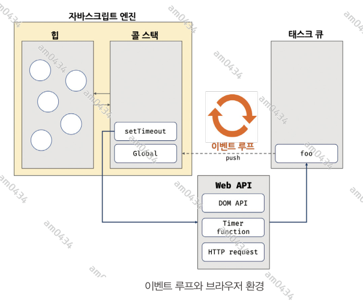

## 41장

### 41.1 호출 스케줄링
함수를 명시적으로 호출하면 함수가 즉시 실행된다. 만약 함수를 명시적으로 호출하지 않고 일정 시간이 경과된 이후에 호출되도록 함수 호출을 예약하려면
타이머 함수를 사용한다. 이를 호출 스케줄링이라 한다.   
자스는 타이머를 생성할 수 있는 타이머 함수 setTimeout과 setInterval, 타이머를 제거할 수 있는 타이머 함수 clearTimeout과 clearInterval을
제공한다.   
타이머 함수 setTimeout과 setInterval 은 모두 일정 시간이 경과된 이후 콜백 함수가 호출되도록 타이머를 생성한다. 타이머 함수 setTimeout과
setInterval 이 생성한 타이머가 만료되면 콜백 함수가 호출된다.
setTimeout 함수가 생성한 타이머는 단 한 번 동작하고, setInterval 함수가 생성한 타이머는 반복 동작한다. 즉, setTimeout 함수의 콜백 함수는
타이머가 만료되면 단 한 번 호출되고, setInterval 함수의 콜백 함수는 타이머가 만료될 때마다 반복 호출된다.    
자스 엔진은 하나의 실행 컨텍스트 스택을 갖기 때문에 두 가지 이상의 태스크를 동시에 실행할 수 없다. 즉, 자바스크립트 엔진은 싱글 스레드로 동작한다.
이런 이유로 타이머 함수는 비동기 처리 방식으로 동작한다. 이에 대해서는 42절에서 살펴보겠다.

### 41.2 타이머 함수
#### 41.2.1 setTimeout / clearTimeout
setTimeout 함수는 두 번째 인수로 전달받은 시간(ms, 1/1000초)으로 단 한 번 동작하는 타이머를 생성한다. 이후 타이머가 만료되면 첫 번째 인수로 전달받은
콜백 함수가 호출된다. 즉, setTimeout 함수의 콜백 함수는 두 번째 인수로 전달받은 시간 이후 단 한 번 실행되도록 호출 스케줄링된다.
   
`const timeoutId = setTimeout(func|code[,delay,param1, param2, ...]);`   
   
- func : 타이머가 만료된 뒤 호출될 콜백 함수
- delay : 타이머 만료 시간, 인수 전달을 생략한 경우 기본값이 0이 지정된다. delay 시간이 설정된 타이머가 만료되면 콜백 함수가 즉시 호출되는 것이
보장되지 않는다. delay 시간은 태스크 큐에 콜백 함수를 등록하는 시간을 지연할 뿐이다. delay가 4ms 이하인 경우 최소 지연 시간 4ms가 지정된다.
- param1, ... : 콜백 함수에 전달해야 할 인수가 존재하는 경우 세 번재 이후의 인수로 전달한다.   
   
setTimeout 함수가 반환한 타이머 id를 clearTimeout 함수의 인수로 전달하여 타이머를 취소할 수 있다. 즉, clearTimeout 함수는 호출 스케줄링을
취소한다.

#### 41.2.2 setInterval / clearInterval
setInterval 함수는 두 번째 인수로 전달받은 시간(ms, 1/1000초)으로 반복 동작하는 타이머를 생성한다. 이후 타이머가 만료될 때마다 첫 번째 인수로
전달받은 콜백 함수가 반복 호출된다. 이는 타이머가 취소될 때까지 계속된다. setInterval에 전달하는 인수는 setTimeout 함수와 동일하다.  
setInterval 함수가 반환한 타이머 id를 clearInterval 함수의 인수로 전달하여 타이머를 취소할 수 있다. 즉, clearInterval 함수는 호출 스케줄링을
취소한다.
```javascript
let count =1;

const timeoutId = setInterval(() => {
    console.log(count);
    if(count++ === 5) {
        clearInterval(timeoutId);
    }
},1000)
```
### 41.3 디바운스와 스로틀
scroll, resize, input, mousemove 같은 이벤트는 짧은 시간 간격으로 연속해서 발생한다. 이러한 이벤트에 바인딩한 이벤트 핸들러는 과도하게 호출되어
성능에 문제를 일으킬 수 있다. 디바운스와 스로틀은 짧은 시간 간격으로 연속해서 발생하는 이벤트를 그룹화해서 과도한 이벤트 핸들러의 호출을 방지하는
프로그래밍 기법이다.   
예를 들어, 다음 예제의 버튼을 짧은 시간 간격으로 연속해서 클릭했을 때 일반적인 이벤트 핸들러와 디바운스, 스로틀된 이벤트 핸들러의 호출 빈도가
어떻게 다른지 살펴보자. 
```html
<body>
    <button>click me</button>
    <pre>일반 클릭 이벤트 카운터 <span class="normal-msg">0</span></pre>
    <pre>디바운스 클릭 이벤트 카운터 <span class="debounce-msg">0</span></pre>
    <pre>스로틀 클릭 이벤트 카운터<span class="throttle-msg">0</span></pre>
    <script>
        const $button = document.querySelector('button');
        const $normal = document.querySelector('.normal-msg');
        const $debounce = document.querySelector('.debounce-msg');
        const $throttle = document.querySelector('.throttle-msg');

        const debounce = (callback, delay) => {
            let timerId;
            return (...args) => {
                if (timerId) clearTimeout(timerId);
                timerId= setTimeout(callback,delay, ...args);
            };
        };

        const throttle =(callback,delay) => {
            let timerId;
            return (...args) => {
                if (timerId) return;
                timerId = setTimeout(()=> {
                    callback(...args);
                    timerId = null;
                }, delay);
            };
        };

        $button.addEventListener('click', () => {
            $normal.textContent= +$normal.textContent+1;
        });

        $button.addEventListener('click', debounce(() => {
            $debounce.textContent= +$debounce.textContent+1;
        },500));

        $button.addEventListener('click', throttle(() => {
            $throttle.textContent= +$throttle.textContent+1;
        },500));
    </script>
</body>
```

디바운스와 스로틀은 이벤트를 처리할 때 매우 유용하다. 디바운스와 스로틀의 구현에는 타이머 함수가 사용된다. 디바운스와 스로틀을 통해 타이머 함수의
활용에 대해 살펴보자

#### 41.3.1 디바운스
디바운스는 짧은 간격으로 이벤트가 연속해서 발생하면 이벤트 핸들러를 호출하지 않다가 일정 시간이 경과한 이후에 이벤트 핸들러가 한 번만 호출되도록 한다.
즉, 디바운스는 짧은 시간 간격으로 발생하는 이벤트를 그룹화해서 마지막에 한 번만 이벤트 핸들러가 호출되도록 한다.

예를 들어 텍스트 입력 필드에서 input 이벤트가 짧은 시간 간격으로 연속해서 발생하는 경우를 살펴보자.
```html
<body>
    <input type="text">
    <div class="msg"></div>
    <script>
        const $input = document.querySelector("input");
        const $msg = document.querySelector(".msg");

        const debounce = (callback, delay) => {
            let timerId;
            //debounce 함수는 timerId를 기억하는 클로저를 반환한다.
            return(...args) => {
                // delay가 경과하기 이전에 이벤트가 발생하면 이전 타이머를 취소하고 새로운 타이머를 재설정한다.
                // 따라서 delay보다 짧은 간격으로 이벤트가 발생하면 callback은 호출되지 않는다.
                
                // 사용자가 입력을 하는 동안에는 계속 clearTimeout이 호출되고 다시 타임아웃이 설정된 입력을 한 순간부터 delay 가 시작!!!!!
                if(timerId) clearTimeout(timerId);
                timerId = setTimeout(callback, delay, ... args);
            };
        };

        $input.oninput = debounce((e)=> {
            $msg.textContent=e.target.value;
        },500)
    </script>
```
input 이벤트는 사용자가 텍스트 입력 필드에 값을 입력할 때마다 연속해서 발생한다. 만약 input의 이벤트 핸들러에서 사용자가 입력 필드에 입력한 값으로
Ajax 요청과 같은 무거운 처리를 수행한다면 사용자가 아직 입력을 완료하지 않았어도 Ajax 요청이 전송될 것이다. 이는 서버에도 부담을 주는 불필요한 처리이므로
사용자가 입력을 완료했을 때 한 번만 Ajax 요청을 전송하는 것이 바람직하다.   
이를 위해 debounce 함수가 반환한 함수는 debounce 함수에 두번째 인수로 전달한 시간(delay)보다 짧은 간격으로 이벤트가 발생하면 이전 타이머를 취소하고
새로운 타이머를 재설정한다. 따라서 delay보다 짧은 간격으로 이벤트가 연속해서 발생하면 debounce 함수의 첫 번째 인수로 전달한 콜백 함수는 호출되지 않다가
delay 동안 input 이벤트가 더 이상 발생하지 않으면 한 번만 호출된다.   
위 예제의 debounce 함수는 이해를 위해 간략하게 구현하여 완전하지 않다. 실무에서는 Underscore의 debounce 함수나 Lodash의 debounce 함수를 사용하는것을
권장한다.

#### 41.3.2 스로틀
스로틀은 짧은 시간 간격으로 이벤트가 연속해서 발생하더라도 일정 시간 간격으로 이벤트 핸들러가 최대 한 번만 호출되도록 한다. 즉, 스로틀은 짧은 시간 간격으로
연속해서 발생하는 이벤트를 그룹화해서 일정시간 단위로 이벤트 핸들러가 호출되도록 호출 주기를 만든다.
```html
<body>
    <input type="text">
    <div class="msg"></div>
    <script>
        const $input = document.querySelector("input");
        const $msg = document.querySelector(".msg");

        const throttle = (callback, delay) => {
            let timerId;

            return(...args) => {
                // timerId 가 한번 설정되면 딜레이가 끝날때까지 아무 일도 일어나지 않음
                // 딜레이가 끝나면 콜백함수 실행 및 타이머 재설정
                // ==> 딜레이 간격으로 콜백함수가 실행됨
                if(timerId) return;
                timerId = setTimeout(()=>{
                    callback(...args);
                    timerId=null
                },delay);
            };
        };

        $input.oninput = throttle((e)=> {
            $msg.textContent=e.target.value;
        },500)
    </script>
</body>
```

---------------------------------------------------------------

## 42.1 동기 처리와 비동기 처리
23장에서 살펴본 바와 같이 함수를 호출하면 함수 코드가 평가되어 함수 실행 컨텍스트가 생성된다. 이때 생성된 함수 실행 컨텍스트는 실행 컨텍스트 스택(콜 스택)에
푸시되고 함수코드가 실행된다. 함수 코드의 실행이 종료하면 함수 실행 컨텍스트는 실행 컨텍스트 스택에서 팝되어 제거된다. 함수가 실행되려면 '함수 코드 평가 과정'에서
생성된 함수 실행 컨텍스트가 실행 컨텍스트 스택에 푸시되어야 한다. 다시 말해, 실행 컨텍스트 스택에 함수 실행 컨텍스트가 푸시되는 것은 바로 함수 실행의
시작을 의미한다. 이처럼 함수의 실행 순서는 실행 컨텍스트 스택으로 관리한다.  
**자바스크립트 엔진은 단 하나의 실행 컨텍스트 스택을 갖는다.** 이는 함수를 실행할 수 있는 창구가 단 하나이며, 동시에 2개 이상의 함수를 동시에 실행할 수
없다는 것을 의미한다. 실행 컨텍스트 스택의 최상위 요소인 "실행 중인 컨텍스트"를 제외한 모든 실행 컨텍스트는 모두 실행 대기 중인 태스크들이다.  
자스 엔진은 한 번에 하나의 태스크만 실행할 수 있는 싱글 스레드 방식으로 동작한다. 싱글 스레드 방식은 한 번에 하나의 태스크만 실행할 수 있기 때문에
처리에 시간이 걸리는 태스크를 실행하는 경우 블로킹(작업 중단)이 발생한다.  
이처럼 현재 실행 중인 태스크가 종료할 때까지 다음에 실행될 태스크가 대기하는 방식을 **동기처리**라고 한다.   
아래 예제를 보겠다.
```javascript
function foo() {
    console.log('foo')
}

function bar() {
    console.log('bar')
}

setTimeout(foo, 2000)
bar();
```
setTimeout 함수는 일정 시간이 경과한 이후에 콜백함수를 호출하지만 setTimeout 함수 이후의 태스크를 블로킹하지 않고 곧바로 실행한다. 이처럼 현재 실행중인
태스크가 종료 되지 않은 상태라도 다음 태스크를 실행하는 방식을 비동기 처리라고 한다.  
동기 방식은 태스크를 순서대로 처리하므로 실행 순서가 보장된다는 장점이 있지만, 앞선 태스크가 종료할 때까지 이후 태스크들이 블로킹 되는 단점이 있다.
비동기 처리 방식은 현재 실행 중인 태스크가 종료되지 않은 상태라 해도 다음 태스크를 곧바로 실행하므로 블로킹이 발생하지 않는다는 장점이 있지만, 태스크의
실행 순서가 보장되지 않는 단점이 있다.   
비동기 처리를 수행하는 비동기 함수는 전통적으로 콜백 패턴을 사용한다. 하지만 이 패턴은 가독성을 나쁘게 하고, 예외 처리가 곤란하며, 여러 개의 비동기 처리를
한 번에 처리하는 데도 한계가 있다.    
**타이머 함수인 setTimeout과 setInterval, HTTP 요청, 이벤트 핸들러는 비동기 처리 방식으로 동작한다.** 비동기 처리는 이벤트 루프와 태스크 큐와
깊은 관계가 있다.

### 42.2 이벤트 루프와 태스크 큐
자스는 싱글 스레드로 동작한다. 하지만 브라우저가 동작하는 것을 보면 여러 태스크가 동시에 처리되는 것처럼 느껴진다. 자스의 동시성을 지원하는 것이
바로 **이벤트 루프**다.  



대부분의 자스 엔진은 크게 2개의 영역으로 구분할 수 있다.

##### 콜 스택
23장 에서 살펴본 바와 같이 소스코드(전역 코드나 함수 코드 등) 평가 과정에서 생성된 실행 컨텍스트가 추가되고 제거되는 스택 자료구조인 실행 컨텍스트
스택이 바로 콜 스택이다.   
함수를 호출하면 함수 실행 컨텍스트가 순차적으로 콜 스택에 푸시되어 순차적으로 실행된다. 자스 엔진은 단 하나의 콜스택을 사용하기 때문에 최상위 실행
컨텍스트가 종료되어 콜 스택에서 제거되기 전까지는 어떤 태스크도 실행되지 않는다.

##### 힙
힙은 객체가 저장되는 메모리 공간이다. 콜 스택의 요소인 실행 컨텍스트는 힙에 저장된 객체를 참조한다. 

이처럼 콜 스택과 힙으로 구성되어 있는 자바스크립트 엔진은 단순히 태스크가 요청되면 콜 스택을 통해 요청된 작업을 순차적으로 실행할 뿐이다. 
**비동기 처리에서 소스코드의 평가와 실행을 제외한 모든 처리는 자바스크립트 엔진을 구동하는 환경인 브라우저 또는 Node.js가 담당한다.** 예를 들어,
비동기 방식으로 동작하는 setTimeout의 콜백 함수의 평가와 실행은 자바스크립트 엔진이 담당하지만 호출 스케줄링을 위한 타이머 설정과 콜백 함수의
등록은 Node.js 가 담당한다. 이를 위해 브라우저 환경은 태스크 큐와 이벤트 루프를 제공한다.

##### 테스크 큐
setTimeout 이나 setInterval과 같은 비동기 함수의 콜백 함수 또는 이벤트 핸들러가 일시적으로 보관되는 영역이다. 태스크 큐와는 별도로 프로미스의
후속 처리 메서드의 콜백 함수가 일시적으로 보관되는 마이크로태스크 큐도 존재한다. 

##### 이벤트 루프
콜 스택에 현재 실행중인 실행 컨텍스트가 있는지, 그리고 태스크 큐에 대기 중인 함수(콜백 함수, 이벤트핸들러 등)가 있는지 반복해서 확인한다. **만약
콜 스택이 비어 있고 태스크 큐에 대기 중인 함수가 있따면 이벤트 루프틑 순차적(FIFO)으로 태스크 큐에 대기 중인 함수를 콜 스택으로 이동**시킨다.
이때 콜 스택으로 이동한 함수는 실행된다. 즉, 태스크 큐에 일시 보관된 함수들은 비동기 처리 방식으로 동작한다.  
아래의 코드가 어떻게 동작할지 살펴보자.
```javascript
function foo() {
    console.log('foo')
}

function bar() {
    console.log('bar')
}

setTimeout(foo, 0)
bar();
```
1. 전역 코드가 평가되어 전역 실행 컨텍스트가 생성되고 콜 스택에 푸시된다.
2. 전역 코드가 실행되기 시작하여 setTimeout 함수가 호출된다. 이때 setTimeout 함수의 함수 실행 컨텍스트가 생성되고 콜스택에 푸시되어 현재 실행중인
실행 컨텍스트가 된다. 브라우저의 Web API(호스트 객체)인 타이머 함수도 함수이므로 함수 실행 컨텍스트를 생성한다.
3. setTimeout 함수가 실행되면 콜백 함수를 호출 스케줄링하고 종료되어 콜 스택에서 팝된다. 이때 호출 스케줄링, 즉 타이머 설정과 타이머가 만료되면
콜백 함수를 태스크 큐에 푸시하는 것은 브라우저의 역할이다.
4. 브라우적 수행하는 4-1과 자바스크립트 엔징니 수행하는 4-2는 병행 처리된다.  
    4-1. 브라우저는 타이머를 설정하고 타이머의 만료를 기다린다. 이후 타이머가 만료되면 콜백 함수 foo가 태스크 큐에 푸시된다. 위 예제의 경우 지연시간이 0이지만
    지연 시간이 4ms 이하인 경우 최소 지연 시간 4ms가 지정된다. 따라서 4ms 후에 콜백 함수 foo가 태스크 큐에 푸시되어 대기하게 된다. 이 처리 또한 자스 엔진이 아니라
    브라우저가 수행한다. 지연 시간 이후에 콜백 함수가 태스크 큐에 푸시되어 대기하게 되지만 콜 스택이 비어야 호출되므로 시간차가 발생할 수 있다.   
    4-2. bar 함수가 호출되어 bar 함수의 함수 실행 컨텍스트가 생성되고 콜 스택에 푸시되어 현재 실행 중인 실행 컨텍스트가 된다. 이후 bar 함수가 종료되어
    콜 스택에서 팝된다. 이때 브라우저가 타이머를 설정한 후 4ms가 경과했다면 foo 함수는 아직 태스크 큐에서 대기중이다.
5. 전역 코드 실행이 종료되고 전역 실행 컨텍스트가 콜 스택에서 팝된다. 이로서 콜 스택에는 아무런 실행 컨텍스트도 존재하지 않게된다.
6. 이벤트 루프에 의해 콜 스택이 비어 있음을 감지하고 태스크 큐에서 대기 중인 콜백 함수 foo가 이벤트 루프에 의해 콜 스택에 푸시된다. 다시 말해, 콜백 함수 foo의
함수 실행 컨텍스트가 생성되고 콜 스택에 푸시되어 현재 실행 중인 실행 컨텍스트가 된다. 이후 foo 함수가 종료되어 콜 스택에서 팝된다.
   
이처럼 **비동기 함수인 setTimeout의 콜백 함수는 태스크 큐에 푸시되어 대기하다가 콜 스택이 비게되면, 다시 말해 전역 코드 및 명시적으로 호출된 함수가
모두 종료하면 비로소 콜 스택에 푸시되어 실행된다.**   
**_자바스크립트는 싱글 스레드 방식으로 동작한다. 이때 싱글 스레드 방식으로 동작하는 것은 브라우저가 아니라 브라우저에 내장된 자스 엔진이라는 것에 주의해야 한다.
만약 모든 자바스크립트 코드가 자바스크립트 엔진에서 싱글 스레드 방식으로 동작한다면 자스는 비동기로 동작할수 없다. 즉, 자바스크립트 엔진은 싱글 스레드로
동작하지만 브라우저는 멀티 스레드로 동작한다._**
      
브라우저와 자브스크립트 엔진이 협력하여 비동기 함수인 setTimeout 함수를 실행한다.


