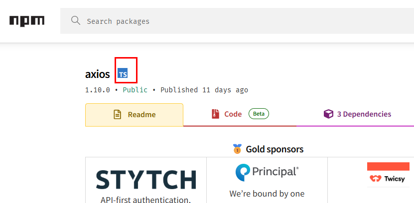
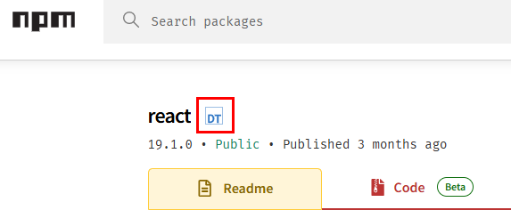

# 4장 타입스크립트 프로젝트 설정하기

## 4.1 개발 환경 설정하기
## 4.2 타입스크립트 지원 패키지 확인하기
자바스크립트나 타입스크립트로 개발할 때는 다른 사람이 만든 라이브러리나 프레임워크를 많이 사용한다. 라이브러리나 프레임워크는 주로 npm(Node Package Manager) 저장소에 있다.
npm에 저자오디어 있는 라이브러리나 프레임워크를 통틀어 패키지라고 부른다.  
npm 저장소에는 자바스크립트 패키지와 타입스크립트 패키지가 섞여 있다. 타입스크립트에서도 자바스크립트 패키지를 사용할 수는 있지만 타입 지원을 받지 못하는 매우 큰 단점이 있다.
모든 타입이 any가 되어버린다. any는 타입스크립트엣 지양해야 할 타입인 만큼 가능한 한 타입스크립트를 지원하는 패키지를 사용하는 것이 좋다.  
타입스크립트를 지원하는 패키지인지는 npm 공식 사이트인 `npmjs.com` 에서 확인할 수 있다. 패키지 이름으로 검색해보면 패키지가 타입스크립트를 지원하는지 알 수 있다.


  
axios 이름 우측에 TS 마크가 붙어있다. 현재 패키지가 자체적으로 타입스크립트를 지원한다는 것을 나타낸다. 타입스크립트에서 사용할 때 타입 지원을 받을 수 있다.  
react 패키지를 검색해보겠다.


  
이름 우측에 DT 마크가 붙어있다. 현재 패키지가 타입스크립트를 지원하지 않지만 타입스크립트 커뮤니티에서 타입을 지원한다는 의미이다. 타입스크립트 커뮤니티는
타입스크립트 사용자들의 모임을 의미하는 것으로, 타입스크립트를 지원하지 않는 패키지들을 위해 DefinitelyTyped 에 커뮤니티를 만들어 제공하고 있다.  
npm 에서는 패키지 이름 앞에 `@types/` 를 붙여 설치할 수 있다. 예를 들어 react 패키지라면 `@types/react` 패키지를 같이 설치하면 타입 지원을 받을 수 있다.
@loadable/component 처럼 처읍부터 @(네임스페이스)가 붙어 있는 패키지라면 @types/loadable__component 이름으로 설치하면 된다. 즉, 다음과 같은 형식이다.
- @types/패키지이름
- @types/네임스페이스__페키지이름
  
자체적으로 타입스크립트를 지원하지 않는 패키지 중에 유명한 패키지들은 대부분 타입스크립트 커뮤니티에서 커뮤니티 타입을 제공한다.  
이번에는 react-native-keyboard-aware-scrollview 패키지를 검색해보겠다.  
이름 우측에 아무런 표시도 없다. 이처럼 타입스크립트를 지원하지 않는 패키지도 있다. 이러한 패키지를 사용하려면 직접 타입을 추가해야 한다. 뒤에서 직접 타이핑해보겠다.

## 4.3 tsc와 tsconfig.json
타입스크립트 프로젝트를 설정하는 방법에 대해 알아보겠다. 
```
$ npx tsx --init (yarn add typescript)
```
위의 명령으로 tsconfig.json 파일이 생성된다.
```json
{
  "compilerOptions": {
    "typeRoots": ["node_modules/@types"],
    "target": "es2017",                                  
    "module": "esnext",                                
    "esModuleInterop": true,                           
    "forceConsistentCasingInFileNames": true,          
    "strict": true,                                    
    "skipLibCheck": true                              
  }
}
```
이 중에서 compilerOptions 속성은 tsc 명령어에 대한 옵션을 담아둔 객체이다. compilerOptions 내부에는 다음 옵션이 기본적으로 활성화되어 있다.
- forceConsistentCasingInFileName 옵션은 import 문에서 파일명을 적을 때 대소문자를 철저히 구분할지 정하는 옵션이다.
- strict 옵션은 코드의 타입을 엄격하게 검사한다는 의미이다.
- skipLibCheck 옵션은 .d.ts 파일에 있는 에러를 무시하는 옵션이다. 타입스크립트를 사용할 때 다른 사람이 만든 타입 선언을 사용하는 경우가 많은데 그 선언이 틀린 경우에도 에러 없이 사용할 수 있다.

이 세 옵션은 기본적으로 true 이므로 그대로 사용한다. 모든 속성에 대해 알 필요는 없다. 자주 사용하는 속성은 앞으로 살펴보겠다.  
- 5장 : esModuleInterop, declaration, target, incremental, tsBuildInfoFile 옵션을 배운다.
- 6장 : module, moduleResolution, traceResolution 옵션
- 7장 : jsx 옵션
- 8장 : listFiles, explainFiles, include, exclude 옵션
- 10장 : baseUrl, paths, declarationDir, outDir, rootDir, allowJs, checkJs 옵션

### 4.3.1 tsc 명령어로 자바스크립트로 변환하기
jquery 디렉터리에 타입스크립트 프로젝트를 생성한다.
```
> yarn init -y              // package.json 파일을 생성한다.
> yarn add typescript       // dependency에 typescript를 추가한다.
> tsc --init                // tsconfig.json 을 생성한다.
```
타입스크립트 코드는 결구 자바스크립트로 변환해야 한다. 타입스크립트가 어떻게 자바스크립트로 바꾸는지 확인해보겠다.  
jquery 폴더에 hello.ts 파일을 만들고 코드를 작성한다.
```typescript
let str:'hello' = 'hello';
str = 'world';  // Type "world" is not assignable to type "hello"
```
일부러 에러가 있는 코드를 입력했다. 이 파일을 자바스크립트로 바꾸겠다. 명령어는 tsc 이다.
```
> tsc
hello.ts:2:1 - error TS2322: Type '"world"' is not assignable to type '"hello"'.

2 str = 'world';  // Type "world" is not assignable to type "hello"
  ~~~

Found 1 error in hello.ts:2
```
터미널에 에러가 표시된다. 하지만 hello.js가 생성된다. 에러가 있는데도 자바스크립트로 변환되는 이유는 tsc 명령어가 다음 두 작업을 독립적으로 수행하기 때문이다.
- 타입스크립트 코드의 에러를 검사하는 작업
- 타입스크립트 코드를 자바스크립트로 변환하는 작업
    
두 작업이 독립적이므로 에러가 있어도 자바스크립트 변환작업은 수행된다. 만약 자바스크립트로 코드를 변환하지 않고 타입에러만 검사하고 싶다면 다음 명령어를 사용한다.
```
> tsc --noEmit
```
만약 에러가 없으면 자바스크립트로 변환하고, 에러가 있으면 변환하지 않고 에러마 표시하고 싶다면 다음 명령어를 사용한다.
```
> tsc --noEmitOnError
```
noEmit, noEitOnError 모두 tsconfig.json 에 있는 옵션이다. tsconfig.json 에서 이 옵션을 활성하하면 tsc 명령어 뒤에 따로 표기하지 않아도 된다.


